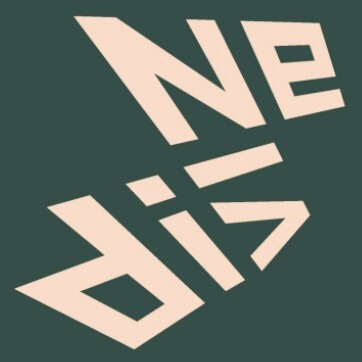
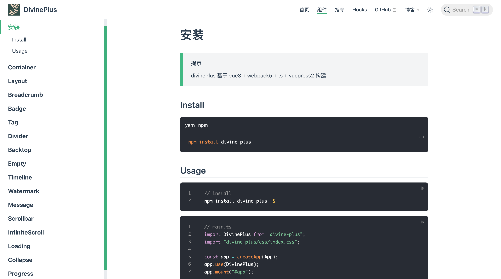

# Divine-Plus

基于 vue3 + webpack5 + ts + vuepress2 构建的组件库

包含了 `组件` `指令` `hooks` 等效率工具



## Homepage

[官网链接 - 说明文档](http://120.53.220.141:8090/components/)

## Usage

```js
// install

npm install divine-plus -S
```

```js
// main.ts

import DivinePlus from "divine-plus";
import "divine-plus/css/index.css";

const app = createApp(App);
app.use(DivinePlus);
app.mount("#app");
```

> 注意: 不要使用 cnpm 安装，vuepress 依赖 vite 很容易出错



## Test

```Shell
1
Download
git clone git@github.com:woow-wu7/8-divine-plus.git

2
Local Testing
npm run dev // or npm run test:dev

3
Document
npm run docs:dev
```

## Discussions

[GitHub Discussions - 讨论区链接](https://github.com/woow-wu7/8-divine-plus/discussions)

## Contributors

<a href="https://github.com/woow-wu7/8-divine-plus/graphs/contributors">
  
</a>

## Blog

[[封装 01-设计模式] 设计原则 和 工厂模式(简单抽象方法) 适配器模式 装饰器模式](https://juejin.cn/post/6950958974854234119)  
[[封装 02-设计模式] 命令模式 享元模式 组合模式 代理模式](https://juejin.cn/post/6950958974854234119)  
[[封装 03-设计模式] Decorator 装饰器模式在前端的应用](https://juejin.cn/post/7037871731070992421)  
[[封装 04-设计模式] Publish Subscribe 发布订阅模式在前端的应用](https://juejin.cn/post/7038522552313970696)  
[[封装 05-ElementUI 源码 01] Row Col Container Header Aside MainFooter](https://juejin.cn/post/7042871115848351774)  
[[封装 06-Divine-plus] 从 0 开始封装一个 VUE3-UI 组件库](https://juejin.cn/post/7131232733841817631/)

## Source Code Analysis

#### (1) element-ui 源码分析 [element-ui^2]

- [element-ui 源码分析-仓库](https://github.com/woow-wu7/8-element-source-code-analysis)

#### (2) element-plus 源码分析 [element-plus^2.26]

- [element-plus 源码分析-仓库](https://github.com/woow-wu7/8-element-plus-source-code-analysis)

## Other Source Code Analysis

#### (1) redux 和 react-redux 源码分析 [redux^4.0.5]

- [redux 源码分析-仓库](https://github.com/woow-wu7/7-react-admin-ts/tree/master/src/SOURCE-CODE-ANALYSIS/REDUX)
- [redux 源码分析-我的掘金博客](https://juejin.cn/post/6844904137952329742)

#### (2) 手写 webpack Compiler 源码 [webpack^4.42.0]

- [手写 Compiler 源码-仓库](https://github.com/woow-wu7/7-compiler)
- [手写 Compiler 源码-我的掘金文章](https://juejin.cn/post/6844903973002936327)

#### (3) axios 源码分析 [axios^0.20.0]

- [axios 源码分析-仓库](https://github.com/woow-wu7/7-react-admin-ts/tree/master/src/SOURCE-CODE-ANALYSIS/AXIOS)
- [axios 源码分析-我的掘金文章](https://juejin.cn/post/6844904147532120072)
- [cancel 取消请求的原理，interceptor 拦截器的原理 - 两个重点掌握](https://github.com/woow-wu7/7-react-admin-ts/tree/master/src/pages/admin-system/interview-cancel/index.tsx)

#### (4) vue 源码分析 [vue^2.6.12]

- [vue 源码分析-仓库](https://github.com/woow-wu7/7-react-admin-ts/tree/master/src/SOURCE-CODE-ANALYSIS/VUE)
- [vue 源码分析-新建仓库](https://github.com/woow-wu7/7-vue2-source-code-analysis)
- [vue 源码分析-我的掘金文章](https://juejin.cn/post/6844904181094957069)

#### (5) vuex 源码分析 [v2.6.10]

- [vuex 源码分析-我的掘金文章](https://juejin.cn/post/6844904166293241863)

#### (6) react 源码分析 [react^17.0.3]

- [react 源码分析-仓库](https://github.com/woow-wu7/7-react-source-code-analysis)
- [react 源码分析-我的掘金文章](https://juejin.cn/post/6993980489463758855)
- [js 实现单向链表 - 源码](https://github.com/woow-wu7/7-react-source-code-analysis/blob/main/src/manual/linked-list.js)
- [手写 hook 调度-useState 实现 - 源码仓库](https://github.com/woow-wu7/7-react-source-code-analysis/blob/main/src/manual/hooks-manual.js)
- [手写 hook 调度-useState 实现 - 思维导图](https://github.com/woow-wu7/7-react-source-code-analysis/blob/main/src/images/hook-useState.png)

#### (7) a-hooks2.0 源码分析 [a-hooks^2.10.9]

- [a-hooks 源码分析 - 仓库](https://github.com/woow-wu7/7-a-hooks-source-code-analysis)

#### (8) a-hooks3.0 源码分析 [a-hooks^2.10.9]

- [a-hooks 源码分析 - 仓库](https://github.com/woow-wu7/7-a-hooks3.0-source-code-analysis)

#### (9) koa 源码分析 [koa^2.13.1]

- [koa 源码分析 - 仓库](https://github.com/woow-wu7/7-koa-source-code-analysis)
- [koa 源码调试 - 仓库](https://github.com/woow-wu7/7-koa-source-code-analysis)
- 注意分析：( axios 拦截器 + redux 中间件 + koa 中间件 ) 三者的相同点和区别

#### (10) badJs-report 源码分析

- [badJs-report 源码分析-仓库](https://github.com/woow-wu7/7-badjs-report-analysis)

#### (11) element-ui 源码分析

- [element-ui 源码分析-仓库](https://github.com/woow-wu7/8-element-source-code-analysis)

#### (12) element-plus 源码分析 [element-plus^2.26]

- [element-plus 源码分析-仓库](https://github.com/woow-wu7/8-element-plus-source-code-analysis)

#### (13) vant [vant^3.4.5]

- [vant3 源码分析-仓库](https://github.com/woow-wu7/8-vant-source-code-analysis)

#### (14) Diff-virtualDOM

- [手写 diff 算法-snabbdom](https://github.com/woow-wu7/7-vue2-source-code-snabbdom)
