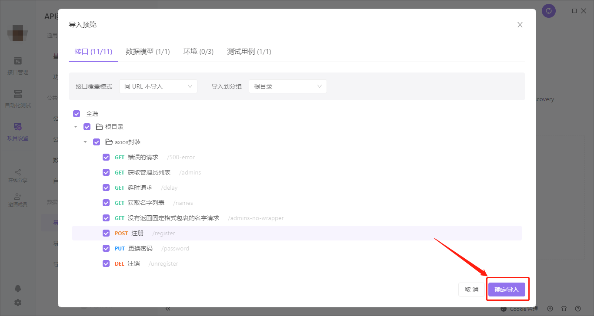

# 阅前先知

在`git clone`该项目到本地后，请根据以下步骤去开启项目。

## 1. 安装**Apifox**且开启本地`mock`服务器

在本文档中的代码组件都会涉及到`API`请求。本文中所有的`API`是通过**Apifox**支持的。因此，我们要安装且运行**Apifox**:

1. 到[Apifox](https://www.apifox.cn/)下载桌面版的**Apifox**，记得要根据自己的操作系统去选择安装包，如下所示：

   

2. 打开**Apifox**后，在登录账号后，新建一个空白项目，项目名称随意，如下所示：

   

3. 进入新建的空白项目后，依次如图所示点击“项目设置”->“导入数据(手动导入)”->“Apifox”，然后把本项目的`./apifox/API层封装接口测试.apifox.json`导入到图片中的文件导入区。

   

4. 选择导入文件后，在**导入预览**中选择确认导入，如下所示：

   

5. 然后在右上角选择**本地 Mock**以开启本地`Mock`服务器，如下所示：

   

6. 如图所示点开右上角按钮查看“本地 Mock”的“前置 URL”且复制：

   

7. 最后把上面复制的`url`粘到`.umirc.ts`的`proxy['/api'].target`上，如图所示：

   

至此，我们已经完成了**Apifox**的配置。

## 2. 启动本项目

安装本项目依赖后运行

```bash
yarn install
yarn start
```

即可一边阅读该文档一边运行文档上的代码组件。
