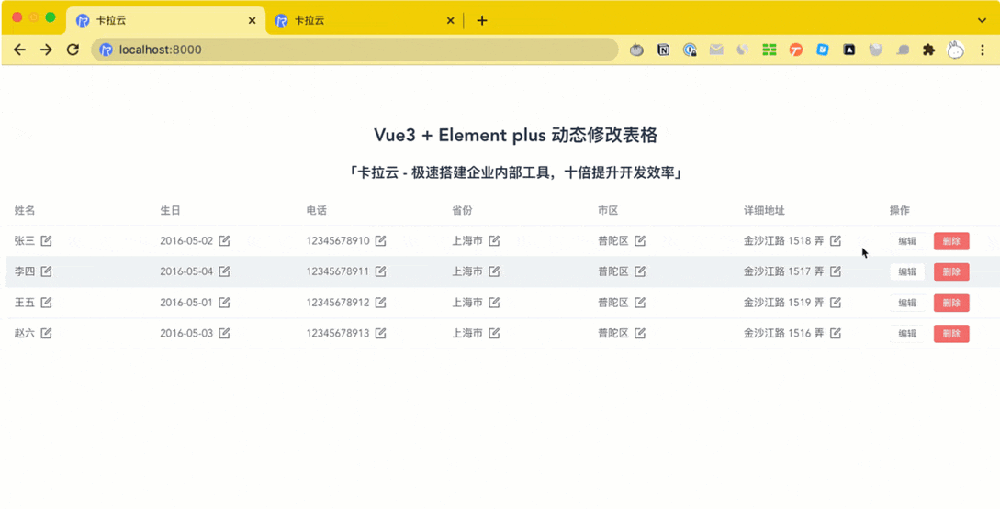

# 在 Vue3 + Element Plus 中生成动态表格，动态修改表格，多级表头，合并单元格

本教程配套文章请访问卡拉云技术博客：《[在 Vue3 + Element Plus 中生成动态表格，动态修改表格，多级表头，合并单元格）](https://kalacloud.com/blog/how-to-build-dynamic-table-in-vue-element-plus/)》

在 Vue 中，[表格组件](https://kalacloud.com/blog/best-vue-data-table-grid/)是使用频率及复杂度排名第一的组件，前端经常需要根据后台返回的数据动态渲染表格，比如动态表格如何生成，因为表格的列并不是固定的，在未知表格具体有哪些列的场景下，前端如何动态渲染表格数据。又或者需要把表格单元格进行合并处理，比如第一列是日期，需要把相同的日期进行合并，这样表格看起来会更加清晰。
本文手把手教你如何在 Vue3 + Element Plus 中创建表格、生成动态表格、创建动态多级表头、表格行合并、列合并等问题。

通过本文你可以学到
- 如何在 Element Plus 中生成动态表格
- 如何在 Element Plus 中动态修改表格
- 如何在 Element Plus 中创建动态多级表头

先来展示个「动态修改表格」的最终效果图吧
