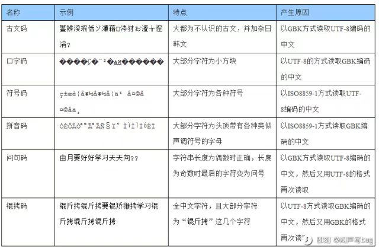

# 字符编码趣闻

## ASCII、Unicode、GBK 和 UTF-8 字符编码的区别联系

#### [知乎链接](https://www.zhihu.com/question/19677619)

#### [原文链接](http://dengo.org/archives/901)

很久很久以前，有一群人，他们决定用 8 个可以开合的晶体管来组合成不同的状态，以表示世界上的万物。他们看到 8 个开关状态是好的，于是他们把这称为”字节“。再后来，他们又做了一些可以处理这些字节的机器，机器开动了，可以用字节来组合出很多状态，状态开始变来变去。他们看到这样是好的，于是它们就这机器称为”计算机“。

开始计算机只在美国用。八位的字节一共可以组合出 256(2 的 8 次方)种不同的状态。 他们把其中的编号从 0 开始的 32 种状态分别规定了特殊的用途，一但终端、打印机遇上约定好的这些字节被传过来时，就要做一些约定的动作。遇上 0×10, 终端就换行，遇上 0×07, 终端就向人们嘟嘟叫，例好遇上 0x1b, 打印机就打印反白的字，或者终端就用彩色显示字母。他们看到这样很好，于是就把这些 0×20 以下的字节状态称为”控制码”。他们又把所有的空 格、标点符号、数字、大小写字母分别用连续的字节状态表示，一直编到了第 127 号，这样计算机就可以用不同字节来存储英语的文字了。大家看到这样，都感觉 很好，于是大家都把这个方案叫做 ANSI 的”Ascii”编码（American Standard Code for Information Interchange，美国信息互换标准代码）。当时世界上所有的计算机都用同样的 ASCII 方案来保存英文文字。

后来，就像建造巴比伦塔一样，世界各地的都开始使用计算机，但是很多国家用的不是英文，他们的字母里有许多是 ASCII 里没有的，为了可以在计算机保存他们的文字，他们决定采用 127 号之后的空位来表示这些新的字母、符号，还加入了很多画表格时需要用下到的横线、竖线、交叉等形状，一直把序号编到了最后一个状态 255。从 128 到 255 这一页的字符集被称”扩展字符集“。从此之后，贪婪的人类再没有新的状态可以用了，美帝国主义可能没有想到还有第三世界国家的人们也希望可以用到计算机吧！

等中国人们得到计算机时，已经没有可以利用的字节状态来表示汉字，况且有 6000 多个常用汉字需要保存呢。但是这难不倒智慧的中国人民，我们不客气地把那些 127 号之后的奇异符号们直接取消掉, 规定：一个小于 127 的字符的意义与原来相同，但两个大于 127 的字符连在一起时，就表示一个汉字，前面的一个字节（他称之为高字节）从 0xA1 用到 0xF7，后面一个字节（低字节）从 0xA1 到 0xFE，这样我们就可以组合出大约 7000 多个简体汉字了。在这些编码里，我们还把数学符号、罗马希腊的字母、日文的假名们都编进去了，连在 ASCII 里本来就有的数字、标点、字母都统统重新编了两个字节长的编码，这就是常说的”全角”字符，而原来在 127 号以下的那些就叫”半角”字符了。 中国人民看到这样很不错，于是就把这种汉字方案叫做 “GB2312“。GB2312 是对 ASCII 的中文扩展。

但是中国的汉字太多了，我们很快就就发现有许多人的人名没有办法在这里打出来，特别是某些很会麻烦别人的国家领导人。于是我们不得不继续把 GB2312 没有用到的码位找出来老实不客气地用上。 后来还是不够用，于是干脆不再要求低字节一定是 127 号之后的内码，只要第一个字节是大于 127 就固定表示这是一个汉字的开始，不管后面跟的是不是扩展字符集里的内容。结果扩展之后的编码方案被称为 GBK 标准，GBK 包括了 GB2312 的所有内容，同时又增加了近 20000 个新的汉字（包括繁体字）和符号。 后来少数民族也要用电脑了，于是我们再扩展，又加了几千个新的少数民族的字，GBK 扩成了 GB18030。从此之后，中华民族的文化就可以在计算机时代中传承了。 中国的程序员们看到这一系列汉字编码的标准是好的，于是通称他们叫做 “DBCS“（Double Byte Charecter Set 双字节字符集）。在 DBCS 系列标准里，最大的特点是两字节长的汉字字符和一字节长的英文字符并存于同一套编码方案里，因此他们写的程序为了支持中文处理，必须要注意字串里的每一个字节的值，如果这个值是大于 127 的，那么就认为一个双字节字符集里的字符出现了。那时候凡是受过加持，会编程的计算机僧侣 们都要每天念下面这个咒语数百遍： “一个汉字算两个英文字符！一个汉字算两个英文字符……”

因为当时各个国家都像中国这样搞出一套自己的编码标准，结果互相之间谁也不懂谁的编码，谁也不支持别人的编码，连大陆和台湾这样只相隔了 150 海里，使用着同一种语言的兄弟地区，也分别采用了不同的 DBCS 编码方案——当时的中国人想让电脑显示汉字，就必须装上一个”汉字系统”，专门用来处理汉字的显示、输入的问题，但是那个台湾的愚昧封建人士写的算命程序就必须加装另一套支持 BIG5 编码的什么”倚天汉字系统”才可以用，装错了字符系统，显示就会乱了套！这怎么办？而且世界民族之林中还有那些一时用不上电脑的穷苦人民，他们的文字又怎么办？ 真是计算机的巴比伦塔命题啊！

正在这时，大天使加百列及时出现了——一个叫 ISO （国际标谁化组织）的国际组织决定着手解决这个问题。他们采用的方法很简单：废了所有的地区性编码方案，重新搞一个包括了地球上所有文化、所有字母和符号 的编码！他们打算叫它”Universal Multiple-Octet Coded Character Set”，简称 UCS, 俗称 “unicode“。

unicode 开始制订时，计算机的存储器容量极大地发展了，空间再也不成为问题了。于是 ISO 就直接规定必须用两个字节，也就是 16 位来统一表示所有的字符，对于 ASCII 里的那些“半角”字符，unicode 包持其原编码不变，只是将其长度由原来的 8 位扩展为 16 位，而其他文化和语言的字符则全部重新统一编码。由于”半角”英文符号只需要用到低 8 位，所以其高 8 位永远是 0，因此这种大气的方案在保存英文文本时会多浪费一倍的空间。这时候，从旧社会里走过来的程序员开始发现一个奇怪的现象：他们的 strlen 函数靠不住了，一个汉字不再是相当于两个字符了，而是一个！是的，从 unicode 开始，无论是半角的英文字母，还是全角的汉字，它们都是统一的”一个字符“！同时，也都是统一的”两个字节“，请注意”字符”和”字节”两个术语的不同，“字节”是一个 8 位的物理存贮单元，而“字符”则是一个文化相关的符号。在 unicode 中，一个字符就是两个字节。一个汉字算两个英文字符的时代已经快过去了。

unicode 同样也不完美，这里就有两个的问题，一个是，如何才能区别 unicode 和 ascii？计算机怎么知道三个字节表示一个符号，而不是分别表示三个符号呢？第二个问题是，我们已经知道，英文字母只用一个字节表示就够了，如果 unicode 统一规定，每个符号用三个或四个字节表示，那么每个英文字母前都必然有二到三个字节是 0，这对于存储空间来说是极大的浪费，文本文件的大小会因此大出二三倍，这是难以接受的。

unicode 在很长一段时间内无法推广，直到互联网的出现，为解决 unicode 如何在网络上传输的问题，于是面向传输的众多 UTF（UCS Transfer Format）标准出现了，顾名思义，UTF-8 就是每次 8 个位传输数据，而 UTF-16 就是每次 16 个位。UTF-8 就是在互联网上使用最广的一种 unicode 的实现方式，这是为传输而设计的编码，并使编码无国界，这样就可以显示全世界上所有文化的字符了。

UTF-8 最大的一个特点，就是它是一种变长的编码方式。它可以使用 1~4 个字节表示一个符号，根据不同的符号而变化字节长度，当字符在 ASCII 码的范围时，就用一个字节表示，保留了 ASCII 字符一个字节的编码做为它的一部分，注意的是 unicode 一个中文字符占 2 个字节，而 UTF-8 一个中文字符占 3 个字节）。从 unicode 到 uft-8 并不是直接的对应，而是要过一些算法和规则来转换。

Unicode 符号范围 | UTF-8 编码方式

(十六进制) | （二进制）

—————————————————————–

0000 0000-0000 007F | 0xxxxxxx

0000 0080-0000 07FF | 110xxxxx 10xxxxxx

0000 0800-0000 FFFF | 1110xxxx 10xxxxxx 10xxxxxx

0001 0000-0010 FFFF | 11110xxx 10xxxxxx 10xxxxxx 10xxxxxx

### 一些字符乱码的原因

