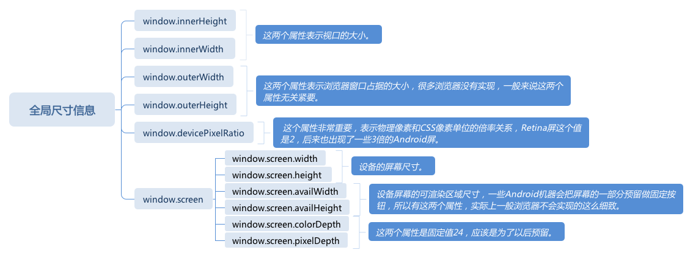

# CSSOM

CSSOM 是 CSS 的对象模型，在 W3C 标准中，它包含两个部分：描述样式表和规则等 CSS 的模型部分（CSSOM），和元素视图相关的 View 部分（CSSOM View）。

CSSOM View 相当于扩展的 DOM 的 API，在实际使用中，CSSOM View 比 CSSOM 更常用一些，因为我们很少需要用代码去动态地管理样式表。

## CSSOM 样式和规则模型部分

CSS 中样式表的模型，可以让我们直接使用 CSSOM API 去操作它们生成的样式表。

### document.styleSheets

document.styleSheets 属性表示文档中的所有样式表，这是一个只读的列表，我们可以用方括号运算符下标访问样式表，也可以使用 item 方法来访问，它有 length 属性表示文档中的样式表数量

**样式表只能使用 style 标签或者 link 标签创建，无法用 CSSOM API 来创建样式表，但是我们可以修改样式表中的内容。** 因为在文档的样式表加载时，一个 CSSStyleSheet 对象由浏览器自动创建并插入至文档的 Document.styleSheets 列表中。由于样式表列表不能直接修改，我们没有什么有效的手段去手动创建一个新的 CSSStyleSheet 对象（不过 Constructable Stylesheet Objects 很快会来到 web 平台，而且 Blink 早已支持）。需要创建新的样式表就直接在文档中插入 style 或 link 元素吧。

document.styleSheets 返回的是一个 StyleSheetList（CSSStyleSheet[]），CSSStyleSheet 接口代表了一个样式表，并允许检查和编辑样式表中的规则列表，它继承自父类型 [StyleSheet](https://developer.mozilla.org/zh-CN/docs/Web/API/StyleSheet)。一个 CSS 样式表包含了一组表示规则的 CSSRule 对象。每条 CSS 规则可以通过与之相关联的对象进行操作，这些规则被包含在 CSSRuleList 内，可以通过样式表的 cssRules (en-US) 属性获取。

CSSStyleSheet 获取 cssRules 属性返回一个实时的 CSSRuleList，其中包含组成样式表的 CSSRule 对象的一个最新列表。CSSStyleRule 表示一条 CSS 样式规则。它实现了 CSSRule 接口，它由两个属性：selectorText 和 style。

selectorText 部分是一个字符串。

style 部分是一个样式表，它跟我们元素的 style 属性是一样的类型，所以我们可以像修改内联样式一样，直接改变属性修改规则中的具体 CSS 属性定义，也可以使用 cssText 这样的工具属性。

```
document.styleSheets -> StyleSheetList（CSSStyleSheet[]）->CSSStyleSheet.cssRules -> CSSRuleList（CSSStyleRule[]）-> CSSStyleRule实现了CSSRule 接口，它由两个属性selectorText 和 style
```

#### CSSStyleSheet.insertRule()

用来给当前样式表插入新的样式规则

```js
document.styleSheets[0].insertRule('p {color: pink;}', 0)
```

尽管 insertRule() 是 CSSStyleSheet 的一个方法，但它实际插入的地方是 CSSStyleSheet.cssRules 的内部 CSSRuleList。

#### CSSStyleSheet.deleteRule()

```js
document.styleSheets[0].deleteRule(0)
```

#### cssRules 下的操作

```js
document.styleSheets[0].insertRule('div {color: blue;}', 0)
const cssStyleRule = document.styleSheets[0].cssRules[0]
// 返回值：{selectorText: 'div', style: CSSStyleDeclaration, styleMap: StylePropertyMap, type: 1, cssText: 'div { color: blue; }', …}
cssStyleRule.style.fontWeight = 'bold' // 就像我们在 DOM 上修改样式一样
```

### window.getComputedStyle(element, [pseudoElt])

CSSOM 还提供了一个非常重要的方法，来获取一个元素最终经过 CSS 计算得到的属性：

语法：`window.getComputedStyle(element, [pseudoElt])`

第一个参数就是我们要获取属性的元素，第二个参数是可选的，用于选择伪元素。返回值 style 是一个实时的 CSSStyleDeclaration 对象，当元素的样式更改时，它会自动更新本身。

```js
var demo = document.getElementById('demo')
var style = window.getComputedStyle(demo)

// 例如：可以获取demo元素的滚动属性来判断它是否可滚动
// 不过这个判断只是说明元素的样式属性规定元素是否可滚动，但是当前元素是否真的有滚动条，还得看具体的元素中的内容有没有溢出
console.log(style.overflowY !== 'hidden')

//还有另外一个写法是：document.defaultView.getComputedStyle(demo)，解决在 firefox3.6 上访问子框架内的样式
```

## CSSOM View

CSSOM View 这一部分的 API 可以视为 DOM API 的扩展，它在原本的 Element 接口上，添加了显示相关的功能。

### 窗口 API

窗口 API 用于操作浏览器窗口的位置、尺寸等：

- moveTo(x, y) 窗口移动到屏幕的特定坐标
- moveBy(x, y) 窗口移动特定距离
- resizeTo(x, y) 改变窗口大小到特定尺寸
- resizeBy(x, y) 改变窗口大小特定尺寸

关于 moveTo 等以上属性不生效的问题可以看一下此回答[javascript-window-moveby-not-working](https://stackoverflow.com/questions/38527683/javascript-window-moveby-not-working)，看一下此示例：[https://www.w3schools.com/jsref/tryit.asp?filename=tryjsref_win_moveto](https://www.w3schools.com/jsref/tryit.asp?filename=tryjsref_win_moveto)

此外，窗口 API 还规定了 window.open() 的第三个参数：

```js
window.open('about:blank', '_blank', 'width=100,height=100,left=100,right=100')
```

不过，一些游览器处于安全考虑没有实现，也不适用于移动端浏览器。

### 滚动 API

要想理解滚动，首先我们必须要建立一个概念，在 PC 时代，浏览器可视区域的滚动和内部元素的滚动关系是比较模糊的，但是在移动端越来越重要的今天，两者必须分开看待，两者的性能和行为都有区别。

#### 视口滚动 API

可视区域（视口）滚动行为由 window 对象上的一组 API 控制：

- scrollX 视口的属性，表示 X 方向上的当前滚动距离，有别名 pageXOffset
- scrollY 视口的属性，表示 Y 方向上的当前滚动距离，有别名 pageYOffset
- scroll(x, y) 使得页面滚动到特定的位置，有别名 scrollTo，**支持传入配置型参数 {top, left}**
- scrollBy(x, y) 使得页面滚动特定的距离，支持传入配置型参数 {top, left}

```js
window.scroll(100, 100)

// 相当于
window.scroll({
  top: 100,
  left: 100,
  behavior: 'smooth', // behavior 表示滚动行为，支持参数：smooth (平滑滚动)，instant (瞬间滚动)，默认值 auto，效果视浏览器而定
})
```

通过这些属性和方法，我们可以读取视口的滚动位置和操纵视口滚动。不过，要想监听视口滚动事件，需要在 document 对象上绑定事件监听函数。

```js
document.addEventListener('scroll', function (event) {
  console.log(window.scrollY)
})
```

#### 元素滚动 API

在 Element 接口中为了支持滚动，加入了以下 API：

- scrollTop 元素的属性，可以**获取或设置**一个元素的内容在垂直方向（Y 方向）的滚动距离，这里的滚动指的是元素内部的滚动。

一个元素的 scrollTop 值 是这个元素的内容顶部（卷起来的）到它的视口可见内容（的顶部）的距离的度量。当一个元素的内容没有产生垂直方向的滚动条，那么它的 scrollTop 值为 0。

- scrollLeft 元素的属性，可以**获取或设置**元素滚动条到元素左边（X 方向）的距离
- scrollWidth 元素的属性，表示元素内部的滚动内容的宽度，一般来说会大于等于元素的宽度

scrollWidth 值等于元素在不使用水平滚动条的情况下适合视口中的所有内容所需的最小宽度。 宽度的测量方式与 clientWidth 相同：**它包含元素的内边距，但不包括边框，外边距或垂直滚动条（如果存在）**。 它还可以包括伪元素的宽度，例如::before 或::after。 如果元素的内容可以完全展示而不需要水平滚动条，则其 scrollWidth 等于 clientWidth

- scrollHeight 元素的属性，表示元素内部的滚动内容的高度（包括由于溢出导致视图中不可见的内容），一般来说会大于等于元素的高度
- scroll(x, y) 使元素中的内容滚动到特定的位置，有别名 scrollTo，支持传入配置型参数 {top, left}
- scrollBy(x, y) 使元素中的内容滚动一段距离，支持传入配置型参数 {top, left}
- scrollIntoView(argument) 滚动元素所在的父元素，使得元素滚动到可见区域，可以通过 argument 来指定滚到中间、开始或者就近。

```js
element.scrollIntoView() // 等同于 element.scrollIntoView(true)
element.scrollIntoView(alignToTop) // Boolean 型参数
element.scrollIntoView(scrollIntoViewOptions) // Object 型参数
```

参数：

- alignToTop 是一个 Boolean，如果为 true，元素的顶端将和其所在滚动区的可视区域的顶端对齐。相应的 scrollIntoViewOptions: {block: "start", inline: "nearest"}。这是这个参数的默认值。如果为 false，元素的底端将和其所在滚动区的可视区域的底端对齐。相应的 scrollIntoViewOptions: {block: "end", inline: "nearest"}。

- scrollIntoViewOptions 是一个对象，包含 behavior、block、inline。其中 block 定义垂直方向的对齐 "start", "center", "end", 或 "nearest"之一。默认为 "start"。inline 定义水平方向的对齐，“start"，“center”， “end” 或 “nearest” 之一，默认为 “nearest”。

除此之外，可滚动的元素也支持 scroll 事件，在元素上监听它的事件即可：

```js
var demo = document.getElementById('demo')
demo.addEventListener('scroll', function (event) {
  console.log(event.target.scrollTop)
})
```

### 布局 API

#### 全局布局信息

window 对象上提供了一些全局的尺寸信息，它是通过属性来提供的。



虽然 window 有这么多相关信息，主要使用的是 innerHeight、innerWidth 和 devicePixelRatio 三个属性。

#### 元素布局信息

我们首先要消除“元素有宽高”这样的概念，事实上只有盒有宽和高，元素是没有的，元素产生盒，有些元素可能产生多个盒。所以我们获取宽高的对象应该是“盒”，于是 CSSOM View 为 Element 类添加了两个方法：

- getClientRects()

返回一个列表，里面包含元素对应的每一个盒所占据的客户端矩形区域，这里每一个矩形区域可以用 x，y，width，height 来获取他们的尺寸。

返回值是 ClientRect 对象集合，该对象是与该元素相关的 CSS 边框（元素设置边框后能出来几个矩形，就说明返回的列表 length 是几）。

起初，微软打算让这个方法给文本的每一行都返回一个 TextRectangle，但是，CSSOM 工作草案规定它应该给每个边框返回一个 ClientRect。因此，对于行内元素这两个定义是相同的，但是对于块级元素，Mozilla 只会返回一个矩形。（**对于行内元素，元素内部的每一行都会有一个边框；对于块级元素，如果里面没有其他元素，一整块元素只有一个边框**）。

[一个 getClientRects 使用的答疑](https://stackoverflow.com/questions/53684908/when-does-element-getclientrects-return-a-collection-of-multiple-objects)

- getBoundingClientRect()

这个 API 的设计更接近我们脑海中的元素盒的概念，它返回元素对应的所有盒的包裹的矩形区域。

返回值是一个 DOMRect 对象，是包含整个元素的最小矩形（包括 padding 和 border-width）。该对象使用 left、top、right、bottom、x、y、width 和 height 这几个以像素为单位的只读属性描述整个矩形的位置和大小。除了 width 和 height 以外的属性是相对于视图窗口的左上角来计算的。

以上两个 API 获取的矩形区域都是相对于视口的坐标，这意味着是受滚动影响的，如果我们要获取相对坐标，或者包含滚动区域的坐标，需要一点小技巧：

```js
var offsetX = document.documentElement.getBoundingClientRect().y - element.getBoundingClientRect().y
```

## 一些元素尺寸区别

### 元素宽度

- clientWidth 元素内部的宽度，包括内边距（padding），但不包括边框（border）、外边距（margin）和垂直滚动条（如果存在）。对于内联元素以及没有 CSS 样式的元素 clientWidth 为 0。
- offsetWidth 元素的布局宽度，一个典型的 offsetWidth 包含元素的边框 (border)、水平线上的内边距 (padding)、竖直方向滚动条 (scrollbar)（如果存在的话）、以及 CSS 设置的宽度 (width) 的值。各浏览器的 offsetWidth 可能有所不同，这个值是个四舍五入的整数，如果需要精确的小数，使用 getBoundingClientRect()
- scrollWidth 元素内容的宽度，指元素在不使用水平滚动条的情况下适合视口中的所有内容所需的最小宽度。 宽度的测量方式与 clientWidth 相同：**它包含元素的内边距，但不包括边框，外边距或垂直滚动条（如果存在）**。 它还可以包括伪元素的宽度，例如::before 或::after。 如果元素的内容可以完整展示而不需要水平滚动条，则其 scrollWidth 等于 clientWidth

元素的高度也类似。

### 元素的定位

- clientTop 元素顶部边框的宽度，即 border-top 的宽度
- offsetTop 元素外边框相对于其 offsetParent 元素的顶部内边距（边框内围）的距离
- scrollTop 可以**获取或设置**一个元素的内容在垂直方向（Y 方向）的滚动距离，这里的滚动指的是元素内部的滚动。
- 通过 getBoundingClientRect() 获取的元素尺寸中，top 或者 y 是元素布局尺寸（边框）到视口的距离

> HTMLElement.offsetParent，是一个只读属性，返回一个指向最近的（指包含层级上的最近）包含该元素的定位元素或者最近的 table, td, th, body 元素。当元素的 style.display 设置为 "none" 或者该元素的 style.position 被设为 "fixed"时，offsetParent 返回 null。

## 推荐阅读

- [用 Javascript 获取页面元素的位置](https://www.ruanyifeng.com/blog/2009/09/find_element_s_position_using_javascript.html)
- [详细解析 JavaScript 获取元素的坐标](https://www.cnblogs.com/dong-xu/p/7150715.html)
