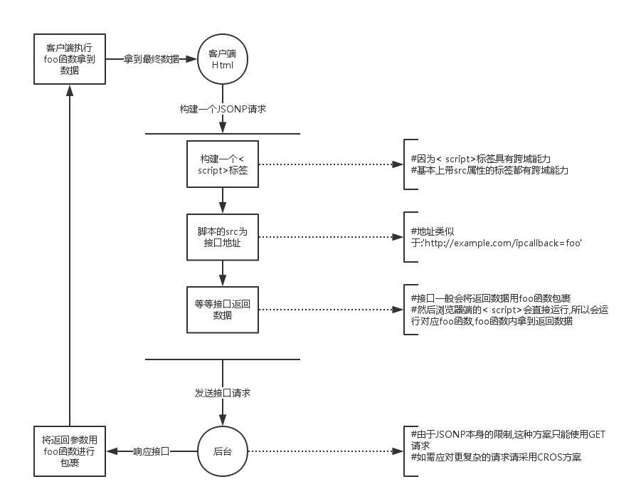

# 前端请求跨域

## 一些定义

* **同源：** 相同来源	同域名、同端口、同协议   

* **同源策略：** 是一种约定，最核心也最基本的安全功能，Web是构建在同源策略基础之上的。

* **跨域：** 访问/请求某个接口/某个地址：必须遵循同域名、同端口、同协议才能正常使用。只要有一个不统一，那么就为跨域。如果不同源，就会产生跨域问题。

* 如果非同源，共有三种行为受到限制。
  - Cookie、LocalStorage 和 indexedDB 无法读取。
  - DOM 无法获得。
  - AJAX 请求不能发送。

<br/>

## Ajax跨域解决

### JSONP

JSONP是之前服务器与客户端跨源通信的常用方法。最大特点就是简单适用，老式浏览器全部支持，服务器改造非常小。  

#### 基本思想

网页通过添加一个`<script>`元素，向服务器请求JSON数据，这种做法不受同源政策限制(因为`script`、`img`这些带src请求资源的都能请求网络的任意位置资源)；服务器收到请求后，将数据放在一个指定名字的回调函数里传回来。

#### 具体方法

1、首先，网页动态插入`<script>`元素，由它向跨源网址发出请求。
```
function addScriptTag(src) {
  var script = document.createElement('script');
  script.setAttribute("type","text/javascript");
  script.src = src;
  document.body.appendChild(script);
}

window.onload = function () {
  addScriptTag('http://example.com/ip?callback=foo');
}

function foo(data) {
  console.log('Your public IP address is: ' + data.ip);
};
```
上面代码通过动态添加`<script>`元素，向服务器`example.com`发出请求。注意，该请求的查询字符串有一个**callback参数**，用来指定回调函数的名字，这对于JSONP是**必需**的。  

2、服务器收到这个请求以后，会将数据放在回调函数的参数位置返回。
```
foo({
  "ip": "8.8.8.8"
});
```
由于`<script>`元素请求的脚本，直接作为代码运行。这时，只要浏览器定义了`foo函数`，该函数就会立即调用。作为参数的JSON数据被视为JavaScript对象，而不是字符串，因此避免了使用`JSON.parse`的步骤。

图解流程：  



基于JSONP的实现原理,所以**JSONP只能是“GET”请求**,不能进行较为复杂的POST和其它请求,所以遇到那种情况,就得参考下面的CORS解决跨域了。


### CORS

CORS是一个W3C标准，全称是"跨域资源共享"（Cross-origin resource sharing）。  
它允许浏览器向跨源服务器，发出XMLHttpRequest请求，从而克服了AJAX只能同源使用的限制。

#### 简介

**CORS需要浏览器和服务器同时支持。** 目前，所有浏览器都支持该功能，IE浏览器**不能低于IE10**。

整个CORS通信过程，都是**浏览器自动完成**，不需要用户参与。对于开发者来说，CORS通信与同源的AJAX通信没有差别，代码完全一样。浏览器一旦发现AJAX请求跨源，就会自动添加一些附加的头信息，有时还会多出一次附加的请求，但用户不会有感觉。

因此，实现CORS通信的关键是服务器。**只要服务器实现了CORS接口，就可以跨源通信。**

#### 两种请求

浏览器将CORS请求分成两类：**简单请求（simple request）** 和 **非简单请求（not-so-simple request）**。

> 简单请求

只要同时满足以下两大条件，就属于简单请求。  
```
(1) 请求方法是以下三种方法之一：
HEAD
GET
POST

(2)HTTP的头信息不超出以下几种字段：
Accept
Accept-Language
Content-Language
Last-Event-ID
Content-Type：只限于三个值application/x-www-form-urlencoded、multipart/form-data、text/plain
```

#### 处理简单请求基本流程

对于简单请求，浏览器直接发出CORS请求。具体来说，浏览器如果发现这次跨源AJAX请求是简单请求，就自动在头信息之中，添加一个Origin字段。
```
GET /cors HTTP/1.1
Origin: http://api.bob.com
Host: api.alice.com
Accept-Language: en-US
Connection: keep-alive
User-Agent: Mozilla/5.0...

Origin字段用来说明，本次请求来自哪个源（协议 + 域名 + 端口）。服务器根据这个值，决定是否同意这次请求。
```

如果Origin指定的域名在许可范围内，服务器返回的响应，会多出几个头信息字段。
```
Access-Control-Allow-Origin: http://api.bob.com
Access-Control-Allow-Credentials: true
Access-Control-Expose-Headers: FooBar
Content-Type: text/html; charset=utf-8

(1)Access-Control-Allow-Origin
该字段是必须的。它的值要么是请求时Origin字段的值，要么是一个*，表示接受任意域名的请求。

(2)Access-Control-Allow-Credentials
该字段可选。它的值是一个布尔值，表示是否允许发送Cookie。默认情况下，Cookie不包括在CORS请求之中。设为true，即表示服务器明确许可，Cookie可以包含在请求中，一起发给服务器。这个值也只能设为true，如果服务器不要浏览器发送Cookie，删除该字段即可。

(3)Access-Control-Expose-Headers
该字段可选。CORS请求时，XMLHttpRequest对象的getResponseHeader()方法只能拿到6个基本字段：Cache-Control、Content-Language、Content-Type、Expires、Last-Modified、Pragma。如果想拿到其他字段，就必须在Access-Control-Expose-Headers里面指定。上面的例子指定，getResponseHeader('FooBar')可以返回FooBar字段的值。
```

#### 扩展——withCredentials

CORS请求默认不发送Cookie和HTTP认证信息。如果要把Cookie发到服务器，一方面要服务器同意，指定`Access-Control-Allow-Credentials`字段。另一方面，开发者必须在AJAX请求中打开`withCredentials`属性。否则，即使服务器同意发送Cookie，浏览器也不会发送。或者，服务器要求设置Cookie，浏览器也不会处理。如下：
```
//服务器端设置
Access-Control-Allow-Credentials: true

//客户端设置
var xhr = new XMLHttpRequest();
xhr.withCredentials = true;
```

*注意：*  
1、如果省略withCredentials设置，有的浏览器还是会一起发送Cookie。这时，可以显式关闭withCredentials。
```
xhr.withCredentials = false;
```

2、如果要发送Cookie，`Access-Control-Allow-Origin`就不能设为星号，必须指定明确的、与请求网页一致的域名。同时，Cookie依然遵循同源政策，只有用服务器域名设置的Cookie才会上传，其他域名的Cookie并不会上传，且（跨源）原网页代码中的document.cookie也无法读取服务器域名下的Cookie。  

> 非简单请求

非简单请求是那种对服务器有特殊要求的请求，比如请求方法是PUT或DELETE，或者Content-Type字段的类型是application/json。即不同时满足简单请求两个条件的就是非简单请求。

#### 预检请求

非简单请求的CORS请求，会在正式通信之前，增加一次HTTP查询请求，称为"预检"请求（preflight）。  

浏览器先询问服务器，当前网页所在的域名是否在服务器的许可名单之中，以及可以使用哪些HTTP动词和头信息字段。只有得到肯定答复，浏览器才会发出正式的XMLHttpRequest请求，否则就报错。如下：  
```
var url = 'http://api.alice.com/cors';
var xhr = new XMLHttpRequest();
xhr.open('PUT', url, true);
xhr.setRequestHeader('X-Custom-Header', 'value');
xhr.send();

上面代码中，HTTP请求的方法是PUT，并且发送一个自定义头信息X-Custom-Header。
```
浏览器发现，这是一个非简单请求，就自动发出一个"预检"请求，要求服务器确认可以这样请求。下面是这个"预检"请求的HTTP头信息。  
```
OPTIONS /cors HTTP/1.1
Origin: http://api.bob.com
Access-Control-Request-Method: PUT
Access-Control-Request-Headers: X-Custom-Header
Host: api.alice.com
Accept-Language: en-US
Connection: keep-alive
User-Agent: Mozilla/5.0...

"预检"请求用的请求方法是OPTIONS，表示这个请求是用来询问的。头信息里面，关键字段是Origin，表示请求来自哪个源。
除了Origin字段，"预检"请求的头信息包括两个特殊字段。

(1)Access-Control-Request-Method
该字段是必须的，用来列出浏览器的CORS请求会用到哪些HTTP方法，上例是PUT。

(2)Access-Control-Request-Headers
该字段是一个逗号分隔的字符串，指定浏览器CORS请求会额外发送的头信息字段，上例是X-Custom-Header。
```

#### 预检请求回应

服务器收到"预检"请求以后，检查了`Origin`、`Access-Control-Request-Method`和`Access-Control-Request-Headers`字段以后，确认允许跨源请求，就可以做出回应。
```
HTTP/1.1 200 OK
Date: Mon, 01 Dec 2008 01:15:39 GMT
Server: Apache/2.0.61 (Unix)
Access-Control-Allow-Origin: http://api.bob.com
Access-Control-Allow-Methods: GET, POST, PUT
Access-Control-Allow-Headers: X-Custom-Header
Content-Type: text/html; charset=utf-8
Content-Encoding: gzip
Content-Length: 0
Keep-Alive: timeout=2, max=100
Connection: Keep-Alive
Content-Type: text/plain
```

#### 预检请求失败

浏览器否定了"预检"请求，会返回一个正常的HTTP回应，但是没有任何CORS相关的头信息字段。这时，浏览器就会认定，服务器不同意预检请求，因此触发一个错误，被XMLHttpRequest对象的onerror回调函数捕获。控制台会打印出如下的报错信息。
```
XMLHttpRequest cannot load http://api.alice.com.
Origin http://api.bob.com is not allowed by Access-Control-Allow-Origin.
```

服务器回应的其他CORS相关字段如下:  
```
Access-Control-Allow-Methods: GET, POST, PUT
Access-Control-Allow-Headers: X-Custom-Header
Access-Control-Allow-Credentials: true
Access-Control-Max-Age: 1728000

(1)Access-Control-Allow-Methods
该字段必需，它的值是逗号分隔的一个字符串，表明服务器支持的所有跨域请求的方法。注意，返回的是所有支持的方法，而不单是浏览器请求的那个方法。这是为了避免多次"预检"请求。

(2)Access-Control-Allow-Headers
如果浏览器请求包括Access-Control-Request-Headers字段，则Access-Control-Allow-Headers字段是必需的。它也是一个逗号分隔的字符串，表明服务器支持的所有头信息字段，不限于浏览器在"预检"中请求的字段。

(3)Access-Control-Allow-Credentials
该字段与简单请求时的含义相同。

(4)Access-Control-Max-Age
该字段可选，用来指定本次预检请求的有效期，单位为秒。上面结果中，有效期是20天（1728000秒），即允许缓存该条回应1728000秒（即20天），在此期间，不用发出另一条预检请求。
```

#### 预检请求成功

一旦服务器通过了"预检"请求，以后每次浏览器正常的CORS请求，就都跟简单请求一样，会有一个Origin头信息字段。服务器的回应，也都会有一个Access-Control-Allow-Origin头信息字段。  

下面是"预检"请求之后，**浏览器**的正常CORS请求：
```
PUT /cors HTTP/1.1
Origin: http://api.bob.com
Host: api.alice.com
X-Custom-Header: value
Accept-Language: en-US
Connection: keep-alive
User-Agent: Mozilla/5.0...

上面头信息的Origin字段是浏览器自动添加的。
```

下面是**服务器**正常的回应:
```
Access-Control-Allow-Origin: http://api.bob.com
Content-Type: text/html; charset=utf-8
```

#### 与JSONP比较

CORS与JSONP的使用目的相同，但是比JSONP更强大。

JSONP只支持GET请求，CORS支持所有类型的HTTP请求。JSONP的优势在于支持老式浏览器，以及可以向不支持CORS的网站请求数据。


