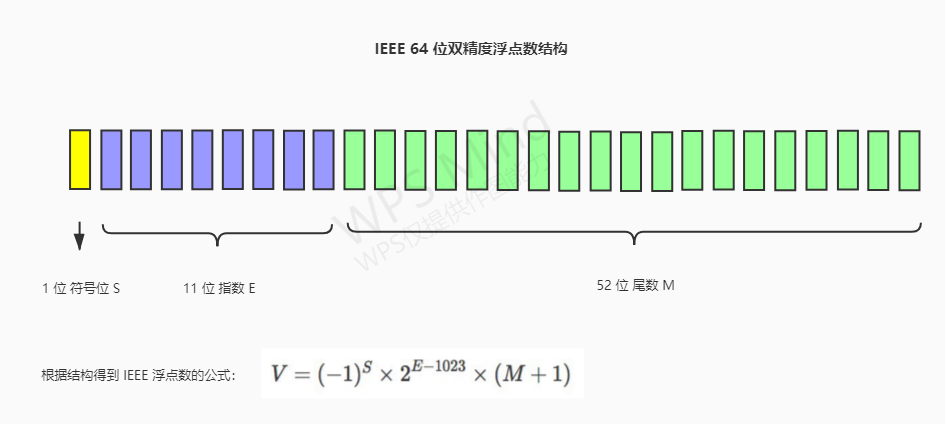
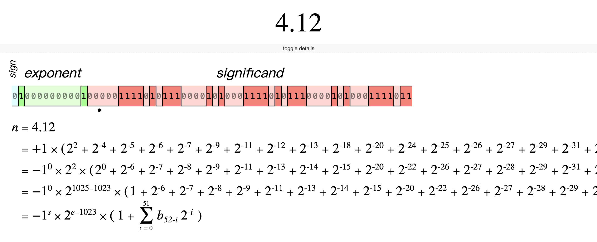
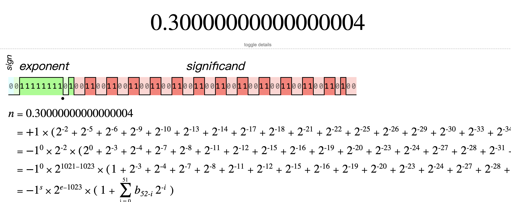

# JavaScript 运算符相关拾遗

## 运算符优先级

运算符的优先级决定了表达式中运算执行的先后顺序，优先级高的运算符会作为优先级低的运算符的操作数。

```js
console.log(4 * 3 ** 2) // 4 * 9

let a, b
console.log((a = b = 5)) // 5
```

### 优先级和结合性

```
a OP1 b OP2 c
```

如果 OP1 和 OP2 **具有不同的优先级**，则优先级最高的运算符先执行，不用考虑结合性。

```js
console.log(3 + 10 * 2) // 相当于 console.log(3 + (10 * 2)) 输出 23

console.log((3 + 10) * 2) // 括号 () 的优先级最高，改变了优先级，输出 26
```

仅使用一个或多个不同优先级的运算符时，结合性不会影响输出，当**有多个具有相同优先级的运算符**时，结合性的差异就会发挥作用。

左结合（左到右）相当于把左边的子表达式加上小括号 `(a OP b) OP c`，右结合（右到左）相当于 `a OP (b OP c)`。赋值运算符是右结合的，例如：

```js
a = b = 5 // 相当于 a = (b = 5)

// 举个明显的例子
var a = 1
a += a *= a -= 1
// 1.根据赋值运算符右结合原理，上面的表达式化为 a += (a *= (a -= 1))
// 2.展开等号， a = a + (a = a * (a = a - 1))
// JavaScript 的一个特性：在一个表达式中，多余的赋值运算会被忽略
// 3.忽略多余的赋值运算，最后得到 a = 1 + (1 * (1 - 1))
// 4.最后表达式的结果是 1，a 的结果也还是 1
```

### 注意点

#### 1、算数运算符中，只有幂运算符（`**`）是右结合的，而其他算术运算符都是左结合的。

```
2 ** 3 ** 2 // 相当于 2 ** (3 ** 2)
```

#### 2、展开语法不是一个运算符，因此没有优先级（也可以理解为优先级最低）。它是数组字面量和函数调用（和对象字面量）语法的一部分

```
let a = '123'
console.log(...a && '321') // 3 2 1 跟 console.log(...(a && '321')) 一致
console.log(...a = '321') // 3 2 1 跟 console.log(...(a = '321')) 一致
```

#### 3、要注意一元运算符的关联顺序。当有多个一元运算符连接时，从右向左执行。例如 new、！、typeof 等。

#### 4、逗号作为运算符时，其优先级是最低的。逗号只有在表达式中作运算符使用，在其他地方都是作为操作符使用的，如：函数传参，变量声明、数组/对象定义

```js
console.log(1, 2, 3, 4, 5, 6) // 1 2 3 4 5 6
console.log((1, 2, 3, 4, 5, 6)) // 6
console.log([1, 2, 3]) // [1, 2, 3]
console.log([(1, 2, 3)]) // [3]
```

### 分组和短路

**分组（Grouping）** 具有最高优先级。然而，这并不意味着总是优先对分组符号`(...)`内的表达式进行求职，尤其是涉及短路时。

短路是条件求值的术语，例如，在表达式 `a && (b + c)` 中，如果 `a` 为假（[falsy](https://developer.mozilla.org/zh-CN/docs/Glossary/Falsy)），那么即使 `(b + c)` 在圆括号中，也不会被求值，这时我们可以说逻辑与运算符（&&）是“短路的”。除此之外，其他的短路运算符还包括 逻辑或（OR）、空值合并、可选链和三元运算符。

```
a || (b * c) // 首先对 a 求值，如果 a 为真值则直接返回 a
a && (b < c) // 首先对 a 求值，如果 a 为假值则直接返回 a
a ?? (b || c) // 首先对 a 求值，如果 a 不是 null 或 undefined 则直接返回 a
a?.b.c // 首先对 a 求值，如果 a 是 null 或 undefined 则直接返回 undefined
```

#### 需要注意 false && true || true

在 JavaScript 中，逻辑运算符 &&（与）的优先级高于 ||（或）。因此，表达式 false && true || true 会先执行 false && true，然后再与 true 进行 || 运算。

```
false && true || true // 相当于 (false && true) || true 结果是 true

false && (true || true) // 改成这样结果就是 false 了
```

### [运算符优先级汇总表](https://developer.mozilla.org/zh-CN/docs/Web/JavaScript/Reference/Operators/Operator_Precedence#%E6%B1%87%E6%80%BB%E8%A1%A8)

### 一些判断优先级的例子

#### 第一个例子

```js
3 > 2 > 1
// 返回 false，因为 3 > 2 是 true，然后 true 会在比较运算符中被隐式转换为 1，因此 true > 1 会变为 1 > 1，结果是 false
// 加括号可以更清楚：(3 > 2) > 1
```

#### 第二个例子

```js
function Foo() {
  getName = function() {
    console.log(1)
  }
  return this
}
Foo.getName = function() {
  console.log(2)
}
Foo.prototype.getName = function() {
  console.log(3)
}
var getName = function() {
  console.log(4)
}
function getName() {
  console.log(5)
}

Foo.getName() //2
getName() //4
Foo().getName() //1
getName() // 1
new Foo.getName() // 2 相当于 new (Foo.getName)()
new Foo().getName() //3 相当于 (new Foo()).getName()
new new Foo().getName() //3 相当于 new ((new Foo()).getName())
```

##### new (带参数列表)、new (无参数列表)与点运算符的优先级

- new (带参数列表) 和成员访问（点运算符）的优先级是一样的（都是 18），优先级一样的情况下，表达式从左向右运算，就好像加和减的优先级一样，计算时从左向右算。因此出现 `new Foo().getName()` 这样的表达式时，从左向右，先计算 `new Foo()`, 再计算 `**.getName`，相当于`(new Foo()).getName()`。就像 3+2-1，就相当于(3+2)-1，我们知道这里的括号可以省略，是因为熟悉这样的运算顺序。

> 带参数列表不一定要有实参，带了括号就表示能带参数的表达式，new Foo()和 new Foo(10)是一样的表达式，前者的参数为 0 个而已。

- new (无参数列表)的优先级是 17，成员访问（点运算符）的优先级是 18，点运算符优先级更高，所以 `new Foo.getName()` 先计算优先级更高的，也就是计算 `Foo.getName`，再计算 `new **`。

#### 第三个例子

```js
let a = 1
console.log(a-- + --a)
console.log(a)
```

- **后置递减运算**优先于**前置递减运算**优先于**加法运算**，加括号：(a--) + (--a)
- 后置递减先参与运算再减，所以加号左边为 1，此时 a 为 0
- 前置加法先减后参与运算，所以加号右边为 -1，此时 a 为 -1
- 运算结果为 1 + -1 = 0，a 最终为 -1

#### 第四个例子

```js
console.log(!2 - 1 || 0 - 2)
```

- **逻辑非**优先于**减法**优先于**逻辑或**，加括号：((!2) - 1) || (0 - 2)
- !2 转化为布尔为 false，再转化为数字为 0，式子为：(0 - 1) || (0 - 2)
- 逻辑或前一项为 -1，为真值，触发逻辑短路，运算结果为 -1

#### 第五个例子

```js
console.log(0 < 1 < 2 == 2 > 1 > 0)
```

- **小于/大于**优先于**等于**，加括号：((0 < 1) < 2) == ((2 > 1) > 0)
- 左边 true < 2，true 转化为数字 1 < 2，左边结果为 true
- 右边 true > 0，true 转化为数字 1 > 0，右边结果也为 true
- 所以，运算结果为 true

#### 第六个例子

```js
console.log(...typeof 1)
```

- typeof 1 结果为 'number'
- 展开输出结果为 n u m b e r

#### 第七个例子

```
var top = 1['toString'].length
var fun = 'fun'
console.log((1 > 2 ? 1 : 2 - 10 ? 4 : 2, 1 ? top : fun))
```

- 注意表达式中间有个逗号，所以前半部分不用管，只看后半部分 1 ? top : fun，1 为真值，所以结果为 var 声明的变量 top
- 但是 var 声明的变量 top，是 window 的属性，window.top 属性，返回的是窗口层级最顶层窗口的引用，是个不可改写的属性
- 所以 top 打印出来的 top 是 Window 对象。

## 位运算符

### 按位与

与（&）：对应位都为 1 时结果为 1，否则为 0。

```js
let a = 5 // 二进制 101
let b = 3 // 二进制 011
let result = a & b // 二进制 001，即1
```

### 按位或

或（|）：只要对应位有一个为 1 时结果为 1，否则为 0。

```js
let a = 5 // 二进制 101
let b = 3 // 二进制 011
let result = a | b // 二进制 111，即7
```

### 按位非

非（~）：对操作数的每个位取反，即 0 变为 1，1 变为 0。

```js
let a = 5 // 二进制 101
let result = ~a // 二进制 11111111111111111111111111111010，即-6
```

### 按位异或

异或（^）：对应位相同为 0，不同为 1。

```js
let a = 5 // 二进制 101
let b = 3 // 二进制 011
let result = a ^ b // 二进制 110，即6
```

### 左移

左移（<<）：将数字的二进制位向左移动指定的位数，右侧空出的位用 0 填充。

```js
let a = 5 // 二进制 101
let result = a << 2 // 二进制 10100，即20
```

### 右移

右移（>>）：将数字的二进制位向右移动指定的位数，左侧空出的位用符号位填充（即正数用 0 填充，负数用 1 填充）。

```js
let a = -5 // 二进制 11111111111111111111111111111011，即-5
let result = a >> 2 // 二进制 11111111111111111111111111111110，即-2
```

在计算机科学中，对负数进行右移操作（即算术右移）是一个有趣且重要的主题。算术右移操作不仅移动数字的位，还保持了数字的符号。以下是对负数进行算术右移的步骤：

#### 1. 二进制表示

首先，负数在计算机中通常以二进制的补码形式表示。补码是一种特殊的二进制表示方式，用于方便地执行加法和减法运算。要得到一个负数的补码，首先将其对应的正数转换为二进制，然后进行两步操作：

- 取反：将所有的 0 变为 1，所有的 1 变为 0。
- 加一：在取反的基础上加 1。

例如，-5 的二进制补码表示（假设使用 8 位）是：

- +5 的二进制表示是 `00000101`。
- 取反得到 `11111010`。
- 加一得到 `11111011`。

#### 2. 算术右移

算术右移操作意味着将所有位向右移动指定的位数，同时保留符号位（即最左边的位）。对于负数的补码表示，符号位是 1。

例如，对 `-5 >> 1`（在 8 位系统中）进行算术右移操作：

- `-5` 的补码是 `11111011`。
- 向右移动一位得到 `11111101`（注意最左边的符号位保持不变）。

#### 3. 结果的解释

右移后的结果仍然是补码表示。在上面的例子中，`11111101` 是某个负数的补码。要理解它表示的是哪个负数，可以进行补码到原码的转换（即补码的逆操作）：

- 减一得到 `11111100`。
- 取反得到 `00000011`。
- 因为最初的补码表示了一个负数，所以这个结果表示 `-3`。

#### 注意

- 算术右移与逻辑右移不同。逻辑右移不保留符号位，而是在左侧插入 0。逻辑右移主要用于无符号数。
- 算术右移的行为在不同的编程语言或平台中可能略有不同，特别是对于移动的位数超过数值大小的情况。通常，编程语言的文档会详细说明这些行为。

### 无符号右移（逻辑右移）

无符号右移（>>>）：将数字的二进制位向右移动指定的位数，左侧空出的位用 0 填充。

```js
let a = -5 // 二进制 11111111111111111111111111111011，即-5
let result = a >>> 2 // 二进制 00111111111111111111111111111101，即1073741821
```

### 注意点

- JavaScript 中的数值都是以 64 位浮点数的形式存储的，但位运算符操作的是数值的前 32 位有符号整数部分，因此位运算符会将操作数视为 32 位有符号整数进行处理。
- 对于位运算符的操作数，会先将其转换为 32 位有符号整数，然后再进行位运算操作。
- 位运算符通常用于一些特定的场景，如权限控制、加密算法等，对于普通的数值运算通常不会用到位运算符。

## 数值精度问题

### 二进制

二进制是一种基数为 2 的数制，由 0 和 1 两个数字构成。十进制是逢十进一，二进制就是逢二进一。

#### 计算机底层通过二进制进行数据交互

数字电路是计算机物理基础构成，这些数字电路可以看成是一个个门电路集合，门电路的理论基础是逻辑运算。当计算机的电路通电工作，每个输出端就有了电压。电压的高低通过模数转换即转换成了二进制：高电平是由 1 表示，低电平由 0 表示。

#### 为什么使用的是二进制，或者说二进制的优点有哪些？

- 技术上容易实现，便宜，成本低：大规模制造二进制电路比较容易，二进制只需要区分出两种不同的电压，但是要制造出能够储存和处理十进制数的电路就很困难，需要电路能可靠的区分出十个不同的电压等级。
- 可靠：只使用 0 和 1，在存储和处理时不容易出错
- 运算规则简单：相比十进制数，二进制的运算规则简单得多，四则运算都可归结为加法和移位，由此，运算线路可以得到简化，从而提高运算速度

#### 计算机的十进制运算

计算机在处理十进制的运算时，会先把十进制的数字转换成二进制的数字，然后进行二进制的运算，得到的结果再转换成十进制。

##### 十进制整数转二进制

方法：将整数除于 2，反向取余数

```
22 / 2  =   11  -- 0 ⬆
11 / 2  =   5   -- 1 ⬆
5 / 2   =   2   -- 1 ⬆
2 / 2   =   1   -- 0 ⬆
1 / 2   =   0   -- 1 ⬆
```

22 转换为二进制数：10110

##### 十进制小数转二进制

方法：将小数部分乘以 2，然后取整数部分，直到小数部分为 0 截止。若小数部分一直都无法等于 0，那么就采用取舍。如果后面一位是 0，那么就舍去。如果后面为 1，那么就进一。读数要正向读。

```
0.125 * 2 = 0.25  -- 0 ⬇
0.25  * 2 = 0.5   -- 0 ⬇
0.5   * 2 = 1.0   -- 1 ⬇
```

0.125 转换为二进制数：0.001

##### 二进制转十进制

二进制转化为十进制，整数部分和小数部分的方法都是相同的。

方法：将二进制每位上的数乘以权，然后相加之和即是十进制数

```
101 = 1*2^2 + 0*2^1 + 1*2^0 = 4 + 0 + 1 = 5
0.101 = 1*2^-1 + 0*2^-2 + 1*2^-3 = 0.5 + 0 + 0.125 = 0.625

101.101(2) = 5 + 0.625 = 5.625(10)
```

101.101 转换为十进制数：5.625

### JavaScript 中的 Number

#### IEEE 754 标准的 64 位双精度浮点数

JavaScript 中的 Number 采用的是 IEEE 754 标准中的 64 位双精度浮点数，所以在 JavaScript 中，所有的数值都是通过浮点数表示。



- S 是符号位，指明这个数是正数还是负数，若 S = 0，该数为正，若 S = 1，该数为负。

- E 是指数位，表示将浮点数的尾数扩大或缩小 2 的 E 次方倍，并且它的偏置值是 1023。

- M 是尾数位（有效数字），64 位双精度浮点数存储时有 52 个有效尾数位，还有 1 个隐藏位。因为 IEEE 浮点数的尾数都是规格化的，其值在 1.0000...00 至 1.1111...11 之间（除非这个浮点数是 0，此时尾数为 0.0000...00）。由于尾数是规格化的，那么它的最高位总是 1，因此将尾数存入存储器时没必要保存最高位的 1，从而被隐藏。

##### 十进制浮点数转二进制后存储

举个例子，比如要将十进制浮点数 4.12 转为二进制并存储在计算机的 64 位中，那么：

第一步，先将 4.12 转为二进制数：

```
4.12.toString(2); // "100.00011110101110000101000111101011100001010001111011"
```

第二步，规格化。将小数点左移，直到尾数变为 1.xxx 的形式，每当小数点左移 1 位，指数就加 1，那么规格化后将得到：

```
1.0000011110101110000101000111101011100001010001111011 * 2^2
```

由此：

- 符号位 S 为 1，因为该数是正数；
- 指数位 E 为 2 + 1023 = 1025（这是十进制），转为二进制数就是：`(1025).toString(2); // "10000000001"`
- 尾数位 M 为 0000011110101110000101000111101011100001010001111011，这里省略了起始位 1

所以最终 4.12 这个十进制浮点数，在 64 位双精度浮点数表示法下，存储的各个位的情况是：

```
1 10000000001 0000011110101110000101000111101011100001010001111011
```

也可以用这个网站实际模拟一下：[http://bartaz.github.io/ieee754-visualization/](http://bartaz.github.io/ieee754-visualization/)



**IEEE 754 标准，可以理解为通过类似科学计数法的方式控制小数点的位置，来表示不同的数值。**

##### 尾数

尾数，也可以称为有效数字，64 位双精度浮点数存储时有 52 个有效尾数位，还有 1 个隐藏位。因为 IEEE 浮点数的尾数都是规格化的，其值在 1.0000...00 至 1.1111...11 之间（除非这个浮点数是 0，此时尾数为 0.0000...00）。由于尾数是规格化的，那么它的最高位总是 1，因此将尾数存入存储器时没必要保存最高位的 1，从而被隐藏。**这样 64 位双精度浮点数相当于可以保存 53 位有效数字** 。

##### 指数

E 是一个无符号的整数，那么在 64 位精度中(E 占 11 位)，可以表示的取值范围为 0 ～ 2047。但是其实我们的科学计数法指数部分是可以出现负数的。那么如何使用 E 来表示负数呢，可以将 E 取一个中间值（偏置值），左边的就为负指数，右边就为正指数了。于是 IEEE 754 就规定，E 的真实值(即在 exponent 中表示的值)必须再减去一个中间数，64 位精确度中的中间数是 1023。

同时指数 E 还可以根据规定分为三种情况讨论(以 64 位精确度作为讨论)

- E 不全为 0 或不全为 1

这个范围就是正常的浮点数表示，通过计算 E 然后减去 1023 即为指数

- E 全为 0

浮点数的指数 E 等于 0-1023 = -1023，当指数为-1023 时，有效数字 M 不再加上第一位的 1，而是还原为 0.xxxxxx 的小数。这样做是为了表示 ±0，以及接近于 0 的很小的数字

- E 全为 1

此时如果有效数字 M 全为 0，那么就表示+∞ 或者-∞，取决于第一位符号位。但是如果有效数字 M 不全为 0，则表示这不是一个数(NaN)

##### 精度

精度（Precision）用来衡量数据被表示得有多好。

存储时位数越多，那么意味着数的表示范围越大，精度也就越高。

所以，**“JavaScript 中所有数字都是用 64 位双精度浮点数表示的”** 这句话，告诉我们 JS 中的数字都是以 IEEE 754 的 64 位双精度标准来存储和处理的，这背后意味着有限的数表示范围和有限的表示精准度。

#### JavaScript 中 NaN 具体数量有多少个？

NaN 的定义为在 E 全为 1 的情况下，如果有效数字 M 不全为 0，则表示这不是一个数（NaN）。即排除掉有效数字 M 全为 0 的情况就行(+∞、-∞)


- 即有 `2*(2^52 - 1) = 9007199254740990` 个浮点值表示这一个 NaN 值
- 注意：在标准的 64 位浮点数中，这些值表示不同的 Not a Number 值；而在 ecma 中表示同一个 NaN 值，所以 `NaN !== NaN`

#### JavaScript 中最多可以表示多少个数值？

首先需明白在 JavaScript 中的数字是 64-bits 的双精度,所以有 2^64 种可能性，在上述中提到，当 E 全为 1 的时候，表示的要么为无穷数，要么为 NaN。所以不是数值的可能为 2^53 种，同时 JavaScript 中把+∞ 和-∞、NaN 定义为数值。所以 JavaScript 数值的总量为：


具体计算过程`·总数 = 2（正负 0） + 2*(2^52 - 1)（非规范化数值） + 2*(2^11 - 2)*2^52（规范化数值） + 2（正负无穷） + 1（NaN 值） = 2^64 - 2^53 + 3 = 18437736874454810627` 个。

#### JavaScript 中的最大安全整数值为什么为 9007199254740991?

64 位双精度浮点数，有效数字位实际有 53 位(包括最前面一位的 1.xxxx 中的 1 这个隐藏位)，如果超出了小数点后面 52 位以外的话，就遵从二进制舍 0 进 1 的原则，那么这样的数字就不是一一对应的，会有误差，精度就丢失了。也就不是安全数了。所以 JavaScript 中的最大安全整数值为：


```
Number.MAX_SAFE_INTEGER // 9007199254740991
```

##### 扩展

```
Number.MAX_SAFE_INTEGER === Math.pow(2, 53) - 1; // true
Number.MIN_SAFE_INTEGER === -Math.pow(2, 53) + 1; // true
```

在 Number.MIN_SAFE_INTEGER 和 Number.MAX_SAFE_INTEGER 之间的整数称为**安全整数**，可以通过 Number.isSafeInteger() 这个静态方法来判断一个值是否是安全整数：

```
Number.isSafeInteger('abc'); // false
Number.isSafeInteger(-Infinity); // false
Number.isSafeInteger(Number.MAX_SAFE_INTEGER); // true
```

#### JavaScript 中能表示的最大正数（最大值）是多少?

- 指数部分最大为：`2046`（因为如果是 2047，就奔着无穷去了）
- 尾数部分最大为：全部是 `1`（52 个 1）

由之前的 64 位双精度浮点数的计算公式可得出：

```
// 小数位 52 个1，整数也是 1（共 53 个 1）
// 1.1111...1 * 2^(2046 - 1023)
// ==>
// 1.1111...1 * 2^1023
// ==>
// 111111...1 * 2^(1023 - 52) // 尾数向左偏移 52 位，指数相应减 52
// ==>
// (2^53 - 1) * 2^971
```

所以**最大正数**，取值为 `(2^53 - 1) * 2^971` 约等于 1.797693134862315e+308

```
Number.MAX_VALUE // 1.7976931348623157e+308
```

#### JavaScript 中能表示的最小正数（最小值）是多少？

正规化数值中，当 e 为 `1`，m 为 `0` 时值最小：`1 * 2^(1-1023) = 2^-1022`

非正规化数值中，此时 e 为 `0` ，m 为 `0.000...01` 时值最小：`(0 + 0.000...01) * 2^-1022 = 2^(-1022-52) = 2^-1074`

所以**最小正数**，无限接近于 0，取值为 2^-1074 约等于 5e-324

```
Number.MIN_VALUE // 5e-324
```

#### 典型的奇怪问题

64 位双精度浮点数存在的精度问题主要有三种：

- 浮点数计算精度丢失
- 大数计算精度丢失
- 浮点数舍入误差

##### `Number.isInteger(3.0000000000000002); // true`

`Number.isInteger` 用来判断一个数为整数。

但是判断 3.0000000000000002 是一个整数，是因为精度问题。64 位双精度浮点数的二进制存储，位数一共有 53 位（1 个隐藏位，52 个有效位），如果数值超过这个位数那么就无法被精确表示。

如果将 3.0000000000000002 这个浮点数转成二进制，那么会超过 53 位，导致最后的 2 被丢弃了。

```
3.0000000000000002 === 3; // true
3.0000000000000002.toString(2); // "11"
```

##### 溢出问题（Overflow）

当运算结果超过了 JavaScript 所能表示的数的上限，就会得到正无穷或者负无穷，这种现象就叫做溢出。

- 正/负无穷进行四则运算后得到的结果还是正/负无穷

```
Infinity-10000; // Infinity
-Infinity * 2; // -Infinity
```

- 一个正数/负数除以 0，会得到正/负无穷

```
17/0; // Infinity
-0.3/0; // -Infinity
```

- 一个正数除以正/负 0，会得到正/负无穷

```
console.log(42 / +0); // Infinity
console.log(42 / -0); // -Infinity
```

- 一个负数除以正/负 0，会得到负/正无穷

```
console.log(-42 / +0); // -Infinity
console.log(-42 / -0); // Infinity
```

- 零除以零没有意义，将会得到一个 `NaN`

```
0/0; // NaN
```

- 可以通过 Number 上的静态属性来访问正负无穷值

```
Number.POSITIVE_INFINITY; // Infinity
Number.NEGATIVE_INFINITY; // -Infinity
```

- 通过 isFinite() 可以判断传入的参数是否是有限的，如果传参不是 NaN、Infinity 或 -Infinity 便会得到 true

```
isFinite(NaN) // false
isFinite(Number.POSITIVE_INFINITY) // false
isFinite(Number.NEGATIVE_INFINITY) // false
isFinite(1e3) // true
```

##### 下溢（Underflow）

- 如果运算结果无限接近 0，比 JS 能表示的最小值还要小时，就是下溢，这时 JS 中会得到 0。

- 如果是一个无限小（接近于 0）的负数，那么会得到负零（-0）

- 0 同时表示为 -0 和 +0（其中 0 是 +0 的别名）。实际上，这两者之间几乎没有区别；例如，+0 === -0 是 true

- 一个 0 除以 正数/负数，会得到正/负 0

```
0/17; // 0
/-0.3; // -0
```

- 总结一下：

```
大于 Number.MAX_VALUE 的正值被转换为 +Infinity。
小于 Number.MIN_VALUE 的正值被转换为 +0。
小于 -Number.MAX_VALUE 的负值被转换为 -Infinity。
大于 -Number.MIN_VALUE 的负值被转换为 -0。
```

##### `toFixed()` 和 `toPrecision()`

`toFixed()` 可以将数字转换为字符串，并保留指定的小数位数，如果需要截断，会采用近似的四舍五入。

`toPrecsion()` 返回一个以指定精度表示该数字的字符串,精度是从左至右第一个不为 0 数开始数起。而不是简单地保留小数点后多少位。

```
0.15.toFixed(1); // "0.1"，这说明并不是简单的四舍五入
0.25.toFixed(1); // "0.3"
0.35.toFixed(1); // "0.3" 确实不是简单的四舍五入
```

这是因为 toFixed 使用的是一种叫做 四舍六入五成双（四舍六入五凑偶） 的进位方法：对于位数很多的近似数，当有效位确定后，后面多余的数字应该舍去，只保留有效数最后一位。具体规则如下：

- 四舍：指小于或等于 4 时，直接舍去；
- 六入：指大于或等于 6 时，舍去后进 1；
- 五凑偶：当 5 后面还有数字时，舍 5 进 1，当 5 后面没有数字或为 0 时
  - 5 前面的数字小于等于 4 时，偶数则舍 5 进 1，奇数则直接舍去；
  - 5 前面的数字大于 4 时，舍 5 进 1。

所以说，我们使用 toFixed 的方案来解决浮点数的运算问题，是不安全的。

其实使用 `toPrecsion()` 也能看出来为什么会出现这样的四舍五入的问题：

```
0.15.toPrecision(16) // '0.1500000000000000'
0.15.toPrecision(17) // '0.14999999999999999'，在此基础上保存小数点后1位，就是0.1
0.25.toPrecision(17) // '0.25000000000000000'
0.35.toPrecision(16) // '0.3500000000000000'
0.35.toPrecision(17) // '0.34999999999999998' ，在此基础上保存小数点后1位，就是0.3

```

##### 0.1 + 0.2 != 0.3?

```
0.1 + 0.2 === 0.3; // false
0.1 + 0.2; // 0.30000000000000004
0.3 - 0.2; // 0.09999999999999998
```

0.1 + 0.2 这个运算是十进制的加法，计算机处理十进制的加法其实是先将十进制转化为二进制之后再运算处理。那么我们需要计算出 0.1 的二进制、0.2 的二进制以及 0.3 的二进制来进行对比校验。

1. 进制转换（有精度损失）

```
0.1 -> 0.0001100110011001...(无限循环)
0.2 -> 0.0011001100110011...(无限循环)
```

- 0.1 在 64 位双精度浮点数表示中大致为：

  - 符号位: 0
  - 指数: 01111111011 （1019 - 1023 的偏移量）
  - 尾数: 1001100110011001100110011001100110011001100110011010 （52 位，四舍五入）

- 0.2 在 64 位双精度浮点数表示中大致为：
  - 符号位: 0
  - 指数: 01111111100 （1020 - 1023 的偏移量）
  - 尾数: 1001100110011001100110011001100110011001100110011010 （52 位，四舍五入）

2. 对齐指数（可能有精度损失）

首先，需要使两个数的指数相同。在我们的例子中，0.1 的指数比 0.2 的指数小 1。因此，我们需要将 0.1 的尾数向右移动一位，并将其指数增加 1，以使其与 0.2 的指数相同。

调整后的 0.1：

- 指数: 01111111100 (与 0.2 相同)
- 尾数: 1100110011001100110011001100110011001100110011001101 (向右移动一位)

3. 尾数相加

接下来，将调整后的 0.1 的尾数与 0.2 的尾数相加。

- 0.1 的尾数: 1100110011001100110011001100110011001100110011001101
- 0.2 的尾数: 1001100110011001100110011001100110011001100110011010

```
  0.1100110011001100110011001100110011001100110011001101(0) // 0.1
+ 1.1001100110011001100110011001100110011001100110011010    // 0.2
 10.0110011001100110011001100110011001100110011001100111

```

4. 规范化结果

结果可能需要规范化。在这个例子中，相加的结果超过了 1 位，所以我们需要将尾数向左移动一位，并且将指数增加 1。

- 规范化尾数: 00110011001100110011001100110011001100110011001100111
- 新的指数: 01111111101 (1021 - 1023 的偏移量)

5. 截断或四舍五入（有精度损失）

如果需要，将尾数截断或四舍五入到 52 位：

```
  00110011001100110011001100110011001100110011001100111  // 第53位是 1 ，需要舍弃，在 52 位 + 1
  0011001100110011001100110011001100110011001100110100 // 尾数最终结果
```

6. 最终结果

最终的浮点数表示为：

- 符号位: 0
- 指数: 01111111101 (1021 - 1023 的偏移量)
- 尾数: 0011001100110011001100110011001100110011001100110100 (52 位)



### 精度问题解决方案

#### 将小数转为整数

```js
function add(num1, num2) {
  const num1Digits = (num1.toString().split('.')[1] || '').length
  const num2Digits = (num2.toString().split('.')[1] || '').length
  const baseNum = Math.pow(10, Math.max(num1Digits, num2Digits))
  return (num1 * baseNum + num2 * baseNum) / baseNum
}

add(0.1, 0.2) // 0.3
```

#### 使用第三方库

如果需要比较精确的浮点数运算，可以使用一些现有的库来完成计算。例如：decimal.js，math.js 或 big.js。

```js
import Decimal from 'decimal.js'

const a = new Decimal(0.1)
const b = a.add(0.2)

console.log(b.toNumber()) // 0.3

const c = new Decimal(16.1)
const d = c.mul(1000)

console.log(d.toNumber()) // 16100
```

## 运算符导致的数据类型隐式转换

在 JavaScript 中，某些运算符可能会导致数据类型的隐式转换。这是因为 JavaScript 是一种动态类型的弱类型语言，这意味着当操作涉及不匹配的类型时，它允许隐式类型转换，而不是抛出类型错误。以下是一些常见的导致隐式类型转换的运算符：

### 1. 等号运算符 (`==` 和 `!=`)

JavaScript 中的等号运算符 (`==` 和 `!=`) 在进行比较时，如果两侧的数据类型不同，会根据一定的规则进行隐式类型转换。以下是当两侧数据类型不同时，JavaScript 如何进行比较的全面概述：

#### 两侧分别是数字和非数字

##### 1. 数字和字符串

- 字符串会被转换为数字（进行的是 **Number 强制转换**），然后进行比较。例如，`'5' == 5` 会先将 `'5'` 转换为 `5`。

##### 2. 数字和布尔值

- 布尔值会被转换为数字（`true` 转换为 `1`，`false` 转换为 `0`），然后进行比较。例如，`true == 1` 会先将 `true` 转换为 `1`。

##### 3. 数字和对象

- 对象（包括数组和函数）会通过调用其 `valueOf()` 和 `toString()` 方法转换为原始值（通常是字符串或数字），然后进行比较。例如，`[1] == 1` 会将 `[1]` 转换为字符串 `'1'`，然后再转换为数字 `1`。

##### 4. 数字和`null` 或 `undefined`

`null` 和 `undefined` 与数字不相等。例如，`null == 0` 或 `undefined == 0` 都是 `false`。

##### 5. 数字和 `NaN`

- `NaN` 与任何值包括其自身都不相等，即 `NaN == NaN` 为 `false`。

#### 两侧分别是字符串和非字符串

##### 1. 字符串和布尔值

布尔值会转换成数字，然后字符串也会转换成数字。例如，'1' == true，true 转换为 1，然后 '1' 也转换为数字 1。

##### 2. 字符串和对象

对象会尝试转换为数字或字符串，如果对象转换后是字符串，就直接比较，如果对象转换后是数字，原有字符串再转成数字进行比较。例如，'hello' == new String('hello')，new String('hello') 被转换为字符串 'hello'。

##### 3. 字符串和 null 或 undefined

null 和 undefined 与字符串不相等。

##### 4. 字符串和 NaN

NaN 与任何字符串都不相等。

#### 布尔值和其他类型

##### 1. 布尔值和对象

对象会尝试转换为原始类型（通常是数字或字符串），然后布尔值也会转换为数字（true 为 1，false 为 0）。

##### 2. 布尔值和 null 或 undefined

null 和 undefined 与布尔值不相等。

##### 3. 布尔值和 NaN:

NaN 与布尔值不相等。

#### 对象和其他类型

##### 1. 对象和 null 或 undefined

对象与 null 和 undefined 不相等。

##### 2. 对象和 NaN

对象与 NaN 不相等。

#### 特殊情况

- `null` 和 `undefined` 是相等的，即 `null == undefined` 为 `true`。
- `null` 或 `undefined` 与 `NaN` 不相等。
- 一些特殊值在比较时可能会有不直观的结果。例如，`[] == ![]` 为 `true`。这是因为左侧的 `[]` 被转换为 `0`，而右侧的 `![]` 首先将数组转换为 `false`（因为数组是真值），然后 `false` 被转换为 `0`。

#### 注意事项

- 这些规则有时可能会导致令人意外的结果。因此，在需要精确比较的情况下，推荐使用严格等于 (`===` 和 `!==`) 运算符，这些运算符不会进行类型转换。

### 2. 加号运算符 (`+`)

#### 1. 字符串与其他类型

- 当数字与字符串相加时，数字会被转换为字符串，然后进行字符串拼接。例如，`'3' + 2` 会变成 `'32'`。
- 当布尔值和字符串相加时，布尔值会被转换为字符串，然后进行字符串拼接，例如，`'text' + true` 会变成 `'text1'`
- `null` 和 `undefined` 也类似，总起来说字符串和其他类型相加，其他类型都会调用 `String()` 进行转换。

#### 2. 布尔值与非字符串

- 布尔值会被转换为数字（`true` 为 `1`，`false` 为 `0`），转换成数字后，再根据与另一操作数的类型进行相应的加法运算。例如，`5 + false` 会变成 `5`。

#### 3. 对象、数组或函数与非字符串

对象、数组或函数会首先尝试转换为原始类型的值（通常是字符串或数字）。这通常涉及到调用对象的 `toString()` 或 `valueOf()` 方法。转换后，再根据与另一操作数的类型进行相应的加法运算。

- 例如，`[1, 2] + 3`，数组首先转换为字符串 `'1,2'`，然后结果为 `'1,23'`。
- 另一个例子，`{ value: 2 } + 10`，对象可能首先转换为字符串 `'[object Object]'`，然后结果为 `'[object Object]10'`。

```
// 特殊的例子
[]+{} // '[object Object]'
{}+[] // 0， {} 被视为空的代码块
console.log({}+[]) // [object Object]， {} 被视为对象
({}+[]) //  [object Object]，{} 被视为对象
```

{}+[] 的结果取决于它的上下文：在全局作用域中作为单独的语句时，它被视为一个空的代码块加上一个空数组，而在表达式上下文中，它表示一个对象和一个数组相加。

#### 4. `null` 和 `undefined` 与其他类型

`null` 通常被转换为 `0`，而 `undefined` 被转换为 `NaN`。

- 例如，`4 + null` 会得到 `4`（因为 `null` 转换为 `0`）。
- `4 + undefined` 会得到 `NaN`。

### 3. 减号、乘号、除号 (`-`, `*`, `/`)

- 如果任一操作数不是数字，JavaScript 会尝试将其转换为数字。例如，字符串、布尔值、null 和 undefined 都会被转换成数字。
- 字符串转换为数字遵循标准的数字解析规则。例如，`'10' - '2'` 会变为 `8`。
- 布尔值 `true` 转换为 `1`，`false` 转换为 `0`。例如，`'5' * true` 会变为 `5`。
- `null` 转换为 `0`，而 `undefined` 转换为 `NaN`。
- 对象、数组和函数，这些类型的值会先尝试转换为原始类型（通常是数字或字符串），通常通过调用对象的 valueOf() 或 toString() 方法。然后进行数值运算。

### 4. 逻辑运算符 (`||`, `&&`, `!`)

- 这些运算符涉及到布尔类型的转换，根据真值或者假值，将非布尔值转换为 `true` 或 `false`。例如，`'text' || 2` 中的 `'text'` 被转换为 `true`。
- 真值包括非零数字、非空字符串、非空对象等，转换为 true
- 假值包括 0、NaN、""（空字符串）、null、undefined 等，转换为 false

其他求表达式布尔值的情况也遵循上述规则，例如 if 判断

```js
if ('abc') {
  console.log('hello')
} // "hello"
```

### 5. 关系运算符 (`<`, `>`, `<=`, `>=`)

#### 1. 字符串

- 当一个操作数是数字，另一个是字符串时，字符串会被转换为数字，然后进行数字比较。例如，'10' < 20 会首先将 '10' 转换为数字 10。
- 在比较两个字符串时，会比较每个字符的字符编码。例如， `'2' < '12'` 是 `false`

#### 2.布尔值

布尔值会被转换为数字（true 转为 1，false 转为 0），然后进行比较。例如，true < 2 会首先将 true 转换为 1。

#### 3. 对象、数组和函数

对象（包括数组和函数）会尝试转换为原始类型的值（通常是数字或字符串），这通常通过调用对象的 valueOf() 或 toString() 方法实现。例如，[2] < 3 会将数组 [2] 转换为字符串 '2'，然后转换为数字 2。

#### 4. null 和 undefined

null 通常会被转换为数字 0 进行比较，但是 undefined 转换为 NaN。

undefined 在与其他值比较时通常会返回 false。

### 6. 一元加减运算符 (`+`, `-`)

- 一元 `+` 会将其后的操作数转换为数字（Number 强制类型转换），例如 `+'5'` 变为 `5`。
- 一元 `-` 也会进行类似的转换，同时改变数值的符号。

### 注意事项

- 在 JavaScript 中，了解这些隐式类型转换非常重要，因为它们可能导致意料之外的结果，特别是在处理复杂的表达式时。
- 为了避免意外的类型转换，建议使用严格等于 (`===` 和 `!==`) 运算符，它们不进行类型转换，只有在两边的值和类型都相等时才返回 `true`。

## JavaScript 中的相等性判断

JavaScript 提供三种不同的值比较运算：

- `===` 严格相等（三个等号）
- `==` 宽松相等（两个等号）
- `Object.is()`

上述三个操作分别与 JavaScript 四个相等算法中的三个相对应：

- `IsLooselyEqual`：==
- `IsStrictlyEqual`：===
- `SameValue`：Object.is()
- `SameValueZero`：被许多内置运算使用

### 使用 == 进行宽松相等比较

在比较两个操作数时，双等号（==）将执行类型转换，并且会按照 IEEE 754 标准对 NaN、-0 和 +0 进行特殊处理（故 NaN != NaN，且 -0 == +0）；

```
NaN == NaN // false
-0 == +0 // true
```

### 使用 === 进行严格相等比较

三等号（===）做的比较与双等号相同（包括对 NaN、-0 和 +0 的特殊处理）但不进行类型转换；如果类型不同，则返回 false；

```
NaN === NaN // false
-0 === +0 // true
```

除了 === 之外，数组索引查找方法也使用严格相等，包括 Array.prototype.indexOf()、Array.prototype.lastIndexOf()、TypedArray.prototype.index()、TypedArray.prototype.lastIndexOf() 和 case 匹配。这意味着你不能使用 indexOf(NaN) 查找数组中 NaN 值的索引，也不能将 NaN 用作 case 值在 switch 语句中匹配任何内容。

### 使用 Object.is() 进行同值相等比较

Object.is() 既不进行类型转换，也不对 NaN、-0 和 +0 进行特殊处理（这使它和 === 在除了那些特殊数字值之外的情况具有相同的表现）。

```js
Object.is(NaN, NaN) // true
Object.is(+0, -0) // false
```

同值相等决定了两个值在所有上下文中是否在功能上相同。

### 零值相等

类似于同值相等，但 +0 和 -0 被视为相等。

零值相等不作为 JavaScript API 公开，但可以通过自定义代码实现：

```js
function sameValueZero(x, y) {
  if (typeof x === 'number' && typeof y === 'number') {
    // x 和 y 相等（可能是 -0 和 0）或它们都是 NaN
    return x === y || (x !== x && y !== y)
  }
  return x === y
}
```

- 零值相等与严格相等的区别在于其将 NaN 视作是相等的
- 零值相等与同值相等的区别在于其将 -0 和 0 视作相等的。
- 这使得它在搜索期间通常具有最实用的行为，特别是在与 NaN 一起使用时。它被用于 Array.prototype.includes()、TypedArray.prototype.includes() 及 Map 和 Set 方法用来比较键的相等性。

## 链接

- [64 位双精度浮点数可视化](http://bartaz.github.io/ieee754-visualization/)
- [Number 编码](https://developer.mozilla.org/zh-CN/docs/Web/JavaScript/Reference/Global_Objects/Number#number_%E7%BC%96%E7%A0%81)
- [ECMA-Number](https://github.com/mirages/Notes/issues/8)
- [前端应该知道的 JavaScript 浮点数和大数的原理](https://zhuanlan.zhihu.com/p/66949640)
- [0.1 + 0.2 != 0.3](https://www.yueluo.club/detail?articleId=62cffdbe397c3e0980cd1cd6)
- [JavaScript 中的相等性判断](https://developer.mozilla.org/zh-CN/docs/Web/JavaScript/Equality_comparisons_and_sameness)
