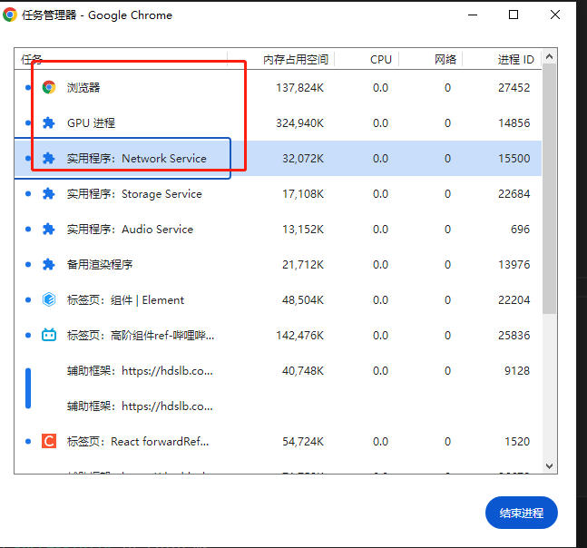
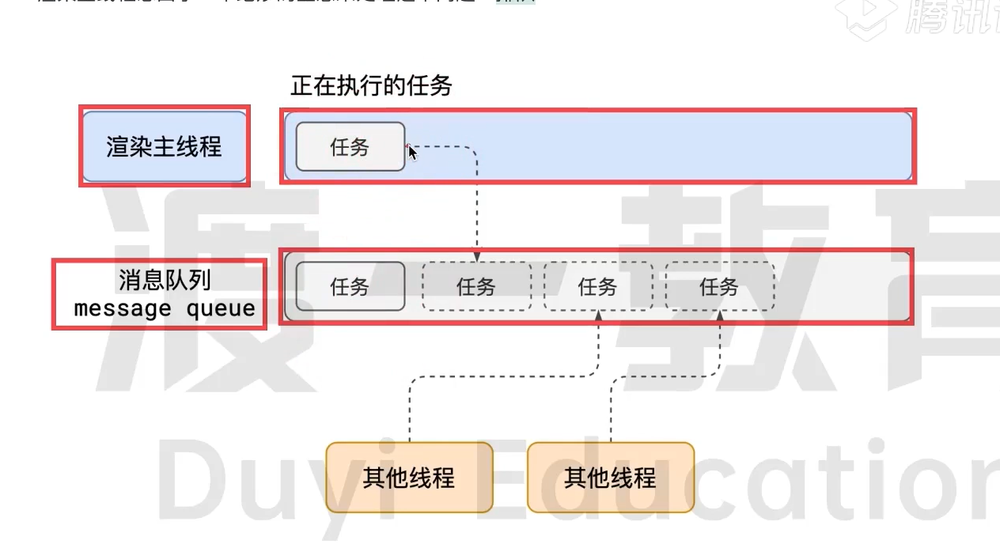
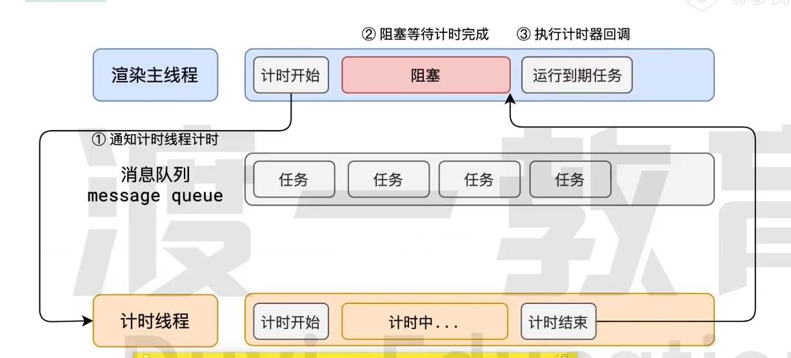

# 事件循环

## 事件循环是浏览器的核心原理

### 浏览器的进程模型

#### 何为进程

程序运行的专属内存空间就是进程，进程之间相互独立，即使要通信，也要双方同意

#### 何为线程

有了进程，就可以运行程序代码了。运行代码的【人】称之为线程。一个进程至少有一个线程，所以在进程开启后会自动创建一个线程来运行代码。

该线程称为主线程。主线程结束，整个程序就结束。

多个线程共享一个内存空间，即共享一个进程。

#### 浏览器有哪些进程和线程

浏览器是一个多线程多进程的应用程序，难度接近操作系统！！

为了避免连环崩溃，启动浏览器后会自动启动多个进程。


1. 浏览器进程

包含多个线程，处理不同任务

  + 负责界面展示（标签、工具栏界面）
  + 用户交互，（点击、滚动、键盘）
  + 子进程管理：启动子页面渲染进程

2. 网络进程

  + 负责加载网络资源
  + 启动多个线程，处理不同网络任务

3. 渲染进程 （*重点）

  + 一个标签页一个渲染进程
  + 渲染进程开启后，会开启一个渲染主线程，主线程负责执行html、css、js

4. GPU进程

### 渲染主线程是如何工作的？

#### 需要处理的任务包括但不限于：

  1. 解析HTML
  2. 解析CSS
  3. 计算样式
  4. 布局
  5. 处理图层
  6. 每秒把页面画60次
  7. 执行事件处理函数
  8. 执行计时器回调函数
  9. ...

  为什么不开多个线程处理？

答：
1. 竞态条件：多线程处理会导致访问共享内存的竞争条件，可能导致数据不一致和死锁等问题。
2. 同步问题：多线程要进行同步，增加代码复杂度和开销。
3. 安全问题：多线程可能会存在安全漏洞，如数据泄露、内存溢出等问题。
4. 性能问题：可能会导致过多的上下文切换和内存消耗，从而降低程序的性能和稳定性。

#### 主线程如何调度任务？

比如

1. 正在执行js函数，执行到一半，用户点击了按钮，该立即执行点击事件函数吗？

2. 正在执行js函数，某个计时器到了时间，该立即执行它的回调吗？

3. 浏览器通知我用户点击了按钮，同时，某个计时器也到时间了，我应该处理哪一个？ 

渲染主线程想了个办法：排队


1. 在最开始的时候，渲染主线程会进入一个无限循环，即event loop(w3c)或message loop(谷歌浏览器)

while(true) {...}

for(;;) {...}

2. 每一次循环会检查消息队列中是否有任务存在，如果有，就取第一个任务执行，执行完后再进入下一次循环。如果没有，则进入休眠状态。

3. 其他所有线程（包括其他进程的线程）可以随时向消息队列添加任务。新任务会加到消息队列末尾。在添加新任务时，如果主线程是休眠状态，则会将其唤醒，以继续循环拿取任务。

## 若干解释

### 何为异步

 不能立即执行的操作叫异步操作，如：计时器、xhr、fetch、点击事件。

渲染主线程中的setTimeout会调用计时线程（复杂）开始计时，计时结束，再通知主线程执行回调函数


#### 如何理解js异步

答：JS是一门单线程的语言，这是因为它运行在浏览器的渲染主线程中，而渲染主线程只有一个。而渲染主线程承担着诸多的工作，渲染页面、执行 JS 都在其中运行。如果使用同步的方式，就极有可能导致主线程产生阻塞，从而导致消息队列中的很多其他任务无法得到执行。这样一来，一方面会导致繁忙的主线程白白的消耗时间，另一方面导致页面无法及时更新，给用户造成卡死现象。
所以浏览器采用异步的方式来避免。具体做法是当某些任务发生时，比如计时器、网络、事件监听，主线程将任务交给其他线程去处理，自身立即结束任务的执行，转而执行后续代码。当其他线程完成时，将事先传递的回调函数包装成任务，加入到消息队列的末尾排队，等待主线程调度执行。在这种异步模式下，浏览器永不阻塞，从而最大限度的保证了单线程的流畅运行。


### js为何会阻碍渲染？

js和渲染都在浏览器的渲染主线程上，绘制页面是一个异步的过程

### 任务优先级

任务没有优先级，在消息队列中先进先出。但是消息队列是有优先级的。

***
+ 以前：两个队列：宏任务队列，微任务队列（vip队列）
现在：抛弃了宏任务的说法；
+ 每个任务都有一个任务类型。同一个类型的任务必须在一个队列，不同类型的任务可以分别属于不同的队列。在一次事件循环中，浏览器可以根据实际情况从不同的队列中取出任务执行。
+ 浏览器必须准备一个微队列，微队列中的任务优先所有其他任务执行。

+ 目前的chrome浏览器中至少包含了下面的队列
  1. 延时队列：用于存放计时器到达后的回调任务，优先级【中】
  2. 交互队列：用于存放用户操作后产生的事件处理任务，优先级【高】
  3. 微队列：用户存放需要最快执行的任务，优先级【最高】
***

微任务： promise、 MutationObserver
```
// 立即把一个函数添加到微队列中
Promise.resolve().then(fn)
```

#### 面试题: 阐述一下 JS 的事件循环
参考答案:
事件循环又叫做消息循环，是浏览器渲染主线程的工作方式。在Chrome 的源码中，它开启一个不会结束的 for 循环，每次循环从消息队列中取出第一个任务执行，而其他线程只需要在合适的时候将任务加入到队列未尾即可。过去把消息队列简单分为宏队列和微队列，这种说法目前已无法满足复杂的浏览器环境，取而代之的是一种更加灵活多变的处理方式。根据 W3C官方的解释，每个任务有不同的类型，同类型的任务必须在同一个队列，不同的任务可以属于不同的队列。不同任务队列有不同的优先级，在一次事件循环中，由浏览器自行决定取哪一个队列的任务。但浏览器必须有一个微队列，微队列的任务一定具有最高的优先级，必须优先调度执行。

#### 面试题: JS 中的计时器能做到精确计时吗?为什么?
参考答案:
不行，因为:
1. 计算机硬件没有原子钟，无法做到精确计时
2. 操作系统的计时函数本身就有少量偏差，由于 JS 的计时器最终调用的是操作系统的函数，也就携带了这些偏差
3. 按照 W3C的标准，浏览器实现计时器时，如果嵌套层级超过 5 层，则会带有 4 毫秒的最少时间，这样在计时时间少于4毫秒时又带来了偏差
4. 受事件循环的影响，计时器的回调函数只能在主线程空闲时运行，因此又带来了偏差