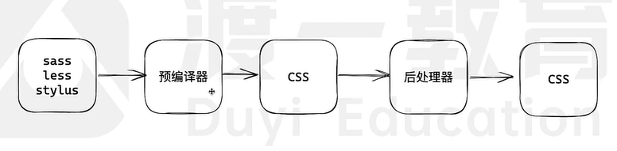
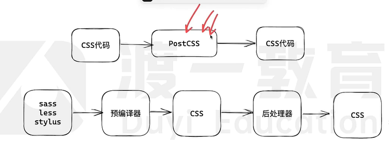
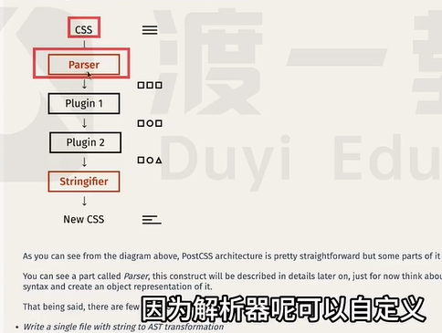

# 语言

两个方面的问题：

  1. 兼容性

      api兼容

          不同的node版本对语法的兼容程度是不一样的，如node v10+对Array.flatMap不支持

          polyfill 填充物、垫片，缺什么api就补充什么api

          core-js 99%

          微队列 不用promise和Observer API就不能实现

          补充：npm i xxx -D是开发依赖，最终不会参与运行

      语法兼容

          async/await属于语法兼容，没有也不能写一个

          syntax transformer 语法转换器 runtime

          不同的语法，用不同工具进行转换

          如async/await使用regenerator进行转换compile

  2. 语言缺陷，语言增强 jsx  ts

## js

  @babel/core 转换代码的api
  
  @babel/cli 命令工具，调用core里的工具进行操作

  安装插件，影响抽象语法树，而影响转换结果

  babel.config.js配置插件

  @babel/preset-env 预设，一堆插件

## css

  1. 语法缺失（循环、判断、字符串拼接……）

  2. 功能缺失（颜色函数、数学函数、自定义函数）

  ### 新语言

  css语言的超集：less、sass、stylus

  编译器：css预编译期，对应不同的语言

  全局安装scss后，使用sass x.scss x2.css --no-source-map进行编译

  ### 后处理器

  #### 厂商前缀 autoprefixer

  #### 代码压缩 cssnano

  #### 代码剪枝 purgecss

  #### 类名冲突 css module

  ### 抽象依赖 PostCSS 处理转换逻辑

    类比js里的babel，不只是后处理器，也可以预编译

    postcss.config.js配置插件

    #### postcss-modules 防止类名冲突

    #### postcss-preset-env 预设，插件集合，如添加厂商前缀

    #### tailwindcss 原子化css

修改parser就能解析less或sass代码

# 协议

+ http

+ websoket

+ oauth2

# 环境

+ 浏览器 web api

+ Drag api

+ File api

+ Observer api

+ Canvas api

# 浏览器

# 框架/库

+ vue

+ react

+ axios

+ egg

+ rn

+ uniapp

+ taro

+ lodash

+ moment

# 服务器

+ node

+ express

+ koa

+ mysql

+ redis

+ mongodb

# 工程化

+ ts

+ sass

+ less

+ stylus

---

1. 构建工具

    开发和维护的工程

    -- 转换  webpack、rollup、esbuild  -->

    运行时需要的工程

    webpack

    1. 哪种工程更适合开发和维护
    一切皆为模块

    2. 哪种工程更适合运行时
    传统工程

    3. 如何进行转换/打包
    webpack

        1. 入口

                AST语法树

                  导入语句 ESM CMJ

                    import require

        2. 开发服务器

              webpack server打开开发服务器

              1) 提供访问网址
              2) 将打包内容存入内存

    浏览器
    -请求->
    开发服务器dev server
    -请求->
    内存
    -取出结果->
    开发服务器dev server
    -响应内容->
    浏览器

        开发服务器 node

        websocket 热更新HMR

        webpack webpack-dev-server express

    3. 文件指纹

      可以缓存300年

    4. css modules

      避免类名冲突
      类名映射表

    5. 源码地图

      devtool: "source-map"

2. 脚手架

    vue-cli vite umijs

    1. 界面交互

    2. 提供工程模板

---

# 模块化和包管理

## 模块化

  + 函数级别

  + 文件级别

    1. （分解）全局污染

    2. （聚合）依赖混乱

  + 包

  ---

  1. 先制定标准，然后解决

  + CommonJS CJS（民间）

  + AMD（民间）

  + CMD（民间）

  + UMD（民间）

  + ECMAScript Module 简称ESM（官方）

  | 标准 | 来源 | 方式 | 补充 |
  | --- |--- | --- | --- |
  | CJS | 民间 | 运行时 | require可以放在任何地方，动态导入 |
  | ESM | 官方 | 编译时 | import只能放在文件顶部，静态导入 |

  2. 实现

      + 浏览器 在script标签中加入type="module"，就会被当做ESM模块

      + node 既支持CJS 也支持 ESM

      + 构建工具 脚手架(vue-cli vite umijs)内部包含构建工具，如webpack rollup esbuilder，webpack同时支持CJS和ESM，rollup esbuilder只认ESM，但是可以扩展支持
  

## 包管理

+ npm (包的属性，registry，cli) cli：命令行 GUI：图形化界面

+ pnpm 硬链接、软链接

+ yarn

+ cnpm

+ bower 浏览器环境包管理，其他都只支持node环境