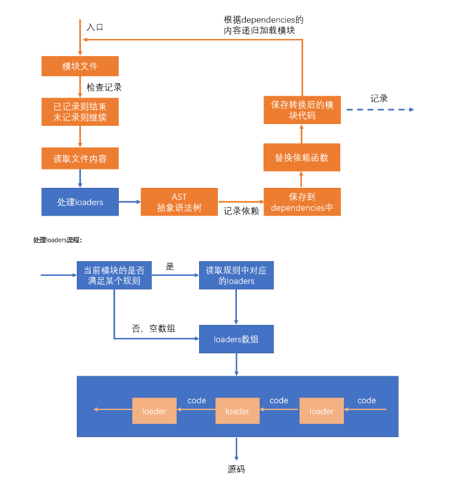

# 参考资料
https://github.com/DuYi-Edu/DuYi-Webpack/tree/master/1.%20webpack%E6%A0%B8%E5%BF%83%E5%8A%9F%E8%83%BD

## loader



## plugin

plugin的本质是一个带有apply方法的对象
```
var plugin = {
    apply: function(compiler){
        
    }
}
```
通常，习惯上，我们会将该对象写成构造函数的模式
```
class MyPlugin{
    apply(compiler){

    }
}
var plugin = new MyPlugin();
```