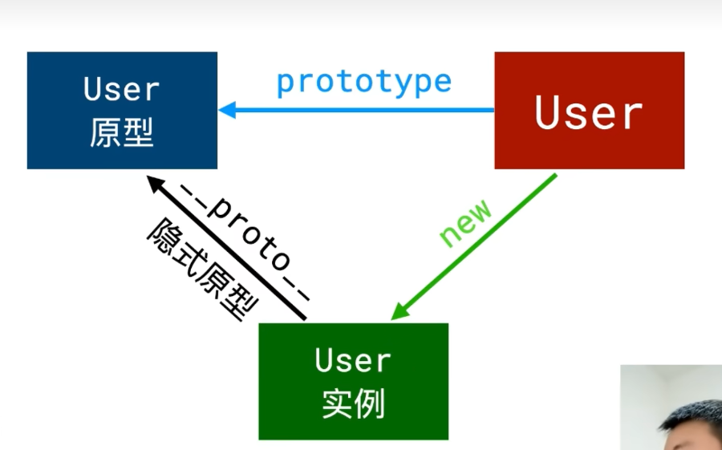
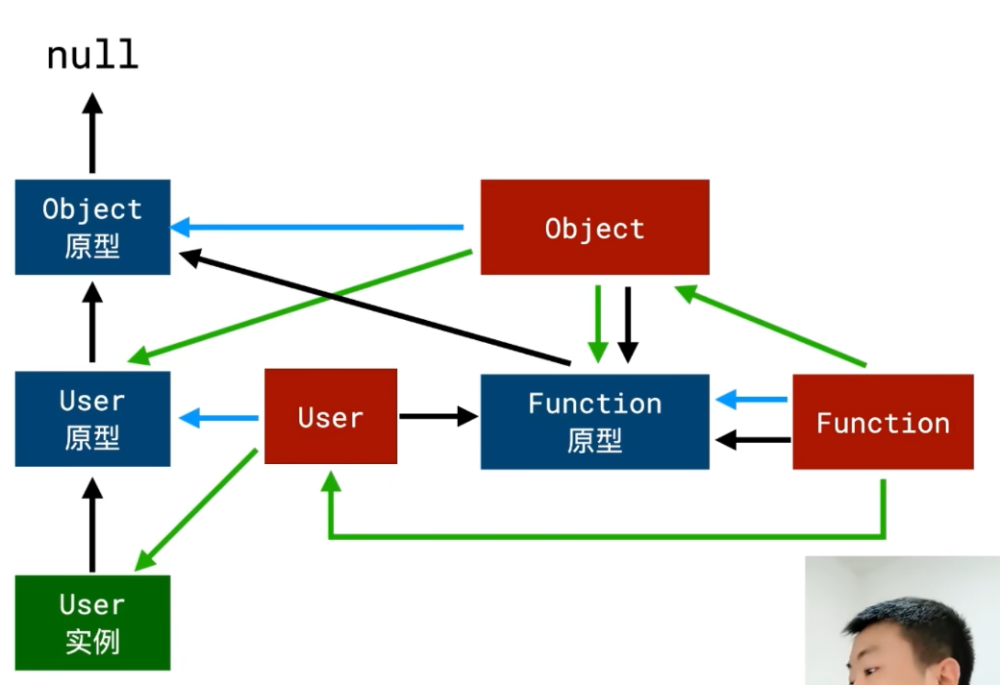

所有对象都是通过new 函数创建
所有函数也是对象
所有对象都是引用类型

1. 除了Object原型外，其他的所有原型都是Object的实例。
2. 所有构造函数（User、Object）都是Function的实例。
3. 原型（蓝线）是最有规律的
4. 没有人能new出下面三个：null、Object原型、Function即没有任何值的实例是这三个。没有绿线指向这三个，其他的都有绿线指向，即都能被new出来。
5. **特殊：Function的原型和隐式原型都指向Function原型 即：Function.prototype === Function.__proto__**

原型 prototype
 所有函数都有一个属性 prototype称为函数原型
 默认情况下，prototype是一个普通的Object对象
 默认情况下，prototype中有一个属性，constructor，它也是一个对象，它指向构造函数本身

隐式原型 __proto__
 所有对象都有一个属性 __proto__，称之为隐式原型
 默认情况下，隐式原型指向创建该对象的函数的原型

* 绿线：function Object() <- new Function()/Function实例
* 绿线：User实例 <- new User()/User实例
* 绿线：function User(){} <- new Function()/Function实例
* 蓝线：User.prototype -> User原型 
* 蓝线：User.prototype -> new Object()/Object实例
* 黑线*：Function.__proto__ -> new Function()/Function实例
* 黑线*：Object.__proto__ -> null
* 黑线：A实例.__proto__ -> A原型

