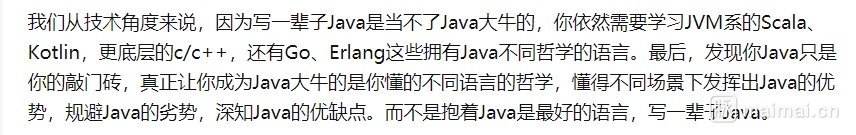

## 第18章 请勿陷入对技术的狂热之中

>找到目标，谁都能成为强者。

- 1.恪守教条的信仰往往有很大的煽动性。 --摘抄

- 2.软件开发和技术的虔诚很容易像信仰生命起源或至高无上的神的存在一样。 --摘抄

- 3.我坚信，如果你能让自己不成为某种技术的信徒，你会在职业生涯之路上走得更远。 --摘抄

>格局。特别喜欢之前看见过的一段话。

>我们从技术角度来说，因为写一辈子Java是当不了Java大牛的，你依然需要学习JVM系的Scala、Kotlin，更底层的c/c++，还有Go、Erlang这些拥有Java不同哲学的语言。最后，发现Java只是你的敲门砖，真正让你成为Java大牛的是你懂的不同语言的哲学，懂得不同场景下发挥出Java的优势，规避Java的劣势，深知Java的优缺点。而不是抱着Java是最好的语言，写一辈子Java。

>

>从上面这段话，我们再反过来想，例如搞工程化，我们不光要搞vite，说会了vite就可以不用学习webpack，gulp，rollup了，并不是，技术视野从来不会这么狭隘，不仅这些我们也需要涉猎，还需要涉猎TypeScript，Node，esbuild等等这些东西，当然涉猎不停留在普通的学会使用的层面，而是知道背后的思想和架构等更高阶的东西，不要用一种语言限制了自己的技术视野，技术没有银弹。

- 4.你对某种技术或编程语言存在偏见，认为它是最好的——至少大多数程序员是这样的。这很正常。我们总是对自己做的事情充满热情；只要是有激情、有热情，就很容易变得极度感性。 --摘抄

>所以我们有时候需要从客观的角度去看问题和技术。

- 5.我们中的大多数崇拜某项特定的技术，只是因为自己熟悉这种技术。我们很自然会相信自己选择的是最好的，然而这会让我们经常忽略任何反对意见。我们不可能充分了解现存的所有技术，从而给“哪项技术最好”做出最英明、最睿智的判断，于是我们倾向于选择我们了解的技术并先入为主地认为它是最好的。人生多艰，无暇他顾。 --摘抄

>拓宽自己的技术视野。

- 6.我们自以为找到所有答案，却只是裹足不前。 --摘抄

- 7.没必要只是选择最好的而贬低其他的。 --摘抄

- 8.不是所有的技术都是伟大的，但多数被普遍应用的技术至少是好的。一样东西如果不好，就不会为人所知或使用，也不会成功。 --摘抄

- 9.至少在历史的某个时间点，每项技术都被看作是哪个时代里“好的”甚至是伟大的。 --摘抄

- 10.在很多情况下，解决问题并不只有一个好的或是最好的方法。同理，最好的编程语言、框架、操作系统，甚至是文本编辑器不会只有一种。你可能会喜欢某项技术多过其他，或者用某种编程语言的效率要高于其他，但是称其最好并无必要。 --摘抄

>如果真的要让你去用一种技术，其实上手起来很快，就像我现在需要使用react，在2周之内一边学一遍做业务，做的也还不错，算是直接上手了，后续再继续学习，就可以了，所以说人的学习能力是无比强大的，不要质疑自己，要相信自己。

- 11.后来，我才发现，接下那份工作是我再职业生涯中所做出的最杰出的决策之一。使用自己一度厌恶的技术工作，让我从不同的视角审视所有的技术。事实证明，Java一点都不糟糕，我也能够理解为什么有些开发人员喜欢用Java而不用C#。 --摘抄

>不同的尝试才会让我们有不同的人生阅历。

>其实从另一个角度说，虽然不存在技术信仰的问题，但是不管哪一行都有基础知识，这些基础知识是我们绝对需要掌握的，所以基础知识还是得学好。

- 12.我也放弃了对操作系统和框架得偏爱，努力尝试新东西之后再做评价。 --摘抄

- 13.没有理由去强烈坚持自己选择的技术就是最好的，而轻视甚至无视其他技术。如果固执己见，最终受损失的是你自己。 --摘抄

- 14.另一方面，如果你愿意对技术保持开放的心态，而不是固守自己已经了解的技术，声称它是最好的，你会发现有更多的机会为你敞开大门。 --摘抄

>技术视野与格局。

## 第二篇 自我营销

>影响力的力量。

- 1.营销就是一场争夺人们注意力的竞赛。 --摘抄

- 总结：我们有没有必要成为一种技术的信徒？我们的技术视野和格局是不是决定了我们的职业生涯的长度和高度？有些时候我们是不是需要使用客观的视角去看待问题和技术，不要带有偏见？我们是不是应该对我们上手各种技术的能力要有绝对的自信？我们是不是应该享受技术给我们带来的一些成就感？如果对技术持开放心态，我们是不是能收获更多？营销的本质是什么？

>没必要，如果你成为了一种技术的信徒，那么这个观念会极大的限制你的技术视野和格局。

>是的，我们的技术视野和格局决定了我们的职业生涯的长度和高度，思维方式也决定着我们的职业生涯。

>是的，有些时候我们需要使用客观的视角去看待问题和技术，不要带有偏见，因为如果带有偏见的话就会影响我们的理性思考和判断。

>是的，我们需要我们自己对上手新技术的学习能力有绝对的自信，这也是我们的专业性之一，强大的学习上手能力，而这个能力中有我们过往经验和经历的支撑。

>是的，我们应该享受一些技术给我带来的成就感，这样我们的工作和生活才会愈加美好。

>是的，如果我们对技术持开放心态，那么我们将收益更多。

>营销的本质其实是抓住更多的人的注意力，让我们有足够的影响力，以后别人见到你会有先入为主的感受，这就是营销的力量。
