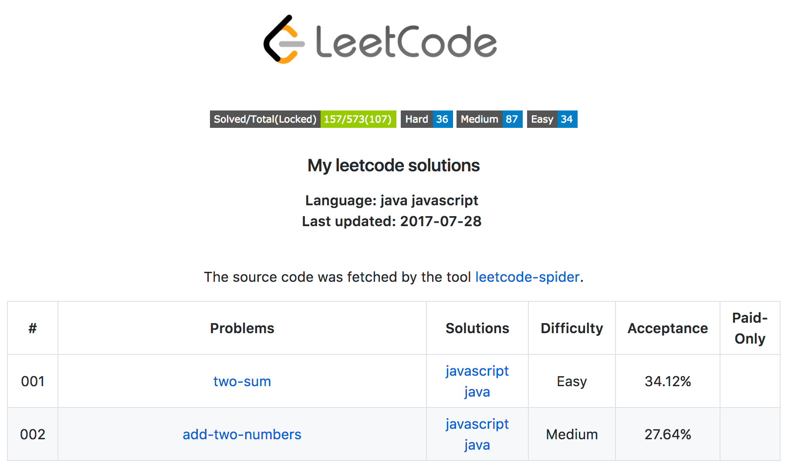

# 此项目已不再维护，有需要者，欢迎 fork
苦于工作繁忙，我已经不刷题很久了，没有使用需求就难以保持爬虫逻辑紧跟 leetcode 官网更新。欢迎 fork，解决需求。

# leetcode-spider [](https://www.npmjs.com/package/leetcode-spider)

使用 JS 编写的 leetcode 解题源码爬虫.爬取你自己的 leetcode 解题源码.

如果你也想把你在 [leetcode](https://leetcode.com/) 上提交且 accepted 的解题代码爬下来,那么本工具就是为此需求而生!爬下来的代码可以放在 github 上管理和开源出来,可以作为个人展示,更可以借助 [leetcode-viewer](https://github.com/Ma63d/leetcode-viewer) 将代码通过一个单页应用完美展现,几条命令就可以呈现一个 leetcode 源码博客,交流和展示搞起来!

## 新版本来了

- 支持使用模板语法来配置你自己的 README.md 模板了！
- 新增部分配置项
- 优化 README.md 输出:
  
- 优化网络错误处理机制
 

**需要 Node 4.0 及以上版本!**

## 安装 Installation

```
npm i leetcode-spider -g
```


## 使用 Usage

请事先建立好如下 json 文件(以命名为 config.json 为例):


```
{
	"username" : "hello@gmail.com",
	"password" : "xxxxxxxxx",
	"language": ["java","c++","c"],
	"outputDir": "./solutions", (可选字段)
	"template": "./README.tpl" (可选字段)
}
```

- `username` 和 `password` 对应你的的 leetcode 账户.


- `language` 对应于你用来解 leetcode 的编程语言,该项为一个数组,即使只有一种语言.
目前 `language` 字段支持填写所有 leetcode 的编程语言:
    - `c++`(别填`cpp`)
    - `c`
    - `java`
    - `javascript` (别填`js`)
    - `python`
    - `c#` (别填`csharp`)
    - `ruby`
    - `swift`
    - `go`

- `outputDir` **选填**，表示你希望存放源码文件的目录，默认`"./solutions"`
- `template` **选填**，表示你自己定义的 README.tpl 路径，默认 "./README.tpl"


## 运行 Execution

```
lc-spider // 默认使用config.json为配置文件运行爬虫
```
**程序会记录上一次爬取了哪些题目,之前爬取过的题目再次运行的时候不会爬取,除非你通过-n选项手动指定.**

**这也意味着,当你在进行增量爬取时,根本不需要去指定要爬哪些题目, leetcode-spider 会自动知道哪些题目需要爬.**

举个例子,按照我们的日常使用:

* 当你昨天 A 了5道题,你用爬虫爬了下来
* 然后今天你 A 了6道题,你今天再次运行程序

程序此时会自动检查你跟上一次爬取结果相比多写了哪些题,然后把这些新增的代码爬取下来,不会重复的去爬取,你也不用手工指定你今天 AC 了哪些题.

永远只用一行命令: `lc-spider`.(除非你想要再去爬以前爬过的题,比如你改进了修改了原先AC的代码,想把新代码爬下来,或者你新增了另一种语言的解法, 那么这种时候可以用-n选项指定具体要爬取的题目,请参考[选项](https://github.com/Ma63d/leetcode-spider#选项)章节的具体内容.)

此外源码对应的 leetcode 的题目,也会爬取下来,放在代码目录, markdown 格式.

爬取完成后会自动生成 README.md 文件,当你把爬下来的代码放在 github 上时,README.md 起一个介绍和导航的作用.另外，有的同学的 config.json 文件是直接放在当前的代码存放目录的，那你在把这个目录上传到 github 上之前，请记得写 `.gitignore` 文件，在里面忽略掉你的 config.json 文件！不然你的用户名和密码也传到 github 上公开给大家了（虽然 leetcode 账户屁用没有）。

如果你运行 lc-spider 却显示无法找到命令,首先请确认一下你在 npm 安装 lc-spider 的时候是否是全局安装(也就是有没有那个`-g`),如果你是全局安装的,那就是你的 npm 的环境变量配置得不对了,请参考百度的 fis 团队写的 [这篇文章](https://github.com/fex-team/fis/issues/565),方便不熟悉 npm 的同学解决自己遇到的问题.

## 模板功能

嫌默认生成自带的 README.md 不好看？嫌我写的文案不够好？ 
没关系，现在你可以自定义你的 README.md 模板，使用 [mustache](https://github.com/janl/mustache.js) 语法（就是 vue 用的那一套），自己书写你的 README.md 模板： 

leetcode-spider 第一次运行之后会在你运行命令的目录下生成 [README.tpl](https://github.com/Ma63d/leetcode-spider/blob/master/lib/README.tpl) 文件，如果你对默认生成的 README.md 文件不满意，那你自行修改这个 README.tpl 模板文件即可。程序会在下次运行时使用这个模板文件来生成  README.md .


## 帮助 Help
```
lc-spider -h
```

## 选项

### -config or -c
```
lc-spider -c xxx.json
```

使用指定的配置文件运行 lc-spider. 默认使用的是 config.json.

### -number or -n
```
lc-spider -n 2-15 3 78-101
```

只爬取你指定的题目,可以使用连字符(如15-100),此处指定的是需要爬取的题号.程序会检查哪些题目你 AC 了,因此你可以放心的填写.比如你a了200-300之间的某几道题,但是不想一个个的指定出来,那你就大胆的写上200-300,程序会查找200-300范围内你 AC 的源码,并爬取下来.

