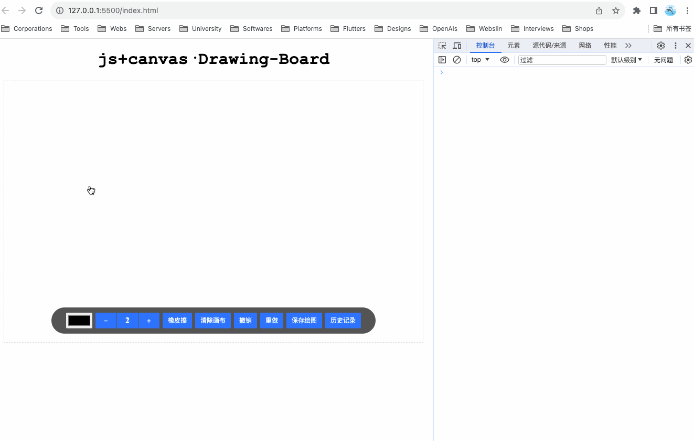

# 契子

前段时间发布了一篇 [浅谈 js+canvas 实现考试系统·拖拽连线题>>](https://juejin.cn/post/7278945628906487843) 的文章，趁热打铁，今天带着大家一起构思一下如何 基于 js + canvas 实现画板工具，先看效果：



同样的，为了方便大家理解阅读，在实现上，我没有过度封装，你只需要跟着我的节奏一次往下阅读实现即可，在文章的最后，会贴上源码地址。

# 思考

开始之前，首先我们需要思考一下，构建一个画板工具需要哪些东西？

1. 画板（Drawing board）：canvas

2. 工具栏（Toolbar）
   - 画笔颜色：允许用户选择绘图的线条颜色，可以提供一个颜色选择器或一组预定义的颜色选项。
   - 画笔粗细：允许用户选择绘图线条的粗细，可以提供增量按钮和减量按钮修改画笔粗细。
   - 橡皮擦：提供一个工具或开关，使用户能够切换到橡皮擦模式，用于擦除已绘制的内容。
   - 清除画布：提供一个按钮，以清除整个画布上的绘图内容。
   - 撤销/重做：提供撤销和重做按钮，以允许用户回退或再次应用之前的绘图操作。
   - 保存绘图：提供一个或按钮，使用户能够保存他们的绘图作品为图像文件。
   - 历史记录：显示用户绘图操作的历史记录，以便他们可以导航和撤销之前的操作。
   - ...

3. 橡皮擦游标（Eraser Cursor）：在橡皮擦模式下，鼠标在画布中按下擦除时会显示橡皮擦元素，跟随鼠标游动。


# 实现

## 1. 布局

```html
<!-- 标题 -->
<h1 class="title">js+canvas·Drawing-Board</h1>
<!-- 画板工具 -->
<div class="drawing-board">
  <!-- 画板 -->
  <canvas class="drawing-board__canvas"></canvas>
  <!-- 工具栏 -->
  <div class="drawing-board__tools">
    <input type="color" />
    <div class="item line-width exclude">
      <div class="decrement">-</div>
      <div class="v">2</div>
      <div class="increment">+</div>
    </div>
    <div class="item eraser exclude">橡皮擦</div>
    <div class="item clear">清除画布</div>
    <div class="item undo">撤销</div>
    <div class="item redo">重做</div>
    <div class="item save">保存绘图</div>
    <div class="item record">历史记录</div>
  </div>
  <!-- 橡皮擦模式：自定义游标 -->
  <div class="drawing-board__cursor"></div>
</div>
```

## 2. 样式

```css
/* 标题 */
.title {
  text-align: center;
  font-family: "Courier New", Courier, monospace;
}

/* 容器 */
.drawing-board {
  width: 800px;
  height: 500px;
  margin: 0 auto;
  box-sizing: border-box;
  border: 1px dashed #ccc;
  user-select: none;
  position: relative;
}

/* 画板 */
.drawing-board__canvas {
  width: 100%;
  height: 100%;
  cursor: pointer;
}

/* 工具栏 */
.drawing-board__tools {
  width: max-content;
  height: 50px;
  padding: 0 28px;
  border-radius: 25px;
  background: #555;

  display: flex;
  align-items: center;
  flex-wrap: nowrap;

  position: absolute;
  bottom: 16px;
  left: 50%;
  transform: translateX(-50%);
}

/* 在绘制状态下，禁止工具栏触发鼠标事件 ⭐️ */
.drawing-board.drawing .drawing-board__tools {
  pointer-events: none;
}

.drawing-board__tools [type="color"] {
  outline: none;
  border: none;
  height: 30px;
  cursor: pointer;
  border-radius: 2px;
}

.drawing-board__tools .item {
  height: 30px;
  padding: 0 10px;
  border-radius: 2px;
  overflow: hidden;
  background: #0074ff;

  display: flex;
  justify-content: center;
  align-items: center;
  flex-shrink: 0;

  font-size: 12px;
  color: #fff;
  cursor: pointer;
  transition: background-color 0.3s, color 0.3s;
}

.drawing-board__tools .item.line-width {
  padding: 0;
  margin-left: 6px;
  overflow: hidden;
}

.drawing-board__tools .item .v {
  width: 40px;
  border-left: 1px solid #555;
  border-right: 1px solid #555;

  font: bold 16px "Times New Roman", Times, serif;
  line-height: 30px;
  text-align: center;
  cursor: default;
}

.drawing-board__tools .item .increment,
.drawing-board__tools .item .decrement {
  width: 40px;
  height: inherit;
  background: #0074ff;
  display: flex;
  justify-content: center;
  align-items: center;
  transition: background-color 0.3s, color 0.3s;
}

.drawing-board__tools .item .increment:hover,
.drawing-board__tools .item .decrement:hover,
.drawing-board__tools .item.eraser.active,
.drawing-board__tools .item:not(.exclude):hover {
  background-color: #0050cc;
  color: #eee;
}

.drawing-board__tools .item:not(:last-child) {
  margin-right: 6px;
}

.drawing-board__cursor {
  position: absolute;
  border: 2px solid #000;
  border-radius: 50%;
  pointer-events: none; /* 使鼠标事件不会被该元素捕获，以允许下方的画布接收鼠标事件 */
  transform: translate(-50%, -50%); /* 将鼠标样式的中心点设置为鼠标位置 */
  display: none; /* 默认隐藏 */
}
```

## 3. 脚本

### 3.1. 工具函数

```js
/**
 * 获取指定元素在文档中的位置
 * @param {*} element
 * @returns
 */
function calcOffset(element) {
  let parentElement = element.offsetParent;
  const rect = {
    left: element.offsetLeft,
    top: element.offsetTop,
  };
  while (parentElement) {
    rect.left += parentElement.offsetLeft;
    rect.top += parentElement.offsetTop;
    parentElement = parentElement.offsetParent;
  }
  return rect;
}

/**
 * 获取鼠标在画布中的位置
 * 兼容移动端
 * @param {*} e
 * @returns
 */
function getCanvasPoint(e) {
  let clientX = 0;
  let clientY = 0;
  if (e.customEvent) {
    clientX = e.x;
    clientY = e.y;
  } else {
    if (/touch/.test(e.type)) {
      clientX = e.touches[0].pageX;
      clientY = e.touches[0].pageY;
    } else {
      clientX = e.pageX;
      clientY = e.pageY;
    }
  }
  const rect = calcOffset(canvas);
  const x = clientX - rect.left;
  const y = clientY - rect.top;
  return { x, y };
}
```

### 3.2. 定义变量

```js
/** 标识绘画状态 */
let painting = false;
/** 记录结束点位置（便于在绘制过程中，计算连线的起始点） */
let lastPoint = { x: 0, y: 0 };
/** 线条粗细边界值 */
let maxLineWidth = 20;
let minLineWidth = 1;
/** 绘画记录·列表 */
let histories = [];
/** 绘画记录·最大长度 */
let maxHistoriesLength = Infinity;
/** 绘画记录·下标（用于处理撤销和重做） */
let historiesIndex = -1;
/** 记录橡皮擦状态 */
let eraser = false;

/** 画板容器 */
const container = document.querySelector(".drawing-board");
/** 画板容器盒子信息 */
const containerRect = container.getBoundingClientRect();
/** 橡皮擦游标元素 */
const customCursor = document.querySelector(".drawing-board__cursor");
```

### 3.3. 获取画布 & 配置画笔

```js
/** @type {HTMLCanvasElement} */
const canvas = document.querySelector(".drawing-board__canvas");
canvas.width = containerRect.width;
canvas.height = containerRect.height;

/** @type {CanvasRenderingContext2D} */
const ctx = canvas.getContext("2d");
ctx.strokeStyle = "#000";
ctx.lineWidth = 2;
ctx.willReadFrequently = true;
ctx.lineCap = "round";
ctx.lineJoin = "round";
```

### 3.4. 事件监听 & 事件处理

这里，我们先实现一个简单的画板功能，后续再逐步完善。

```js
// -- 事件监听
// -- Mobile
canvas.addEventListener("touchstart", start, { passive: false });
canvas.addEventListener("touchmove", move, { passive: false });
canvas.addEventListener("touchend", end, { passive: false });
// -- PC
canvas.addEventListener("mousedown", start);
canvas.addEventListener("mousemove", move);
canvas.addEventListener("mouseup", end);
canvas.addEventListener("mouseleave", end);

// -- 事件处理函数
function start(e) {
  // -- 更新绘制状态
  painting = true;
  // -- 容器标识绘制状态
  container.classList.add("drawing");
  // -- 获取鼠标在画布中的位置
  const point = getCanvasPoint(e);
  // -- 记录当前位置，用于移动中计算连线坐标
  lastPoint = point;
  // -- 绘制圆点
  drawCircle(point.x, point.y, Math.ceil(ctx.lineWidth / 2));
}

function move(e) {
  if (painting) {
    // -- 获取鼠标在画布中的位置
    const newPoint = getCanvasPoint(e);
    // -- 实时绘制线条
    drawLine(lastPoint.x, lastPoint.y, newPoint.x, newPoint.y);
    // -- 更新lastPoint
    lastPoint = newPoint;
  }
}

function end(e) {
  if (painting) {
    // -- 更新状态
    painting = false;
    // -- 移除容器标识绘制状态
    container.classList.remove("drawing");
  }
}
```

上述代码中，开始绘制时我给画布容器新增了 **`drawing`** 类名，结合CSS，如下：

```css
.drawing-board.drawing .drawing-board__tools {
  pointer-events: none;
}
```

设置 **`pointer-events:none`** 取消工具栏鼠标事件的目的是为了在绘制过程中，不会因为鼠标移动到工具栏上导致绘制中断的问题。

### 3.5. 设置画笔颜色

思路：

1. 获取颜色拾取器
2. 监听值变化
3. 更新画笔颜色

代码实现：

```js
const inputColor = document.querySelector('[type="color"]');
inputColor.onchange = (e) => {
  ctx.strokeStyle = e.target.value;
};
```

### 3.6. 设置画笔粗细

思路：

1. 获取元素：增量按钮、减量按钮、画笔粗细值展示标签
2. 监听按钮点击事件
3. 更新画笔粗细：如果当前值抵达画笔粗细的边界值则不做处理，否则更新画笔粗细及页面显示

代码实现：

```js
const btnIncrement = document.querySelector(".increment");
const btnDecrement = document.querySelector(".decrement");
const spanLineWidth = document.querySelector(".line-width .v");

btnIncrement.onclick = function () {
  if (ctx.lineWidth === maxLineWidth) return;
  ctx.lineWidth++;
  spanLineWidth.textContent = ctx.lineWidth;
};
btnDecrement.onclick = function () {
  if (ctx.lineWidth === minLineWidth) return;
  ctx.lineWidth--;
  spanLineWidth.textContent = ctx.lineWidth;
};
```

### 3.7. 清除画布

思路：

1. 获取按钮元素 & 监听按钮点击事件
2. 调用 ctx.clearRect 清除

代码实现：

```js
const btnClear = document.querySelector(".clear");
btnClear.onclick = function () {
  ctx.clearRect(0, 0, canvas.width, canvas.height);
};
```

### 3.8. 保存画布

思路：

1. 获取按钮元素 & 监听按钮点击事件
2. 获取画布数据 canvas.toDateURL
3. 在页面里创建并插入一个a标签，模拟点击下载

代码实现：

```js
const btnSave = document.querySelector(".save");
btnSave.onclick = function () {
  const imgUrl = canvas.toDataURL("image/png");
  const a = document.createElement("a");
  a.href = imgUrl;
  a.download = "pic__" + Date.now();
  a.target = "_blank";
  a.click();
};
```

### 3.9. 撤销 & 重做 & 历史记录

思路：

1. 首先，我们需要一个数组用于存储 **历史记录**（histories），每次使用画笔后将当前绘图储存进数组中，值得注意的是，由于是每次使用画笔后才存储，那在初始化历史记录时，需将画板的初始状态手动存入记录中，便于在撤销时，可以撤销到画板最初的状态。

2. 其次，我们需要引用一个 **下标** 变量（historiesIndex）用于实现 **撤销** 和 **重做** 功能，每次存入历史记录，**下标+1**。

   - 实现 **撤销** 时：**下标-1**，然后根据下标拿到存储的数据渲染到画布上。
   - 实现 **重做** 时：**下标+1**，然后根据下标拿到存储的数据渲染到画布上。

   在这个过程中，如果下标已经抵达边界值（`0` 或者 `histories.length - 1`），则不做任何处理。

3. 最后，根据上面的做法，历史记录会无限增加，导致数组越来越长，此时，可以引入变量（maxHistoriesLength）用于限制历史记录的最大长度，这样每次在存储历史记录时，就判断当前历史记录长度是否抵达边界值，如果抵达边界值，则将数组第1项删除，再将新纪录插入到数组末尾（栈结构）。

代码实现：

```js
/**
 * 存储历史记录
 */
function saveToHistories() {
  // -- 判断当前历史记录是否抵达边界值，如果抵达，则删除第1项并更新下标
  if (histories.length >= maxHistoriesLength) {
    histories.shift();
    historiesIndex--;
  }
  // -- 追加新纪录
  histories.push({
    data: ctx.getImageData(0, 0, canvas.width, canvas.height),
    timestamp: Date.now(),
  });
  historiesIndex++;
}

...

// -- 将初始画布存入历史记录
saveToHistories();

...


function end(e) {
  if (painting) {
    ...
    // -- 每次画完之后，将当前画板数据存入历史记录
    saveToHistories();
  }
}

... 

btnClear.onclick = function () {
  ...
  // 清除画布之后，也需要将当前操作存入历史记录中
  saveToHistories();
};


...
// -- 撤销（上一步）
const btnUndo = document.querySelector(".undo");
btnUndo.onclick = function () {
  // -- 判断是否抵达边界值
  if (historiesIndex === 0) return;
  // -- 下标-1
  --historiesIndex;
  // -- 根据下标，获取快照
  const snapshot = histories[historiesIndex];
  // -- 将快照呈现在画布上
  ctx.putImageData(snapshot.data, 0, 0);
};

// -- 重做（下一步）
const btnRedo = document.querySelector(".redo");
btnRedo.onclick = function () {
  // -- 判断是否抵达边界值
  if (historiesIndex === histories.length - 1) return;
  // -- 下标+1
  ++historiesIndex;
  // -- 根据下标，获取快照
  const snapshot = histories[historiesIndex];
  // -- 将快照呈现在画布上
  ctx.putImageData(snapshot.data, 0, 0);
};
```

### 3.10. 橡皮擦

思考：

1. 首先，我们需要设置一个变量（eraser）用于标识橡皮擦的状态，当点击橡皮擦按钮时，切换状态并更新UI呈现，同时设置画板模式（目标擦除/正常绘制）及橡皮擦游标尺寸。
2. 其次：
   - 在开始绘制时，判断如果是在橡皮擦模式下，则显示橡皮擦元素并更新橡皮擦游标位置
   - 在移动绘制时，判断如果是在橡皮擦模式下，则试试更新橡皮擦游标位置
   - 在结束绘制时，判断如果是在橡皮擦模式下，隐藏橡皮擦游标元素

代码实现：

```js
// -- 橡皮擦
const btnEraser = document.querySelector(".eraser");
btnEraser.onclick = function () {
  eraser = !eraser;
  if (eraser) {
    // 设置为“目标擦除”模式
    ctx.globalCompositeOperation = "destination-out";
    // 更新橡皮擦按钮样式
    btnEraser.classList.add("active");
    // 设置橡皮擦游标尺寸（同画笔粗细）
    customCursor.style.width = customCursor.style.height = ctx.lineWidth + "px";
  } else {
    // 设置为“正常绘制”模式
    ctx.globalCompositeOperation = "source-over";
    // 更新橡皮擦按钮样式
    btnEraser.classList.remove("active");
  }
};


function start(e) {
  ...
  // -- 橡皮擦模式下，橡皮擦元素并更新橡皮擦游标位置
  if (eraser) {
    customCursor.style.display = "block";
    const { x, y } = getCanvasPoint(e);
    customCursor.style.left = x + "px";
    customCursor.style.top = y + "px";
  }
}

function move(e) {
  if (painting) {
    ...
    // -- 橡皮擦模式下，更新橡皮擦游标位置
    if (eraser) {
      const { x, y } = getCanvasPoint(e);
      customCursor.style.left = x + "px";
      customCursor.style.top = y + "px";
    }
  }
}

function end(e) {
  if (painting) {
    ...
    // -- 橡皮擦模式下，隐藏橡皮擦游标元素
    if (eraser) {
      customCursor.style.display = "none";
    }
  }
}

```


# 完整代码（脚本）


# 参考

- 「1」周石页.[使用Canvas和JavaScrip做一个画板](https://segmentfault.com/a/1190000013747671).SegmentFault.2018-03-15

- 「2」MDN.Web API 接口参考.[CanvasRenderingContext2D](https://developer.mozilla.org/zh-CN/docs/Web/API/CanvasRenderingContext2D)

  