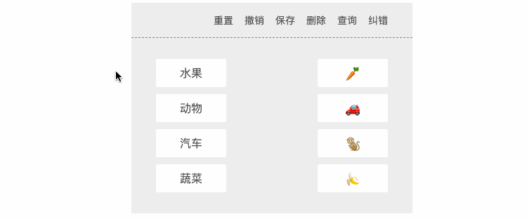
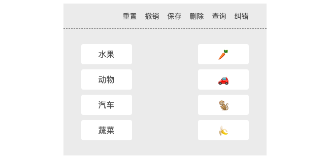
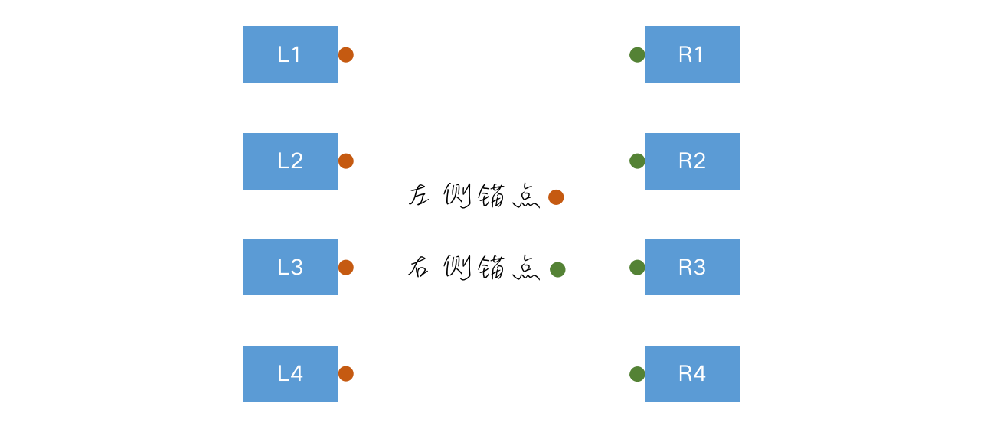
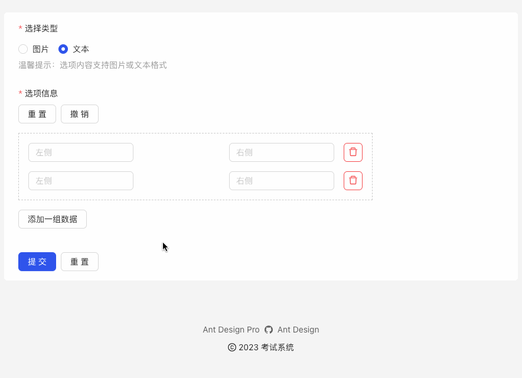

# 概述

最近在做一个考试系统，其中有一个题型是 **连线题**，当时在网上查阅了大量的资料，没找到自己想要的效果，于是决定自己实现。

效果如下：



本示例主要使用原生js + canvas 实现，为了各位看官能够理解实现，代码中有大量的注释，并且没有过度封装和抽离。

# 需求

1. 左右布局，支持 **1对1双向连线**（即从左侧连到右侧，从右侧连到左侧）。
2. 支持【重置画板】【撤销】【保存连线记录】【删除连线记录】【查询连线记录】【纠错】功能

# 实现

在开始实现之前，首先我们需要确定一下相关的数据结构

1. 连线答案/标准答案结构

   ```js
   {
     水果: '🍌',
     动物: '🐒',
     汽车: '🚗',
     蔬菜: '🥕',
   }
   ```

   > 温馨提示：由于只考虑1对1的情况，这里我们直接用 `key`:`value` 对标识，其中 `key` 为左侧选项值，`value` 为右侧选项值。

2. 连线记录结构

   ```js
   [
     { key: 'xxx', point: { x1, y1, x2, y2 } },
     { key: 'xxx', point: { x1, y1, x2, y2 } },
     ...
   ];
   ```

   - `key`：连线答案中的 `key` 值，在后续查找连接开始元素和结束元素时，可以快速定位 `key:value` 对查找。
   - `point`：连线元素锚点（*顺序无所谓，只要有两个点确保能连成一条线即可*）

3. 纠错结构

   ```js
   [
     { isOk, point: { x1, y1, x2, y2 } },
     { isOk, point: { x1, y1, x2, y2 } },
     ...
   ];
   ```

   - `isOk`：布尔值，标识当前连线是否正确，用于在绘制线条时赋予不同的颜色标注，比如 ❎用红色，✅用蓝色。
   - `point`：连线元素锚点（*顺序无所谓，只要有两个点确保能连成一条线即可*）

> 提示：实现章节中，我将根据我的实现思路，按顺序编辑，所以你只需要从上往下阅读文章并敲代码实践即可，文章的最后，我会贴上脚本部分的完整代码。

## 布局 & 样式



两列布局，基于 flex 实现，画板用了两个 `canvas` 标签，一个用于实际连线，因为在连接的过程中，有可能会取消，此时会调用 crearRect 清除画板，为了避免将之前的记录一起给清除了，所以需要另一个画板用于回显，主要展示已经连接好的路径。

**`index.html`**

```html
<div class="container">
  <!-- 工具栏 -->
  <div class="tools">
    <div class="button reset">重置</div>
    <div class="button undo">撤销</div>
    <div class="button save">保存</div>
    <div class="button delete">删除</div>
    <div class="button read">查询</div>
    <div class="button check">纠错</div>
  </div>
  <div class="content">
    <!-- 左侧 -->
    <div class="options leftOptions">
      <div class="option" data-value="水果" data-ownership="L">水果</div>
      <div class="option" data-value="动物" data-ownership="L">动物</div>
      <div class="option" data-value="汽车" data-ownership="L">汽车</div>
      <div class="option" data-value="蔬菜" data-ownership="L">蔬菜</div>
    </div>
    <!-- 右侧 -->
    <div class="options rightOptions">
      <div class="option" data-value="🥕" data-ownership="R">🥕</div>
      <div class="option" data-value="🚗" data-ownership="R">🚗</div>
      <div class="option" data-value="🐒" data-ownership="R">🐒</div>
      <div class="option" data-value="🍌" data-ownership="R">🍌</div>
    </div>
    <!-- 实际连线标签 -->
    <canvas id="canvas" width="400" height="250"></canvas>
    <!-- 模拟连线标签 -->
    <canvas id="backCanvas" width="400" height="250"></canvas>

  </div>
</div>
```

> 提示：在布局标签时，`data-value` 标识数据，`data-ownership` 标识元素所在的区间，`L` 表示左侧，`R` 表示右侧。

**`./css/index.css`**

```css
.container {
  width: 400px;
  margin: 100px auto;
}

.tools {
  height: 50px;
  display: flex;
  justify-content: flex-end;
  align-items: center;
  background-color: #EEE;
  box-sizing: border-box;
  padding: 0 35px;
  border-bottom: 1px dashed #808080;
  font-size: 14px;
  color: #555;
  cursor: pointer;
}

.tools .button:not(:first-child) {
  margin-left: 16px;
}

.tools .button:hover {
  color: #1E90FF;
}

.content {
  width: 400px;
  height: 250px;
  background: #EEE;
  box-sizing: border-box;
  padding: 0 35px;
  display: flex;
  justify-content: space-between;
  align-items: center;
  position: relative;
}

.rightOptions {
  font-size: 26px;
}

.option {
  width: 100px;
  height: 40px;
  background-color: #fff;
  display: flex;
  justify-content: center;
  align-items: center;
  border-radius: 4px;
  cursor: pointer;
  user-select: none;
  color: #555;
  position: relative;
  z-index: 1;
}

.option:not(:last-child) {
  margin-bottom: 10px;
}

.option.active {
  background: #6495ED;
  color: #FFF;
}

#canvas,
#backCanvas {
  width: 100%;
  height: 100%;
  position: absolute;
  top: 0;
  left: 0;
}
```

## 获取Canvas & 配置画笔

```js
// 第1步：获取Canvas & 配置画笔
const canvas = document.getElementById("canvas");
const backCanvas = document.getElementById("backCanvas");
canvas.width = backCanvas.width = 400;
canvas.height = backCanvas.height = 250;

/** @type {CanvasRenderingContext2D} */
const ctx = canvas.getContext("2d");
const backCtx = backCanvas.getContext("2d");

ctx.strokeStyle = backCtx.strokeStyle = '#6495ED';
ctx.lineWidth = backCtx.lineWidth = 1;
```

## 获取必要元素，挂载数据

```js
// 第2步：获取列表元素，挂载后续操作所需的数据
const tag = 'v__' + Math.random().toString(36).slice(2);
const options = document.querySelectorAll('.container .option');
options.forEach(item => {
  // 获取元素在屏幕上的信息
  const { width, height } = item.getBoundingClientRect();
  // 获取元素归属：左侧还是右侧·用于计算元素锚点坐标
  const ownership = item.dataset.ownership;
  // 记录元素锚点坐标
  const anchorX = ownership === 'L' ? item.offsetLeft + width : item.offsetLeft;
  const anchorY = item.offsetTop + height / 2;
  item.dataset.anchorX = anchorX;
  item.dataset.anchorY = anchorY;

  // 标识当前元素是否连线
  item.dataset.checked = '0';
  // 标识当前元素为连线元素
  item.dataset.tag = tag;

  // 绘制锚点，查看锚点位置是否准确（临时代码）
  ctx.beginPath();
  ctx.arc(anchorX, anchorY, 4, 0, Math.PI * 2);
  ctx.stroke();
  ctx.closePath();
});
```

## 绑定事件

```js
// 第3步：绑定事件
options.forEach((item) => (item.onmousedown = onMousedown));
document.onmousemove = onMousemove;
document.onmouseup = onMouseup;
```

## 连线相关（核心逻辑）



分析：

1. 当鼠标按在（mousedown）某个元素上时，该元素将作为 **开始元素**（不管左侧还是右侧）
2. 在鼠标按下移动的过程中，需实时基于canvas显示路径（直线，将开始元素的锚点作为开始点，将鼠标移动的实时位置作为结束点）
3. 当鼠标经过（mousemove） **目标元素**（如果起始元素在左侧，那目标元素一定是在右侧，反之亦然） 时，如果 **目标元素** 未被选中，则标识开始元素和目标元素的连线状态。
4. 当鼠标抬起（mouseup）时：
   - 未命中任何目标元素，删除路径，并恢复开始元素的状态
   - 命中目标元素，判断目标元素是否已连线
     - 已连线：删除路径，并恢复开始元素的状态
     - 未连线：更新路径，直接将开始元素和目标元素的锚点连接在一起，并且高亮起始元素和目标元素，标识已选中。
5. 如果开始元素已连线，可以修改连线，将其连接到未连线的目标元素上，同时将之前匹配的目标元素恢复初始状态。
6. 具体的逻辑在代码中有体现...

代码：

```js
// 第4步：连线相关（核心逻辑）
let trigger = false; // 标识是否触发连线
let startPoint = { x: 0, y: 0 }; // 记录每一次连线开始点
let endPoint = { x: 0, y: 0 }; // 记录每一次连线结束点
let startElement = null; // 记录每一次连线开始元素
let endElement = null; // 记录每一次连线结束元素
let backLines = []; // 记录已经连接好的线·数据结构 
let anwsers = {}; // 记录答案

function onMousedown(event) {
  // 高亮显示按下的元素
  this.classList.add('active');
  // 记录每一次连线的开始元素
  startElement = this;
  // 更新每一次连线开始点信息
  startPoint.x = +this.dataset.anchorX;
  startPoint.y = +this.dataset.anchorY;
  // 标识触发连线，用于在mousemove中判断是否需要处理后续的逻辑
  trigger = true;
  // 阻止时间冒泡/默认行为
  event.stopPropagation();
  event.preventDefault();
}


function onMousemove(event) {
  if (trigger) {
    /****************
     * 处理连线
     ****************/

    // 获取鼠标在屏幕上的位置
    const { clientX, clientY } = event;

    // 计算鼠标在画板中的位置
    const { left, top } = canvas.getBoundingClientRect();
    const endPoint = {
      x: clientX - left,
      y: clientY - top
    }

    // 连线：实际画板
    ctx.clearRect(0, 0, canvas.width, canvas.height);
    ctx.beginPath();
    ctx.moveTo(startPoint.x, startPoint.y);
    ctx.lineTo(endPoint.x, endPoint.y);
    ctx.closePath();
    ctx.stroke();

    /****************
     * 处理后续逻辑
     ****************/

    // 获取鼠标经过的元素
    const overElement = document.elementFromPoint(clientX, clientY);
    // 获取开始元素归属：左侧还是右侧
    const ownership = startElement.dataset.ownership;
    // 如果鼠标经过的元素等于目标元素，不作任何处理
    if (overElement === endElement) return;


    // 判断是否命中目标元素，条件如下（同时满足）
    // ① 鼠标经过的元素必须必须是连线元素（可通过判断 data-tag 是否和设置的tag一致即可）
    // ② 鼠标经过的元素和开始元素不在同一侧
    // ③ 鼠标经过的元素未被连线
    const condition1 = overElement.dataset.tag === tag;
    const condition2 = overElement.dataset.ownership !== ownership;
    const condition3 = overElement.dataset.checked !== '1';
    if (condition1 && condition2 && condition3) {
      // 记录目标元素
      endElement = overElement;
      // 更新目标元素状态（高亮显示）
      endElement.classList.add('active');
      // 将开始元素和目标元素表示为已连线
      endElement.dataset.checked = '1';
      startElement.dataset.checked = '1';
    }
    // 如果没有命中目标元素，但是目标元素又存在，则移除相关状态
    else if (endElement) {
      endElement.classList.remove('active');
      endElement.dataset.checked = startElement.dataset.checked = '0';
      endElement = null;
    }
  }
  // 阻止事件冒泡/默认行为
  event.stopPropagation();
  event.preventDefault();
}

function onMouseup(event) {
  if (!trigger) return;

  // 如果开始元素存在且未被连线，则恢复开始元素的状态
  if (startElement && startElement.dataset.checked !== '1') {
    startElement.classList.remove('active');
  }
  // 完成连线：开始元素和目标元素同时存在，并且被标识选中
  if (startElement && endElement && startElement.dataset.checked === '1' && endElement.dataset.checked === '1') {
    // 获取连线始末坐标点
    const { anchorX: x1, anchorY: y1 } = startElement.dataset;
    const { anchorX: x2, anchorY: y2 } = endElement.dataset;
    // 获取开始元素归属：左侧还是右侧
    const ownership = startElement.dataset.ownership;

    // 获取开始元素和目标元素的值
    const startValue = startElement.dataset.value;
    const endValue = endElement.dataset.value;

    // 判断开始元素是否已经连线
    const keys = Object.keys(anwsers);
    const values = Object.values(anwsers);
    if (keys.includes(startValue) || values.includes(startValue)) {
      // 已连线，处理步骤
      // ① 找到已连线的目标元素的value·注意：可能在Map结构的左侧，也可能在右侧
      let key = '';
      let value = '';
      for (let i = 0; i < keys.length; i++) {
        const k = keys[i];
        const v = values[i];
        if ([k, v].includes(startValue)) {
          key = k;
          value = k === startValue ? v : k;
          break;
        }
      }
      // ② 根据targetValue找到目标元素
      const sel = `[data-value=${value}]`;
      const tarElement = document.querySelector(sel);
      // ③ 恢复目标元素的状态（标识+高亮状态）
      tarElement.dataset.checked = '0';
      tarElement.classList.remove('active');
      // ④ 将对应的数据从记录中移除（因为后面会重新插入数据）
      delete anwsers[key];
      const index = backLines.findIndex((item) => item.key === key);
      if (index >= 0) {
        backLines.splice(index, 1);
      }
    }

    // 未连线
    const k = ownership === 'L' ? startValue : endValue;
    const v = ownership === 'L' ? endValue : startValue;
    anwsers[k] = v;
    backLines.push({
      key: k,
      point: { x1, y1, x2, y2 },
    });
    drawLines();

  }

  // 恢复元素状态
  trigger = false;
  startElement = null;
  endElement = null;
  // 清空实际连线画布
  ctx.clearRect(0, 0, canvas.width, canvas.height);

  // 阻止事件冒泡/默认行为
  event.stopPropagation();
  event.preventDefault();
}
// -- 模拟连线
function drawLines() {
  backCtx.clearRect(0, 0, backCanvas.width, backCanvas.height);
  backLines.forEach(({ point: { x1, y1, x2, y2 } }) => {
    backCtx.beginPath();
    backCtx.moveTo(x1, y1);
    backCtx.lineTo(x2, y2);
    backCtx.closePath();
    backCtx.stroke();
  });
}
```

## 重置画板

思路：

① 清空模拟连线画布

② 恢复元素初始状态

③ 置空连线记录

```js
// 第5步：重置
const btnReset = document.querySelector('.reset');
btnReset.onclick = function () {
  backCtx.clearRect(0, 0, backCanvas.width, backCanvas.height);
  options.forEach((item) => {
    item.classList.remove('active');
    item.dataset.checked = '0';
  });
  anwsers = {};
  backLines = [];
}
```

## 撤销

思路：

① 将最后一次连线的数据从连线记录中移除（出栈）

② 获取撤销记录的 key 值

③ 根据 key 查找连线开始元素和目标元素

④ 从答案中删除撤销的记录（保持同步）

⑤ 恢复撤销记录开始元素和目标元素的状态

⑥ 重新绘制模拟连线

```js
// 第6步：撤销
const btnUndo = document.querySelector('.undo');
btnUndo.onclick = function () {
  const line = backLines.pop();
  if (line) {
    const { key } = line;
    const leftSel = `[data-value="${key}"]`;
    const rightSel = `[data-value="${anwsers[key]}"]`;
    delete anwsers[key];
    const leftElement = document.querySelector(leftSel);
    const rightElement = document.querySelector(rightSel);
    if (leftElement && rightElement) {
      leftElement.dataset.checked = rightElement.dataset.checked = '0';
      leftElement.classList.remove('active');
      rightElement.classList.remove('active');
      drawLines();
    }
  }
}
```

## 保存连线记录

思路：直接将 `anwser` 存储至本地即可

```js
// 第7步：保存连线记录
const saveAnwsers = () => {
  if (Object.keys(anwsers).length > 0) {
    localStorage.setItem('ANWSERS', JSON.stringify(anwsers));
    console.log('保存成功');
  } else {
    console.log('没有可保存的数据');
  }
}
const btnSave = document.querySelector('.save');
btnSave.onclick = saveAnwsers;
```

## 删除连线记录

思路：直接从本地删除即可

```js
// 第8步：删除连线记录
const btnDelete = document.querySelector('.delete');
btnDelete.onclick = () => {
  localStorage.removeItem('ANWSERS');
  console.log('删除成功');
};
```

## 读取连线记录

思路：

① 从本地读取数据

② 判断数据是否存在，如果存在，则遍历数据做后续处理

③ 获取每一条线路的开始元素和目标元素

④ 更新开始元素和目标元素的状态：选中状态/高亮显示

⑤ 计算连线坐标

⑥ 拼装数据并绘制到模拟连线画板上

```js
// 第9步：读取连线记录
const showAnwsers = () => {
  const localAnwsers = localStorage.getItem('ANWSERS');
  if (localAnwsers) {
    anwsers = JSON.parse(localAnwsers);
    const keys = Object.keys(anwsers);
    keys.forEach((key) => {
      const value = anwsers[key];
      // 获取开始元素和目标元素
      const leftSel = `[data-value="${key}"]`;
      const rightSel = `[data-value=${value}]`;
      const leftElement = document.querySelector(leftSel);
      const rightElement = document.querySelector(rightSel);
      if (leftElement && rightElement) {
        // 更新选中状态
        leftElement.dataset.checked = rightElement.dataset.checked = '1';
        // 高亮显示元素
        leftElement.classList.add('active');
        rightElement.classList.add('active');
        // 计算坐标
        const { anchorX: x1, anchorY: y1 } = leftElement.dataset;
        const { anchorX: x2, anchorY: y2 } = rightElement.dataset;
        // 拼装数据
        backLines.push({
          key,
          point: { x1, y1, x2, y2 },
        });
      }
    });
    drawLines();
  } else {
    console.log("没有可回显的数据")
  }
}
const btnShow = document.querySelector('.read');
btnShow.onclick = showAnwsers;
```

## 纠错

思路：

① 从本地读取数据

② 判断数据是否存在，如果存在，则遍历数据做后续处理

③ 获取每一条线路的开始元素和目标元素

④ 更新开始元素和目标元素的状态：选中状态/高亮显示

⑤ 计算连线坐标

⑥ 处理纠错逻辑

⑦ 拼装数据并绘制到模拟连线画板上

```js
const standardAnwsers = {
  水果: '🍌',
  动物: '🐒',
  汽车: '🚗',
  蔬菜: '🥕',
};
const checkAnwsers = () => {
  // 获取答案keys
  const keys = Object.keys(anwsers);
  if (keys.length === 0) {
    console.log('没有可纠错的答案');
    return;
  }
  // 定义变量，记录连线信息
  const lines = [];
  // 遍历keys
  keys.forEach((key) => {
    const value = anwsers[key];
    /****************
     * 找到用户连线的数据
     ****************/
    const leftSel = `[data-value="${key}"]`;
    const rightSel = `[data-value=${value}]`;
    const leftElement = document.querySelector(leftSel);
    const rightElement = document.querySelector(rightSel);
    if (leftElement && rightElement) {
      // 更新选中状态
      leftElement.dataset.checked = rightElement.dataset.checked = '1';
      // 高亮显示元素
      leftElement.classList.add('active');
      rightElement.classList.add('active');
      // 计算坐标
      const { anchorX: x1, anchorY: y1 } = leftElement.dataset;
      const { anchorX: x2, anchorY: y2 } = rightElement.dataset;
      /****************
       * 处理纠错逻辑
       ****************/
      // 获取答案
      const anwser = standardAnwsers[key];
      // 拼装数据
      lines.push({
        isOk: value === anwser,
        point: { x1, y1, x2, y2 },
      });
    }
  });
  // 绘制模拟连线画板
  backCtx.clearRect(0, 0, backCanvas.width, backCanvas.height);
  lines.forEach(({ isOk, point: { x1, y1, x2, y2 } }) => {
    backCtx.strokeStyle = isOk ? '#3CB371' : '#DC143C';
    backCtx.beginPath();
    backCtx.moveTo(x1, y1);
    backCtx.lineTo(x2, y2);
    backCtx.stroke();
  });
}
const btnCheck = document.querySelector('.check');
btnCheck.onclick = checkAnwsers;
```

可以看到，【纠错】部分的代码和【读取连线记录】的代码大部分都是相同的，区别就在于，【纠错】时需根据标准答案判断连线的记录是否正确，通过 `isOK` 标识，在绘制到模拟连线画板上时，会根据状态决定绘制的颜色，实际上，在应用中我们应该抽离一部分公共代码，但是为了大家能够看懂，这里我并没有这么做。

# 完整代码

点击查看 [完整代码](https://gitee.com/lihongyao/Canvas/tree/master/CODES/%E8%BF%9E%E7%BA%BF%E9%A2%98)

已封装 **`MatchLine`** 工具类发布至npm，点击 [前往查看 >>](https://www.npmjs.com/package/@likg/match-line)

# 补充：创建试题，构造连线数据

> 更新日期：2023年09月20日·上午

有小伙伴在后台留言说，知道怎么在客户端渲染绘制连线题了，但是在 **后台管理系统** 创建试题时，如何去构造连线试题的数据呢？那么今天，刚好有时间，带着大家一起去探讨。先看效果：



## 需求

1. 管理员创建连线题试题
   - 由于只实现 **1对1**，因此连线题数据左右项的长度必须一致。
   - 为了保证连线题的顺序，我们应该使用数组结构来存储数据项。
   - 连线题至少包含两组选项，否则没有意义。
   - 数据项 **不能重复** 且 **不能为空**。
   - 可根据实际需求限制数据项的长度，在录入数据项时清除首尾空格。
   - ...
2. 管理员设置标准答案

## 思考

回顾一下，我们在最开始设计时，对于答案的数据结构使用的是 Map 结构，如下所示：

```
{
  水果: '🍌',
  动物: '🐒',
  汽车: '🚗',
  蔬菜: '🥕',
}
```

> 注意：在这个结构中，所有的 `key` 表示 **左列** 值，所有的  `value` 表示 **右列** 值。

由于Map结构是无序的，为了保证前端在渲染数据项时有序，这里对于数据项的存储我们使用数组结构，这样也便于我们去对数据项做添加和删除的动作，具体结构如下所示：

```ts
export type MatchLineOptions = Array<{
  leftOption: string;
  rightOption: string;
}>
```

```ts
[
  { leftOption: '水果', rightOption: '🥕' },
  { leftOption: '动物', rightOption: '🚗' },
  { leftOption: '汽车', rightOption: '🐒' },
  { leftOption: '蔬菜', rightOption: '🍌' },
]
```

创建试题时，我们主要维护数据项数组 `options` 即可，当点击 **添加一组数据** 时，我们只需要在数组末尾追加数据项即可，如下所示：

```ts
options.push({leftOption: '', rightOption: ''})
```

> 提示：你应该确保数据项至少包含两组，否则连线题无意义。

当用户编辑数据项时，动态更新对应的值。

## 代码实现

框架：React + TypeScript + Ant Design 

### MatchLineForm

**`.tsx`**

```tsx
import { DeleteOutlined, UploadOutlined } from '@ant-design/icons';
import MatchLine, {
  MatchLineAnwsers,
  MatchLineOptions,
} from '@likg/match-line';
import { App, Button, Input, Space } from 'antd';
import React, { useEffect, useState } from 'react';
import './index.less';

let index__ = 0;

export interface MatchLineFormValue {
  options: MatchLineOptions;
  anwsers?: MatchLineAnwsers;
}

interface IProps {
  type?: 'TEXT' | 'IMAGE';
  value?: MatchLineFormValue;
  onChange?: (value: MatchLineFormValue) => void;
}

const MatchLineForm: React.FC<IProps> = React.memo(
  ({ value, type = 'TEXT', onChange }) => {
    const { message } = App.useApp();
    const defaultValue: MatchLineFormValue = {
      options: [
        { leftOption: '', rightOption: '' },
        { leftOption: '', rightOption: '' },
      ],
      anwsers: undefined,
    };

    const [matchline, setMatchline] = useState<MatchLine | null>(null);
    const [showAnchor, setShowAnchor] = useState(false);
    const [dataSource, setDataSource] = useState<MatchLineFormValue>(
      value || defaultValue,
    );

    const onPushOption = () => {
      const t = { ...dataSource };
      t.options.push({ leftOption: '', rightOption: '' });
      t.anwsers = undefined;
      setDataSource(t);
      onChange && onChange(t);
    };

    const onDeleteOption = (index: number) => {
      if (dataSource.options.length <= 2) {
        return message.warning('至少需要两组选项');
      }
      const t = { ...dataSource };
      t.options.splice(index, 1);
      t.anwsers = undefined;
      setDataSource(t);
      onChange && onChange(t);
    };

    const onInputChange = (
      value: string,
      index: number,
      key: 'leftOption' | 'rightOption',
    ) => {
      const t = { ...dataSource };
      t.options[index][key] = value;
      t.anwsers = undefined;
      setDataSource(t);
      onChange && onChange(t);
    };

    const onFileChange = (
      files: FileList | null,
      index: number,
      key: 'leftOption' | 'rightOption',
    ) => {
      if (files && files.length > 0) {
        const file = files[0];
        message.loading('图片上传中...', 60 * 1000);
        // -- 模拟图片
        const urls = [
          'https://gimg2.baidu.com/image_search/src=http%3A%2F%2Fsafe-img.xhscdn.com%2Fbw1%2F351de5f7-9498-40bf-a2a4-50f8a7599acc%3FimageView2%2F2%2Fw%2F1080%2Fformat%2Fjpg&refer=http%3A%2F%2Fsafe-img.xhscdn.com&app=2002&size=f9999,10000&q=a80&n=0&g=0n&fmt=auto?sec=1698247010&t=60c3f75d31bfb77d5aa46bc56751c7bc',
          'https://gimg2.baidu.com/image_search/src=http%3A%2F%2Fsafe-img.xhscdn.com%2Fbw1%2Fc77eccc9-5752-4ab5-a777-bc64122a7fc2%3FimageView2%2F2%2Fw%2F1080%2Fformat%2Fjpg&refer=http%3A%2F%2Fsafe-img.xhscdn.com&app=2002&size=f9999,10000&q=a80&n=0&g=0n&fmt=auto?sec=1698247010&t=d084e5951792eecace95df293e6c507d',
          'https://gimg2.baidu.com/image_search/src=http%3A%2F%2Fsafe-img.xhscdn.com%2Fbw1%2F4cecb617-8679-4d3c-bb1b-222334871030%3FimageView2%2F2%2Fw%2F1080%2Fformat%2Fjpg&refer=http%3A%2F%2Fsafe-img.xhscdn.com&app=2002&size=f9999,10000&q=a80&n=0&g=0n&fmt=auto?sec=1698247010&t=eadc698ee9de58281d527d7c964bfaa8',
          'https://gimg2.baidu.com/image_search/src=http%3A%2F%2Fsafe-img.xhscdn.com%2Fbw1%2Fa87bd95e-af43-43fb-b9c6-2be9720ae8c4%3FimageView2%2F2%2Fw%2F1080%2Fformat%2Fjpg&refer=http%3A%2F%2Fsafe-img.xhscdn.com&app=2002&size=f9999,10000&q=a80&n=0&g=0n&fmt=auto?sec=1698247010&t=4d072c0b9c7d60abf0c2a12b8f24f4c6',
          'https://gimg2.baidu.com/image_search/src=http%3A%2F%2Fsafe-img.xhscdn.com%2Fbw1%2Fbb44dd9b-3e37-4ca6-ae76-4cf845703948%3FimageView2%2F2%2Fw%2F1080%2Fformat%2Fjpg&refer=http%3A%2F%2Fsafe-img.xhscdn.com&app=2002&size=f9999,10000&q=a80&n=0&g=0n&fmt=auto?sec=1698247010&t=e152ef9a03b93ab2fd4ae36d478e7ad9',
          'https://gimg2.baidu.com/image_search/src=http%3A%2F%2Fsafe-img.xhscdn.com%2Fbw1%2Fcefc1885-6350-4f70-9af8-a24ec8ff3f3f%3FimageView2%2F2%2Fw%2F1080%2Fformat%2Fjpg&refer=http%3A%2F%2Fsafe-img.xhscdn.com&app=2002&size=f9999,10000&q=a80&n=0&g=0n&fmt=auto?sec=1698247010&t=6d7a71d028356c7a5d08e44e5d31b0d4',
        ];
        setTimeout(() => {
          const t = { ...dataSource };
          t.options[index][key] = urls[index__++];
          t.anwsers = undefined;
          setDataSource(t);
          onChange && onChange(t);
          message.destroy();
        }, 500);
      }
    };

    useEffect(() => {
      const { options, anwsers } = dataSource;
      if (anwsers) {
        setShowAnchor(true);
      } else {
        const see: Record<string, boolean> = {};
        let flag = true;
        for (let i = 0; i < options.length; i++) {
          const { leftOption, rightOption } = options[i];
          if (!leftOption || !rightOption) {
            flag = false;
            break;
          }
          if (see[leftOption]) {
            flag = false;
            break;
          }
          see[leftOption] = true;
          if (see[rightOption]) {
            flag = false;
            break;
          }
          see[rightOption] = true;
        }
        setShowAnchor(flag);
      }
    }, [dataSource]);

    useEffect(() => {
      const container = document.querySelector('.match-line__container');
      const items = document.querySelectorAll('.anchor');
      const canvas = document.querySelector('#canvas');
      const backCanvas = document.querySelector('#backCanvas');
      if (container && items && canvas && backCanvas) {
        const matchline = new MatchLine({
          id: 'a',
          container: container as HTMLDivElement,
          items: items as NodeListOf<HTMLElement>,
          canvas: canvas as HTMLCanvasElement,
          backCanvas: backCanvas as HTMLCanvasElement,
          anwsers: dataSource?.anwsers,
          onChange(anwsers) {
            const t = { ...dataSource };
            t.anwsers = anwsers;
            setDataSource(t);
            onChange && onChange(t);
          },
        });
        setMatchline(matchline);
      }
    }, [onChange, dataSource, showAnchor]);

    const renderItems = () => {
      return dataSource.options.map((option, i) => {
        return (
          <div className="row" key={i}>
            <div className="wrap">
              {/* 左侧 */}
              <div className="item leftOption">
                {type === 'TEXT' ? (
                  <Input
                    placeholder="左侧"
                    value={option.leftOption}
                    onChange={(e) =>
                      onInputChange(e.target.value, i, 'leftOption')
                    }
                  />
                ) : (
                  <div
                    className="upload-box"
                    style={{
                      backgroundImage: `url('${option.leftOption}')`,
                    }}
                  >
                    {option.leftOption ? null : (
                      <Space direction={'vertical'} align={'center'}>
                        <UploadOutlined style={{ color: '#C5C5C5' }} />
                      </Space>
                    )}
                    <input
                      type={'file'}
                      onChange={(event) => {
                        onFileChange(event.target.files, i, 'leftOption');
                      }}
                    />
                  </div>
                )}

                {showAnchor && (
                  <div
                    draggable={false}
                    className="anchor"
                    data-value={option.leftOption}
                    data-ownership={'L'}
                    data-checked="0"
                  />
                )}
              </div>
              {/* 右侧 */}
              <div className="item rightOption">
                {showAnchor && (
                  <div
                    draggable={false}
                    className="anchor"
                    data-value={option.rightOption}
                    data-ownership={'R'}
                    data-checked="0"
                  />
                )}
                {type === 'TEXT' ? (
                  <Input
                    placeholder="右侧"
                    value={option.rightOption}
                    onChange={(e) =>
                      onInputChange(e.target.value, i, 'rightOption')
                    }
                  />
                ) : (
                  <div
                    className="upload-box"
                    style={{
                      backgroundImage: `url('${option.rightOption}')`,
                    }}
                  >
                    {option.rightOption ? null : (
                      <Space direction={'vertical'} align={'center'}>
                        <UploadOutlined style={{ color: '#C5C5C5' }} />
                      </Space>
                    )}
                    <input
                      type={'file'}
                      onChange={(event) => {
                        onFileChange(event.target.files, i, 'rightOption');
                      }}
                    />
                  </div>
                )}
              </div>
            </div>
            {/* 删除 */}
            <Button
              className="deleteBtn"
              danger
              icon={<DeleteOutlined />}
              onClick={() => {
                onDeleteOption(i);
              }}
            />
          </div>
        );
      });
    };
    return (
      <div className="match-line">
        {/* 工具栏 */}
        <Space style={{ marginBottom: 16 }}>
          <Button onClick={() => matchline?.reset()}>重置</Button>
          <Button onClick={() => matchline?.undo()}>撤销</Button>
        </Space>
        {/* 连线容器 */}
        <div className="match-line__container" draggable={false}>
          {/* 内容 */}
          <div className="match-line__contents">{renderItems()}</div>
          {/* 画板 */}
          <canvas id="canvas"></canvas>
          <canvas id="backCanvas"></canvas>
        </div>
        {/* 操作项 */}
        <Button
          onClick={onPushOption}
          style={{ marginTop: 16, marginBottom: 16 }}
        >
          添加一组数据
        </Button>
      </div>
    );
  },
);

export default MatchLineForm;

```

**`.less`**

```less
.match-line {
  width: 600px;
  &__container {
    position: relative;
    canvas {
      width: 100%;
      height: 100%;
      position: absolute;
      top: 0;
      left: 0;
    }
  }
  &__contents {
    padding: 16px;
    user-select: none;
    border: 1px dashed #ccc;
    background: #fff;
    .row {
      display: flex;
      justify-content: space-between;
      align-items: center;
      &:not(:last-child) {
        margin-bottom: 16px;
      }
    }
    .deleteBtn {
      position: relative;
      z-index: 1;
      margin-left: 16px;
    }
    .wrap {
      flex: 1;
      display: flex;
      justify-content: space-between;
      align-items: center;
    }
    .item {
      position: relative;
      z-index: 1;
      display: flex;
      align-items: center;
      position: relative;
      .anchor {
        width: 12px;
        height: 12px;
        flex-shrink: 0;
        background: #ccc;

        cursor: pointer;
        &.active {
          background: #6495ed;
        }
      }
    }
    .upload-box {
      width: 100px;
      height: 100px;
      border: 1px dashed #ccc;
      display: flex;
      justify-content: center;
      align-items: center;
      font-size: 28px;
      background-repeat: no-repeat;
      background-position: center center;
      background-size: contain;
      position: relative;
      [type='file'] {
        width: 100%;
        height: 100%;
        background: orange;
        position: absolute;
        top: 0;
        left: 0;
        opacity: 0;
        cursor: pointer;
      }
    }
  }
}

```

### 页面调用

```tsx
import MatchLineForm, { MatchLineFormValue } from '@/components/MatchLineForm';
import {
  ProCard,
  ProForm,
  ProFormDependency,
  ProFormInstance,
  ProFormRadio,
} from '@ant-design/pro-components';
import { RuleObject } from 'antd/es/form';
import { StoreValue } from 'antd/es/form/interface';
import React, { useRef } from 'react';

const LgTest: React.FC = () => {
  const vForm = useRef<ProFormInstance>();

  const validator = (_: RuleObject, value: StoreValue) => {
    if (value) {
      const { options, anwsers } = value as MatchLineFormValue;
      const see: Record<string, boolean> = {};
      for (let i = 0; i < options.length; i++) {
        const { leftOption, rightOption } = options[i];

        if (!leftOption || !rightOption) {
          return Promise.reject('请完善选项信息');
        }

        if (see[leftOption]) {
          return Promise.reject('选项信息不可重复');
        }
        see[leftOption] = true;

        if (see[rightOption]) {
          return Promise.reject('选项信息不可重复');
        }
        see[rightOption] = true;
      }

      if (!anwsers) {
        return Promise.reject('请设置标准答案');
      }

      if (Object.keys(anwsers).length !== options.length) {
        return Promise.reject('请完善标准答案');
      }

      return Promise.resolve(null);
    }

    return Promise.reject('请完善选项信息');
  };
  return (
    <ProCard>
      <ProForm
        formRef={vForm}
        initialValues={{
          match_type: 'TEXT',
        }}
        onFinish={async (values) => {
          console.log(values);
        }}
      >
        <ProFormRadio.Group
          label="选择类型"
          name={'match_type'}
          required
          rules={[{ required: true }]}
          extra={'温馨提示：选项内容支持图片或文本格式'}
          fieldProps={{
            onChange: () => {
              vForm.current?.setFieldValue('matchlines', undefined);
            },
          }}
          options={[
            { value: 'IMAGE', label: '图片' },
            { value: 'TEXT', label: '文本' },
          ]}
        />
        <ProFormDependency name={['match_type']}>
          {({ match_type }) => {
            switch (match_type) {
              case 'IMAGE':
                return (
                  <ProForm.Item
                    label="选项信息"
                    name={'matchlines'}
                    rules={[{ validator }]}
                  >
                    <MatchLineForm key={'IMAGE'} type={'IMAGE'} />
                  </ProForm.Item>
                );
              case 'TEXT':
                return (
                  <ProForm.Item
                    label="选项信息"
                    name={'matchlines'}
                    required
                    rules={[{ validator }]}
                  >
                    <MatchLineForm key={'TEXT'} type={'TEXT'} />
                  </ProForm.Item>
                );
            }
            return null;
          }}
        </ProFormDependency>
      </ProForm>
    </ProCard>
  );
};

export default LgTest;
```

# 尾叙

如果大家觉得这篇文章帮到了您，欢迎 **点赞** + **关注**，在 **连线题** 的实现中，我认为还有很多值得优化和推敲的地方，如果大家有什么更好的建议，欢迎评论区留言，我们一起探讨最优解。

> 温馨提示：原创不易，转载请注明出处。


