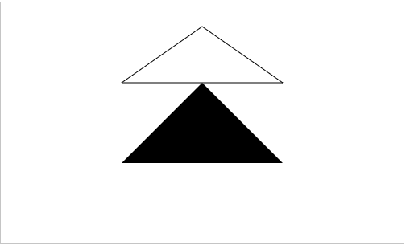

# 一、简介

[Canvas](https://developer.mozilla.org/zh-CN/docs/Web/API/Canvas_API) 是HTML5新增的组件，它就像一块画板，可以用 JavaScript在上面绘制各种图表、动画等。

一个Canvas定义了一个指定尺寸的矩形框，在这个范围内我们可以随意绘制：

```html
<canvas id="canvas" width="500" height="300"></canvas>
```

由于浏览器对HTML5标准支持不一致，所以，通常在 `<canvas>` 内部添加一些说明性HTML代码，如果浏览器支持Canvas，它将忽略 `<canvas>` 内部的HTML，如果浏览器不支持Canvas，它将显示 `<canvas>` 内部的HTML：

```html
<canvas id="canvas" width="500" height="300">
  <span>当前浏览器不支持Canvas，请下载最新的浏览器</span>
  <a href="https://www.google.com/chrome/">立即下载</a>
</canvas>
```

> **注意:** 如果你绘制出来的图像是扭曲的, 尝试用width和height属性为 \<canvas>明确规定宽高，而不是使用CSS。

在使用Canvas前，用 `canvas.getctx` 来测试浏览器是否支持Canvas：

```js
const canvas = document.getElementById('canvas');
if (canvas.getctx) {
  /** @type {CanvasRenderingctx2D} */
  const ctx = canvas.getctx('2d');
} else {
  console.log("当前浏览器不支持Canvas，请下载最新的浏览器");
}
```

获取上下文：

```js
// 2D
const ctx = canvas.getctx('2d');
// 3D
const ctx = canvas.getctx("webgl"); 
```

> 提示：本节我们只专注于绘制2D图形。

Canvas的坐标系：


Canvas的坐标以左上角为原点，水平向右为X轴，垂直向下为Y轴，以像素为单位，所以每个点都是非负整数。

# 二、方法

Canvas 绘制相关的API可以参考 [CanvasRenderingContext2D >>](https://developer.mozilla.org/zh-CN/docs/Web/API/CanvasRenderingContext2D)

## 1. 风格

```js
// 1. 填充
ctx.fillStyle = '字符串 | 十六进制(缩写) | RGB(A)';
ctx.fill();

// 2. 勾勒
ctx.strokeStyle = '字符串 | 十六进制(缩写) | RGB(A)';
ctx.stroke();

// 3. 画笔粗细
ctx.lineWidth;

// 4. 线头
ctx.lineCap = 'butt | round | square';

// 5. 交点
ctx.lineJoin = 'miter|round|bevel';

// 6. 透明度
ctx.globalAlpha = 0.5; // between 0 and 1

// 7. 阴影
ctx.shadowColor = 'color';
ctx.shadowBlur = blur;
ctx.shadowOffsetX = x;
ctx.shadowOffsetY = y;

// 8. 线性渐变
const gradient = ctx.createLinearGradient(xStart,yStart,xEnd,yEnd);
gradient.addColorStop(offset, color); // 颜色节点
ctx.fillStyle = gradient;
ctx.fillRect();

// 9. 径向渐变
const gradient = ctx.createRadialGradient(xStart,yStart,radiusStart,xEnd,yEnd,radiusEnd);
gradient.addColorStop(offset,color);
ctx.fillStyle = gradient;
ctx.fill();
```

## 2. 绘制文字

```js
// 1. 填充文字
ctx.fillText(text, x, y, maxWidth);

// 2. 绘制文字轮廓
ctx.strokeText(text, x, y, maxWidth);

// 3. 字体样式
ctx.font = "[italic / bold] 40px Arial";

// 4. 水平对齐方式（以文字宽度的中心点作为基准线）
ctx.textAlign='start | left | center | right |end';

// 5. 垂直对齐方式（以文字高度的中心点作为基准线）
ctx.textBaseline='top | hanging | middle | alphabetic | ideographic | bottom';

// 6. 计算文本宽度
ctx.measureText(text).width;
```

代码示例：

```javascript
const canvas = document.querySelector('#canvas');
const ctx = canvas.getctx('2d');

ctx.strokeStyle = 'blue';
ctx.font = 'italic 36px 微软雅黑';
ctx.textAlign = 'left';
ctx.textBaseline = 'middle';
const width = ctx.measureText('Hello, world!').width;
ctx.strokeText('Hello, world!', 500 / 2 - width / 2, 150);
```


## 3. 绘制矩形

```js
// 1. 填充矩形
ctx.fillRect(x,y,width,height);
// 2. 绘制矩形
strokeRect(x,y,width,height);
// 3. 清除矩形区域
ctx.clearRect(x, y, width, height);
```

代码示例：

```js
/** @type {HTMLCanvasElement} */
const canvas = document.getElementById('canvas');
/** @type {CanvasRenderingContext2D} */
const ctx = canvas.getContext('2d');
ctx.strokeRect(50, 50, 100, 100);
ctx.fillRect(100, 100, 100, 100);

let height = 0;
const timer = setInterval(() => {
  height++;
  ctx.clearRect(0, 0, canvas.clientWidth, height);
  if (height > canvas.clientHeight) clearInterval(timer);
}, 10);s
```


## 4. 绘制圆形

```markdown
// 1. 语法形式
ctx.arc(x, y, radius, starAngle,endAngle, anticlockwise「是否逆时针」)
```


代码示例：

```javascript
/** @type {HTMLCanvasElement} */
const canvas = document.getElementById('canvas');
/** @type {CanvasRenderingContext2D} */
const ctx = canvas.getContext('2d');


ctx.beginPath();
ctx.arc(125, 150, 75, 0, 2 * Math.PI, false);
ctx.closePath();
ctx.fillStyle = "#333";
ctx.closePath();
ctx.fill();


ctx.beginPath();
ctx.arc(325, 150, 75, 0, 45, true);
ctx.strokeStyle = "#333";
ctx.closePath();
ctx.stroke()
```


代码示例：

```js
/** @type {HTMLCanvasElement} */
const canvas = document.getElementById('canvas');
/** @type {CanvasRenderingContext2D} */
const ctx = canvas.getContext('2d');

// 绘制脸
ctx.beginPath();
ctx.arc(250, 150, 50, 0, Math.PI * 2, true);
ctx.closePath();
ctx.stroke();
// 绘制嘴
ctx.beginPath();
ctx.arc(250, 150, 35, 0, Math.PI);
ctx.stroke();

// 绘制左眼
ctx.beginPath();
ctx.arc(230, 130, 10, 0, Math.PI * 2);
ctx.closePath();
ctx.stroke();

// 绘制右眼
ctx.beginPath();
ctx.arc(270, 130, 10, 0, Math.PI * 2);
ctx.stroke();
```


上述代码，我们可以看到有多次重复的代码，如：

```js
ctx.beginPath();
...
ctx.closePath();
ctx.stroke();
```

实际上，我们可以通过 `moveTo` 方法实现相同的效果，基于 moveTo 可以绘制一条不连续的路径，更改之后的代码为：

```js
/** @type {HTMLCanvasElement} */
const canvas = document.getElementById('canvas');
/** @type {CanvasRenderingContext2D} */
const ctx = canvas.getContext('2d');

// 绘制脸
ctx.arc(250, 150, 50, 0, Math.PI * 2, true);
ctx.moveTo(285, 150);
// 绘制嘴
ctx.arc(250, 150, 35, 0, Math.PI);
ctx.moveTo(240, 130);

// 绘制左眼
ctx.arc(230, 130, 10, 0, Math.PI * 2);
ctx.moveTo(280, 130);

// 绘制右眼
ctx.arc(270, 130, 10, 0, Math.PI * 2);
ctx.stroke();
```

> 提示：moveTo 的坐标其实就是下一次绘制时的 **开始坐标**。

## 5. 绘制图像

```markdown
// 1. 绘制图像
ctx.drawImage(Image, dX, dY);
// 2. 指定尺寸
ctx.drawImage(Image, dX, dY, dWidth, dHeight);
// 3. 绘制部分
ctx.drawImage(image,sx,sy,sw,sh,dx,dy,dw,dh)

参数解读：
1. image：图像
2. sx：图像上的x坐标
3. sy：图像上的y坐标
4. sw：矩形区域的宽度
5. sh：矩形区域的高度
6. dx：画在canvas的x坐标
7. dy：画在canvas的y坐标
8. dw：画出来的宽度
9. dh：画出来的高度

// 4. 平铺
ctx.createPattern(Image, no-repeat | repeat | repeat-x | repeat-y);
```

代码示例：

```js
// => 绘制
let canvas = document.querySelector('//canvast');
let ctx = canvas.getctx('2d');
// => 绘制图片
let image = new Image();
image.onload = function() {
    ctx.drawImage(image, 0, 0, 500, 300);
}
image.src = "../jayChou.jpeg";
```

```js
// => 裁切
let canvas = document.querySelector('//canvast');
let ctx = canvas.getctx('2d');
// => 绘制图片
let image = new Image();
image.onload = function() {
    ctx.beginPath();
    ctx.arc(250, 150, 100, 0, Math.PI * 2, true);
    ctx.closePath();
    ctx.clip();
    ctx.drawImage(image, 0, 0, 500, 300);
}
image.src = "../jayChou.jpeg";
```

# 三、路径

```js
// 1. 开始路径
ctx.beginPath();
// 2. 线段
ctx.moveTo(x,y);
ctx.lineTo(x,y);
// 3. 弧形
ctx.arc(x, y, radius, startAngle, endAngle, counterClockwise);
// 4. 贝塞尔曲线
ctx.quadraticCurveTo(cpx, cpy, x, y);
ctx.bezierCurveTo(cp1x, cp1y, cp2x, cp2y, x, y);
// 5. 关闭路径
ctx.closePath();
```

示例1：

```js
/** @type {HTMLCanvasElement} */
const canvas = document.getElementById('canvas');
/** @type {CanvasRenderingContext2D} */
const ctx = canvas.getContext('2d');


ctx.beginPath();
ctx.moveTo(250, 30);
ctx.lineTo(350, 100);
ctx.lineTo(150, 100);
ctx.closePath();
ctx.stroke();

ctx.beginPath();
ctx.moveTo(250, 100);
ctx.lineTo(350, 200);
ctx.lineTo(150, 200);
ctx.closePath();
ctx.fill();
```




# 四、变形转换

```js
// 1. 位移
ctx.translate(x, y)
// 2. 旋转
ctx.rotate(angle)
// 3. 缩放
ctx.scale(x, y)
```

# 五、状态存储

```js
// 1. 保存状态
ctx.save();
// 2. 恢复状态
ctx.restore();
```

# 六、组合

图形组合就是两个图形相互叠加了图形的表现形式，是后画的覆盖掉先画的呢，还是相互重叠的部分不显示等等，至于怎么显示取决于 `type`值。

语法形式：*ctx.globalCompositeOperation=type*

| type 值               | 描述                                                         |
| --------------------- | ------------------------------------------------------------ |
| source-over（默认值） | 在原有图形上绘制新图形                                       |
| destination-over      | 在原有图形下绘制新图形                                       |
| source-in             | 显示原有图形和新图形的交集，新图形在上，所以颜色为新图形的颜色 |
| destination-in        | 显示原有图形和新图形的交集，原有图形在上，所以颜色为原有图形的颜色 |
| source-out            | 只显示新图形非交集部分                                       |
| destination-out       | 只显示原有图形非交集部分                                     |
| source-atop           | 显示原有图形和交集部分，新图形在上，所以交集部分的颜色为新图形的颜色 |
| destination-atop      | 显示新图形和交集部分，新图形在下，所以交集部分的颜色为原有图形的颜色 |
| lighter               | 原有图形和新图形都显示，交集部分做颜色叠加                   |
| xor                   | 重叠部分不显示                                               |
| copy                  | 只显示新图形                                                 |

看图理解：


代码示例：

```javascript
var canvas = document.querySelector(".test-canvas");
var ctx    = canvas.getctx("2d");

// 蓝色矩形
ctx.fillStyle = 'blue';
ctx.fillRect(150, 100, 200, 100);

// 设置组合方式
ctx.globalCompositeOperation = 'lighter';
// 设置新图形（红色圆形）
ctx.beginPath();
ctx.fillStyle = 'red';
ctx.arc(250, 150, 180, 0, Math.PI * 2, false);
ctx.closePath();
ctx.fill();
```


# 七、保存图片

```markdown
// 1. 获取Data URL
canvas.toDataURL();
```

案例：将canvas保存为图片并进行展示：

```js
// => 需要延时
setTimeout(() => {
    let oImage = new Image();
    oImage.src = canvas.toDataURL();
    document.body.appendChild(oImage);
}, 100);
```

# 八、动画

canvas 动画实现的基本原理就是结合定时器绘制，并定时清除整个canvas重新绘制。

你可以通过以下的步骤来画出一帧:

1. **清空 canvas**
   除非接下来要画的内容会完全充满 canvas （例如背景图），否则你需要清空所有。最简单的做法就是用 `clearRect` 方法。
2. **保存 canvas 状态**
   如果你要改变一些会改变 canvas 状态的设置（样式，变形之类的），又要在每画一帧之时都是原始状态的话，你需要先保存一下。
3. **绘制动画图形（animated shapes）**
   这一步才是重绘动画帧。
4. **恢复 canvas 状态**
   如果已经保存了 canvas 的状态，可以先恢复它，然后重绘下一帧。

# // 参考/资料 

1. [runoob-canvas](http://www.runoob.com/tags/ref-canvas.html)
2. [w3school-canvas](http://www.w3school.com.cn/tags/html_ref_canvas.asp)
3. [Canvas-Tutorial](https://developer.mozilla.org/zh-CN/docs/Web/API/Canvas_API/Tutorial)
4. [WebGL](http://www.hewebgl.com/)
5. [Canvas-demos](https://github.com/supperjet/H5-Animation)
6. https://www.webhek.com/post/html5-canvas-cheat-sheet.html


