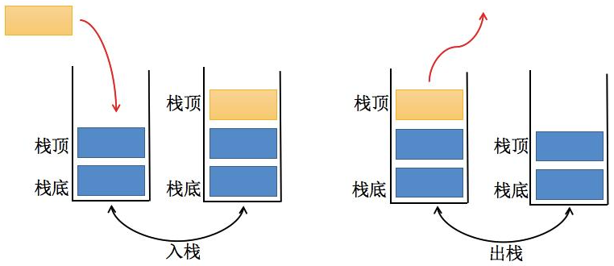

# 一、概述

我们知道数组是一种 **线性结构**，并且可以在数组的任意位置插入和删除数据。但是有时候，我们为了实现某些功能，必须对这种任意性加以限制，而 栈和队列，就是比较常见的 **受限的线性结构**。栈的特点是：**先进后出（FILO)**




# 二、栈结构实现

```js
class Stack {
  constructor() {
    this.items = [];
  }
  /**
   * 入栈
   * @param {*} value
   */
  push(value) {
    this.items.push(value);
  }

  /**
   * 出栈
   * @returns 返回出栈元素
   */
  pop() {
    return this.items.pop();
  }

  /**
   * 返回栈顶元素
   * @returns
   */
  peek() {
    if (this.isEmpty()) return null;
    return this.items[this.items.length - 1];
  }

  /**
   * 返回栈的大小
   * @returns
   */
  size() {
    return this.items.length;
  }

  /**
   * 判断栈行结构是否为空
   * @returns
   */
  isEmpty() {
    return this.items.length === 0;
  }

  /**
   * 清空栈
   */
  clear() {
    this.items = [];
  }
}
```

测试栈：

```js
const stack = new Stack();
stack.push(1);
stack.push(2);
stack.push(3);
stack.push(4);
stack.push(5);
console.log(stack.items); //  [ 1, 2, 3, 4, 5 ]
console.log(stack.pop()); // 5
console.log(stack.pop()); // 4
console.log(stack.items); // [ 1, 2, 3 ]
console.log(stack.peek()); // 3
console.log(stack.isEmpty()); // false
console.log(stack.size()); // 3
```

# 三、栈结构的简单应用

利用栈结构的特点封装实现十进制转换为二进制的方法。

## 1. 代码实现

```js
function dec2bin(dec) {
  // new 一个 Stack，保存余数
  const stack = new Stack();

  // 当不确定循环次数时，使用 while 循环
  while (dec > 0) {
    // 除二取余法
    stack.push(dec % 2); // 获取余数，放入栈中
    dec = Math.floor(dec / 2); // 除数除以二，向下取整
  }

  let binaryString = "";
  // 不断地从栈中取出元素（0 或 1），并拼接到一起。
  while (!stack.isEmpty()) {
    binaryString += stack.pop();
  }

  return binaryString;
}
```

