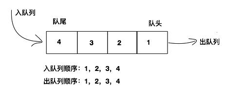

# 一、认识队列

队列（Queue）是一种 **受限的线性数据结构**，具有 **先进先出**（FIFO，**F**irst **I**n **F**irst **O**ut）的特点。

**受限之处：**

- 只允许在表的前端（front）进行删除操作。
- 只允许在表的后端（rear）进行插入操作。

我们可以将队列的特点与生活中的一些场景进行类比：

生活中类似队列结构的场景：

- **排队**：在电影院、商场或者排队购票、结账、使用厕所等场合，人们按照先来后到的顺序排队等待。当有人完成任务或离开时，排在前面的人先得到处理，后面的人依次顺延。
- **优先处理**：有时候在队列中可能存在一些特殊情况，例如有一些人拥有特权或优先级较高，可以优先得到处理。这类似于某些特定情况下，例如VIP顾客或急诊患者在排队过程中可以被提前处理。

**图解队列：**



队列作为一种常见的数据结构，具有广泛的应用。它在计算机科学和软件开发中有着重要的角色，用于解决各种问题，例如任务调度、缓冲区管理、广度优先搜索等。

通过理解队列的特性和场景，我们可以更好地应用队列数据结构来解决实际问题，并提高处理效率。

# 二、队列的实现

```js
class Queue {
  constructor() {
    this.items = [];
  }

  /**
   * 入队
   * @param {*} value
   */
  enqueue(value) {
    this.items.push(value);
  }

  /**
   * 出队
   * @returns 返回出队的元素
   */
  dequeue() {
    return this.items.shift();
  }

  /**
   * 判断队列是否为空
   * @returns
   */
  isEmpty() {
    return this.items.length === 0;
  }

  /**
   * 返回队头元素
   * @returns
   */
  front() {
    if (this.isEmpty()) return null;
    return this.items[0];
  }

  /**
   * 清空队列
   */
  clear() {
    this.items = [];
  }

  /**
   * 返回队列的大小
   * @returns
   */
  size() {
    return this.items.length;
  }
}
```

# 三、队列的应用

## 1. 击鼓传花

使用队列实现小游戏：**击鼓传花**。

分析：传入一组数据集合和设定的数字 number，循环遍历数组内元素，遍历到的元素为指定数字 number 时将该元素删除，直至数组剩下一个元素。

```js
function passGame(nameList, num) {
  // 1. 创建一个队列
  const queue = new Queue();

  // 2. 将 nameList 里面的每一个元素一次加入到队列中
  for (const name of nameList) {
    queue.enqueue(name);
  }

  // 3. 开始数数：队列中只剩下 1 个元素时就停止数数
  while (queue.size() > 1) {
    // 不是 num 时，重新加入到队列的末尾
    // 是 num 时，将其删除
    for (let i = 0; i < num - 1; i++) {
      queue.enqueue(queue.dequeue());
    }
    // num 对应这个人，直接从队列中删除
    queue.dequeue();
  }

  // 4. 获取剩下的那个人
  return queue.front();
}
```

```js
console.log('击鼓传花：'', passGame(['A', 'B', 'C', 'D', 'E'], 3));
// 击鼓传花： D
```

# 四、优先级队列

##  1. 场景

生活中类似 **优先队列** 的场景：有时候在队列中可能存在一些特殊情况，例如有一些人拥有特权或优先级较高，可以优先得到处理。这类似于某些特定情况下，例如VIP顾客或急诊患者在排队过程中可以被提前处理。

## 2. 特点

- 我们知道，普通的队列插入一个元素，数据会被放在后端，并且需要前面所有的元素都处理完成后才会处理前面的数据。
- 但是优先级队列，在插入一个元素的时候会考虑该数据的**优先级**。
- 和其他数据优先级进行 **比较**，
- 比较完成后，可以得出这个元素在队列中正确的位置。
- 其他处理方式，和基本队列的处理方式一样。

### 3. 代码实现

```js
class PriorityQueue extends Queue {
  /**
   * 重写入队方法
   * @param {*} value 元素
   * @param {*} priority 优先级
   */
  enqueue(value, priority) {
    // 1. 创建入队元素
    const element = { value, priority };
    // 2. 根据优先级插入到合适的位置
    let inserted = false;
    for (let i = 0; i < this.items.length; i++) {
      const item = this.items[i];
      if (priority > item.priority) {
        this.items.splice(i, 0, element);
        inserted = true;
        break;
      }
    }
    // 3. 如果优先级最低，则插入到队尾
    if (!inserted) {
      this.items.push(element);
    }
  }
}
```
