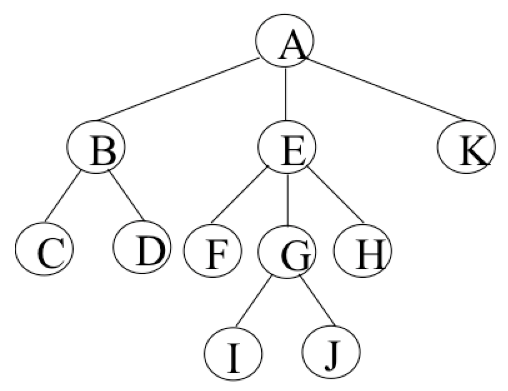
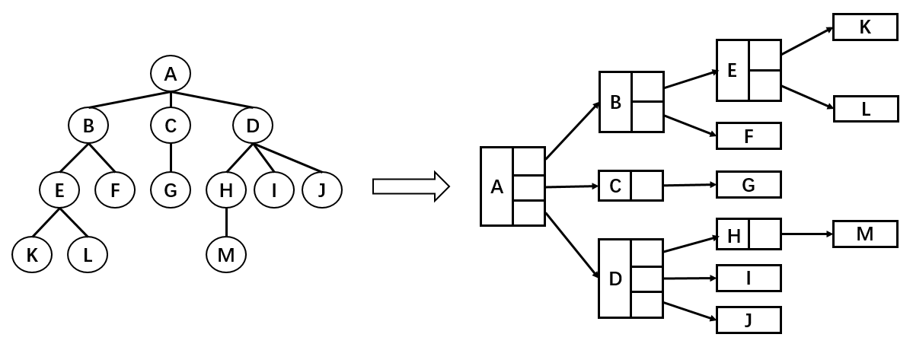
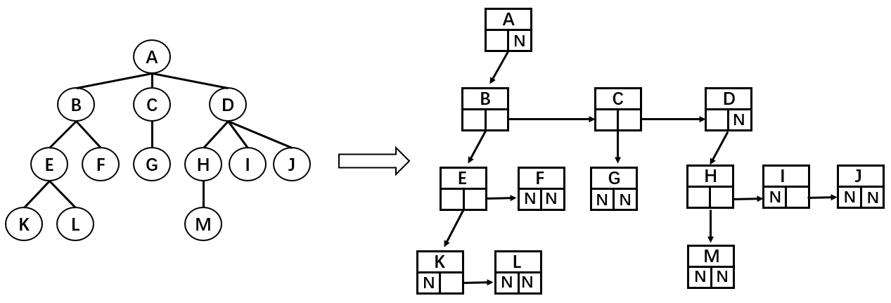
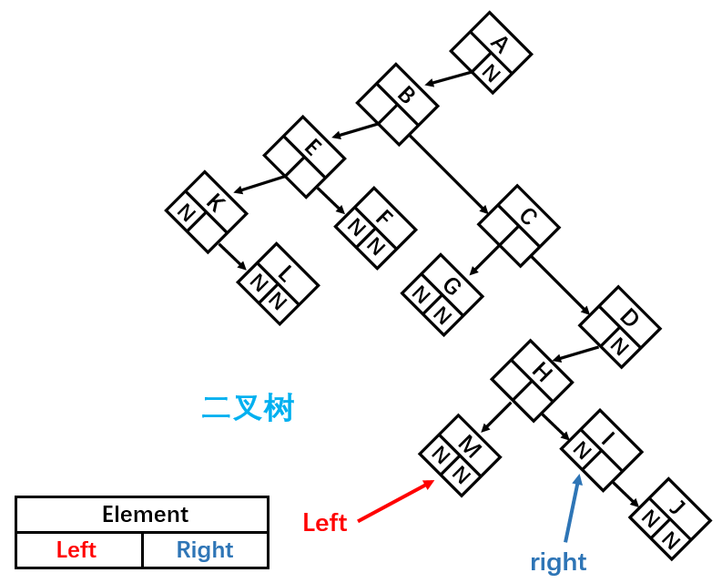

# 一、树

## 1. 什么是树？

真实的树：


树的特点：

- 树一般都有一个**根**，连接着根的是**树干**；
- 树干会发生分叉，形成许多**树枝**，树枝会继续分叉成更小的**树枝**；
- 树枝的最后是**叶子**;

## 2. 模拟树结构

公司组织架构：


现实生活中很多结构都是树的抽象，模拟的树结构相当于旋转 `180°` 的树。

我们将里面的 **数据移除**，仅仅抽象出来 **结构**，那么就是我们要学习的树结构。



## 3. 树的优点

我们之前已经学习了多种数据结构来保存数据，为什么要**使用树结构**来保存数据呢?

树结构对比于数组/链表/哈希表有哪些优点呢？

① 数组：

- 优点：通过**下标值访问**，效率高。（*如果根据元素来查找对应的位置时，比较好的方式是先对数组进行 **排序**，再进行 **二分查找***）；
- 缺点：查找数据时需要先对数据进行**排序**，生成**有序数组**，才能提高查找效率；另外在插入和删除元素时，需要大量的**位移操作**；

② 链表：

- 优点：数据的插入和删除操作效率都很高；
- 缺点：查找效率低，需要从头开始依次查找，直到找到目标数据为止；当需要在链表中间位置插入或删除数据时，插入或删除的效率都不高。

③ 哈希表：

- 优点：哈希表的插入/查询/删除效率都非常高；
- 缺点：
  - **空间利用率不高**，底层使用的是数组，并且某些单元是没有被利用的；
  - 哈希表中的元素是**无序**的，不能按照固定的顺序来遍历哈希表中的元素；
  - 不能快速找出哈希表中**最大值或最小值**这些特殊值。

④ 树结构：

- 我们不能说树结构比其他结构都要好，因为**每种数据结构都有自己特定的应用场景**。
- 但是树结构确实综合了上述数据结构的优点（尽管效率一般情况下不及哈希表高效）并且弥补了它们的缺点。
- 使用树结构可以更方便地模拟某些场景，尤其是对于需要表示一对多关系的情况，例如文件的目录结构。树结构的非线性特点能够直观地展示数据之间的层次关系。

总的来说：**每种数据结构都有自己特定的应用场景。**

## 4. 树的术语

树结构：

- 树（Tree）：$n(n >= 0)$ 个节点构成的 **有限集合**。

   - 当 $n = 0$ 时，称为 **空树**。

- 对于任何一颗非空树 ($n > 0$)，它具备以下性质：

  - 树中有一个称为 **根（Root）** 的特殊节点，用 `R` 表示。
  - 其余节点可分为 $m(m > 0)$ 个互不相交的有限集 $T1, T2... Tm$ ，其中每个集合本身又是一棵树，称为原来树的**子树**。

常用术语：



- **节点的度**：子节点的个数，比如节点 B 的度为 2；
- **树的度**：树所有节点中 <u>最大的度数</u>，如上图树（二叉树）的度为 2；
- **叶节点**：<u>度为 0 （没有子节点）的节点</u>（也称为终端节点），如上图的 H、E、I、J、G；
- **父节点**：一个节点的直接上级节点称为其父节点，如上图节点 B 是节点 D 和 E 的父节点；
- **子节点**：一个节点的直接下级节点称为其子节点；
- **兄弟节点**：具有相同父节点的节点称为兄弟节点，比如上图的 B 和 C，D 和 E 互为兄弟节点；
- **路径**：一个节点到另一节点的通道，比如上图节点A到H的线路就是路径，路径所包含边（节点和节点之间的连线）的个数称为<u>路径长度</u>，比如 A→H 的路径长度为 3；
- **节点的层次**：规定 **根节点在 1 层**，其他任一节点的层数是其父节点的层数加 1。如 B 和 C 节点的层次为 2；
- **树的深度**：树种所有节点中的**最大层次**是这棵树的深度，如上图树的深度为 4；

## 5. 树结构的表示方式

**① 最普通的表示方式**



如图，树结构的组成方式类似于链表，都是由一个个节点连接构成。不过，根据每个父节点子节点数量的不同，每一个父节点需要的引用数量也不同。比如节点 A 需要 3 个引用，分别指向子节点 B，C，D；B 节点需要 2 个引用，分别指向子节点 E 和 F；K 节点由于没有子节点，所以不需要引用。

这种方法缺点在于我们无法确定某一结点的引用数。

**② 儿子 - 兄弟表示法**



这种表示方法可以完整地记录每个节点的数据，比如：

```js
// 节点A
Node {
  this.data = data; // 存储数据
  this.leftChild = B; // 统一只记录左边的子节点
  this.rightSibling = null; // 统一只记录右边的第一个兄弟节点
}

// 节点B
Node{
  this.data = data;
  this.leftChild = E;
  this.rightSibling = C;
}

// 节点F
Node{
  this.data = data;
  this.leftChild = null;
  this.rightSibling = null;
}
```

这种表示法的优点在于每一个节点中引用的数量都是确定的。

**③ 儿子-兄弟 表示法旋转**

将儿子-兄弟表示法组成的树结构顺时针旋转 45° 之后：



这样就成为了一棵**二叉树**，由此我们可以得出结论：**任何树都可以通过二叉树进行模拟**。但是这样父节点不是变了吗？其实，父节点的设置只是为了方便指向子节点，在代码实现中谁是父节点并没有关系，只要能正确找到对应节点即可。

# 二、二叉树

## 1. 概念

**度为2**（*每个节点最多只有2个子节点*） 的树被称为 **<u>二叉树</u>**。几乎所有的树都可以表示成二叉树的形式。

- 二叉树可以为空，也就是没有子节点。
- 若不为空，则它是由根节点和称为其左子树（`TL`）和右子树（`TR`）的两个不相交的二叉树组成。

二叉树的5种基本形态：


## 2. 特性 *

二叉树有几个比较重要的特性，在笔试题中比较常见：

- 一个二叉树第 `i` 层的最大节点数为：$2^{(i - 1)}, i >= 1$；
- 深度为 `K` 的二叉树的最大节点总数为：$2^k - 1, k >= 1$；
- 对任何非空二叉树 `T`，若 `n0` 表示叶节点的个数， `n2` 是度为2的非叶节点个数，那么两者满足关系 `n0 = n2 + 2`;

```
      A
   /     \
  B       C
 / \     / 
D   E   F  
   / \   \
  J   K   H
```

上图中，叶节点树是4，分别是D,J,K,H，度为2的节点数是3，分别是A,B,E，满足公式：4 = 3 + 1

## 3. 二叉树类型

1. **满二叉树：** 满二叉树是一种特殊的二叉树，每个节点要么没有子节点（叶节点），要么同时有左子节点和右子节点。满二叉树的所有层级都是满的，即每个层级的节点数达到最大值。

   ```
        A
      /   \
     B     C
    / \   / \
   D   E F   G
   ```

2. **完全二叉树：** 完全二叉树是一种二叉树，除了最后一层可能不是满的外，其他层级都是满的，并且最后一层的节点从左到右连续排列。在完全二叉树中，叶节点只会出现在最后一层或倒数第二层。

   ```
       A
      / \
     B   C
    / \ 
   D   E
   ```

3. **平衡二叉树：** 平衡二叉树是一种特殊的二叉树，其中任意节点的左子树和右子树的高度差不超过1。平衡二叉树的目的是在插入或删除节点时，保持树的平衡，以提高查找、插入和删除操作的效率。

   ```
        A
       / \
      B   C
     / \   \
    D   E   F
   ```

4. **斜二叉树）：** 斜二叉树是一种特殊的二叉树，所有节点只有左子节点或只有右子节点。斜二叉树可以分为左斜二叉树（所有节点只有左子节点）和右斜二叉树（所有节点只有右子节点）两种形态。

   ```
       A                  A
        \                  \
         B                  C
          \                  \
           C                  D
   ```

5. **二叉搜索树：** 二叉搜索树是一种有序的二叉树，其中任意节点的左子树中的值都小于节点的值，而右子树中的值都大于节点的值。通过这种有序性质，二叉搜索树可以进行高效的查找、插入和删除操作。

   ```
         8
        / \
       3   10
      / \    \
     1   6    14
        / \   /
       4   7 13
   ```

## 4. 二叉树的存储

二叉树的存储常见的方式是 <u>数组</u> 和 **<u>链表</u>**。

### 4.1. 使用数组

**① 完全二叉树**

按从上至下，从左到右顺序存储


**② 非完全二叉树**

非完全二叉树要转成完全二叉树才可以按照上面的方案存储，但是会造成很大的空间浪费。


### 4.2. 使用链表

二叉树最常见的方式还是使用链表存储。

每个节点封装成一个 Node，Node中包含：*存储的数据*、*左节点的引用*、*右节点的引用*


# 三、二叉搜索树

## 1. 概念

二叉搜索树（BST，**B**inary **S**earch **T**ree），是一种有序的二叉树，BST具有以下特点和性质：

- 非空 **左子树** 的所有 **键值小于其根节点** 的键值；
- 非空 **右子树** 的所有 **键值大于其根节点** 的键值；
- **左、右子树本身也都是二叉搜索树；**

比如下面两棵树，左边的树，因为5小于10，应该在10的左子树上，因此不是二叉查找树，右边的树则符合二叉查找树的条件。


二叉搜索树的 **特点** 是相对**较小的值**总是保存在**左节点**上，相对**较大的值**总是保存在**右节点上**。

二叉搜索树的这个特点使得其查找效率非常高。

## 2. 封装

二叉搜索树常见操作：

- `insert(value)`：插入节点到二叉搜索树中。
- `search(value)`：在二叉搜索树中查找指定值的节点。
- `remove(value)`：从二叉搜索树中删除指定值的节点。
- `inorderTraverse`：通过中序遍历方式遍历所有节点。
- `preOrderTraverse`：通过先序遍历方式遍历所有节点（升序）。
- `postOrderTraverse`：通过后序遍历方式遍历所有节点。
- `min`：返回树中最小的值/键。
- `max`：返回树中最大的值/键。

> **提示**：在 [这里 >>](https://www.cs.usfca.edu/~galles/visualization/BST.html) 可以在线演示二叉搜索树的插入、删除及遍历过程，以帮助你更深入的了解二叉搜索树的执行过程。

准备工作：

```js
// 二叉搜索树节点类
class BinarySearchTreeNode {
  constructor(value) {
    this.value = value; // 节点对应的值
    this.left = null;   // 左子节点
    this.right = null;  // 右子节点
  }
}

// 二叉搜索树类
export class BinarySearchTree {
  constructor() {
    // 根节点
    this.root = null;
  }
}
```

结构图如下：


### 2.1. 插入数据

```js
/**
 * 插入节点到二叉搜索树中
 * @param {number} value - 要插入的节点值
 */
insert(value) {
  // 1. 根据value创建对应的节点
  const newNode = new BinarySearchTreeNode(value);
  // 2. 如果根节点为空，则新节点为根节点
  if (this.root) {
    this.insertNode(this.root, newNode);
  } else {
    this.root = newNode;
  }
}
/**
 * 递归地插入节点到二叉搜索树中的合适位置
 * @param {Node} node - 当前节点
 * @param {Node} newNode - 要插入的新节点
 */
insertNode(node, newNode) {
  if (newNode.value < node.value) {
    // 向左查找：如果新节点的值小于当前节点的值，则将新节点插入当前节点的左子树
    if (node.left === null) {
      node.left = newNode;
    } else {
      this.insertNode(node.left, newNode);
    }
  } else {
    // 向右查找：如果新节点的值大于等于当前节点的值，则将新节点插入当前节点的右子树
    if (node.right === null) {
      node.right = newNode;
    } else {
      this.insertNode(node.right, newNode);
    }
  }
}
```

代码测试：

```js
const bst = new BinarySearchTree();
bst.insert(11);
bst.insert(7);
bst.insert(15);
bst.insert(5);
bst.insert(3);
bst.insert(9);
bst.insert(8);
bst.insert(10);
bst.insert(13);
bst.insert(12);
bst.insert(14);
bst.insert(20);
bst.insert(18);
bst.insert(25);
```

二叉树示例：


接下来，我们再插入一个 6，观察位置：


### 2.2. 遍历二叉搜索树

前面，我们向树中插入了很多的数据，为了能看到测试结果，我们先来学习一下**树的遍历** 。

在树的遍历过程中，我们对树的每个节点进行访问，可以执行某些操作，比如打印节点的值。树与线性结构的遍历有所不同，线性结构通常按照顺序从前到后遍历，但是树的遍历方式有多种选择。

常见的树的遍历方式有三种：

1. **先序遍历：** 先序遍历是指先访问根节点，然后递归地遍历左子树和右子树。具体操作为：先访问当前节点，然后先序遍历左子树，最后先序遍历右子树。
2. **中序遍历：** 中序遍历是指先递归地遍历左子树，然后访问根节点，最后递归地遍历右子树。具体操作为：先中序遍历左子树，然后访问当前节点，最后中序遍历右子树。
3. **后序遍历：** 后序遍历是指先递归地遍历左子树和右子树，然后访问根节点。具体操作为：先后序遍历左子树，然后后序遍历右子树，最后访问当前节点。

这三种遍历方式都适用于任意二叉树，不仅仅局限于二叉搜索树。它们的区别在于节点的访问顺序，每种遍历方式都可以采用递归或迭代的方式实现。

另外，还有一种常见的树的遍历方式是层序遍历，它按照树的层级逐层遍历节点，从上到下、从左到右的顺序进行。层序遍历通常使用队列来实现，但在此处不做具体实现。

通过不同的遍历方式，我们可以按照不同的顺序访问树的节点，以满足特定的需求和问题。

#### 2.2.1. 先序遍历

遍历过程为：

1. 访问根节点
2. 先序遍历其左子树
3. 先序遍历其右子树


代码示例：

```js
/**
 * 先序遍历
 * @returns {number[]} - 有序的节点值数组
 */
preOrderTraverse() {
  const result = [];
  this.preOrderTraverseNode(this.root, result);
  return result;
}
/**
 * 递归地先序遍历二叉搜索树
 * @param {Node} node - 当前节点
 * @param {number[]} result - 保存遍历结果的数组
 */
preOrderTraverseNode(node, result) {
  if (node) {
    // 1. 处理经过的节点
    result.push(node.value);
    // 2. 处理经过节点的左子节点
    this.preOrderTraverseNode(node.left, result);
    // 3. 处理经过节点的右子节点
    this.preOrderTraverseNode(node.right, result);
  }
}
```

#### 2.2.2. 中序遍历

遍历过程为：

1. 中序遍历其左子树
2. 访问根节点
3. 中序遍历其右子树


> 提示：你可以结合函数入栈和出栈的思想来理解中序遍历。

代码示例：

```js
/**
 * 中序遍历二叉搜索树（升序输出）
 * @returns {number[]} - 有序的节点值数组
 */
inorderTraverse() {
  const result = [];
  this.inorderTraverseNode(this.root, result);
  return result;
}
/**
 * 递归地中序遍历二叉搜索树
 * @param {Node} node - 当前节点
 * @param {number[]} result - 保存遍历结果的数组
 */
inorderTraverseNode(node, result) {
  if (node) {
    // 1. 处理左子树中的节点
    this.inorderTraverseNode(node.left, result);

    // 2. 处理节点
    result.push(node.value);

    // 3. 处理右子树种的节点
    this.inorderTraverseNode(node.right, result);
  }
}
```

#### 2.2.3. 后续遍历

遍历过程为：

1. 后序遍历其左子树
2. 后序遍历其右子树
3. 访问根节点


代码示例：

```js
/**
 * 后续遍历二叉搜索树（升序输出）
 * @returns {number[]} - 有序的节点值数组
 */
postOrderTraverse() {
  const result = [];
  this.postOrderTraverseNode(this.root, result);
  return result;
}
/**
 * 递归地后序遍历二叉搜索树
 * @param {Node} node - 当前节点
 * @param {number[]} result - 保存遍历结果的数组
 */
postOrderTraverseNode(node, result) {
  if (node) {
    // 1. 处理左子树中的节点
    this.inorderTraverseNode(node.left, result);
    // 2. 处理右子树种的节点
    this.inorderTraverseNode(node.right, result);
    // 3. 处理节点
    result.push(node.value);
  }
}
```

### 2.3. 最大值 & 最小值

在二叉搜索树中搜索最值是一件非常简单的事情，其实用眼睛看就可以看出来了。


从上图看一看书，树的最左侧为最小值，最右侧为最大值。

代码示例：

```js
/**
 * 找到二叉搜索树中最小的节点值
 * @returns 最小节点的值
 */
min() {
  // 1. 判断根节点是否存在
  if (!this.root) {
    return null;
  }
  // 2. 存在，则查找最小节点
  const minNode = this.findMinNode(this.root);
  // 3. 返回最小节点的值
  return minNode.value;
}
/**
 * 找到二叉搜索树中最小的节点
 * @param {Node} node - 当前节点
 * @returns {Node} - 最小节点
 */
findMinNode(node) {
  if (!node.left) {
    return node;
  } else {
    return this.findMinNode(node.left);
  }
}

/**
 * 最大值
 * @returns
 */
max() {
  // 1. 判断根节点是否存在
  if (!this.root) {
    return null;
  }
  // 2. 存在，则查找最大节点
  const maxNode = this.findMaxNode(this.root);
  // 3. 返回最大节点的值
  return maxNode.value;
}
/**
 * 找到二叉搜索树中最大的节点
 * @param {Node} node - 当前节点
 * @returns {Node} - 最大节点
 */
findMaxNode(node) {
  if (node.right === null) {
    return node;
  } else {
    return this.findMaxNode(node.right);
  }
}
```

### 2.4. 搜索特定的值

二叉树不仅仅在获取最值效率非常高，搜索特定值的效率也非常高。

代码示例：

```js
/**
 * 在二叉搜索树中查找指定值的节点
 * @param {number} value - 要查找的值
 * @returns {Node|null} - 找到的节点，若未找到则返回null
 */
search(value) {
  return this.searchNode(this.root, value);
}

/**
 * 递归地在二叉搜索树中查找指定值的节点
 * @param {Node} node - 当前节点
 * @param {number} value - 要查找的值
 * @returns {Node|null} - 找到的节点，若未找到则返回null
 */
searchNode(node, value) {
  // 若节点为空或节点的值等于要查找的值，则返回节点
  if (node === null || node.value === value) {
    return node;
  }
  // 如果要查找的值小于当前节点的值，则在左子树中递归查找
  else if (value < node.value) {
    return this.searchNode(node.left, value);
  }
  // 如果要查找的值大于当前节点的值，则在右子树中递归查找
  else {
    return this.searchNode(node.right, value);
  }
}
```

### 2.5. 删除 *

二叉搜索树的删除有些复杂，删除节点首先要做的事情是找到该节点，找到节点后，需要考虑三种情况：

1. 该节点是叶节点（没有子节点，比较简单）
2. 该节点只有一个子节点（也相对简单）
3. 该节点有两个子节点（情况比较复杂，我们后面慢慢道来）

所以删除节点的大致思路是：

1. 找到要删除的节点，如果没有找到，不需要删除
2. 找到了
   - 删除叶子节点
   - 删除只有一个子节点的节点
   - 删除有两个子节点的节点

代码示例：

```js
/**
 * 从二叉搜索树中删除指定值的节点
 * @param {number} value - 要删除的节点值
 */
remove(value) {
  this.root = this.removeNode(this.root, value);
}

/**
 * 递归地从二叉搜索树中删除指定值的节点
 * @param {Node} node - 当前节点
 * @param {number} value - 要删除的节点值
 * @returns {Node|null} - 删除节点后的新子树根节点
 */
removeNode(node, value) {
  if (node === null) {
    return null;
  }

  if (value < node.value) {
    node.left = this.removeNode(node.left, value);
    return node;
  } else if (value > node.value) {
    node.right = this.removeNode(node.right, value);
    return node;
  } else {
    // 当前节点为要删除的节点
    // 情况1: 要删除的节点为叶子节点
    if (node.left === null && node.right === null) {
      node = null;
      return node;
    }

    // 情况2: 要删除的节点只有一个子节点
    if (node.left === null) {
      node = node.right;
      return node;
    } else if (node.right === null) {
      node = node.left;
      return node;
    }

    // 情况3: 要删除的节点有两个子节点
    const minNode = this.findMinNode(node.right);
    node.value = minNode.value;
    node.right = this.removeNode(node.right, minNode.value);
    return node;
  }
}
```


## 3. 平衡树（二叉搜索树缺陷）

二叉搜索树可以 **快速地** 找到给定关键数字的数据项，并且可以快速地 **删除和插入数据项**。

但是，二叉搜索树有一个很麻烦的问题：如果插入的数据是 **有序的数据**，比如下面的情况。

1）有一棵初始化为 9 8 12 的二叉树，如下图所示：


2）插入下面的数据：7 6 5 4 3，如下图所示：


在二叉搜索树中，树的平衡程度与其深度密切相关。在之前的示例中，我们展示了一棵**非平衡树**。

一个良好的二叉搜索树应该具有**均匀分布**的左右子树。然而，当插入连续数据时，树的分布变得不均匀，这种情况下我们称其为非平衡树。对于一棵平衡二叉树，插入、查找等操作的效率为 $O(logN)$。然而，对于一棵非平衡二叉树，相当于我们在操作一个链表，查找的效率变为 $O(N)$。

为了能以 **较快的时间 $O(logN)$** 来操作一棵树，我们需要**保证树总是平衡的**：

- 至少大部分是平衡的，那么时间复杂度也是接近 $O(logN)$ 的
- 也就是说树中每个节点 **左边的子孙节点的个数**，应该尽可能的等于**右边的子孙节点的个数**
- 常见的平衡树有哪些呢?
  - AVL树：
    - AVL树是最早的一种平衡树，它有些办法**保持树的平衡**（每个节点多存储了一个额外的数据）
    - 因为AVL树是平衡的，所以时间复杂度也是 $O(logN)$
    - 但是，每次插入/删除操作相对于红黑树效率都不高，所以**整体效率不如红黑树**
  - 红黑树：
    - 红黑树也通过**一些特性**来保持树的平衡
    - 因为是平衡树，所以时间复杂度也是在 $O(logN)$
    - 另外插入/删除等操作，红黑树的性能要优于AVL树，所以现在平衡树的应用基本都是红黑树


