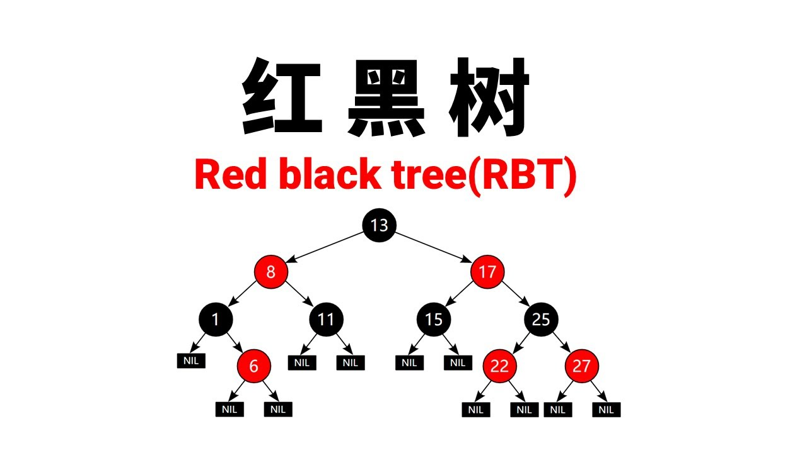
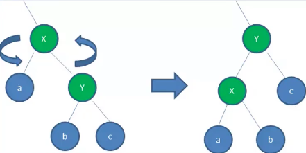
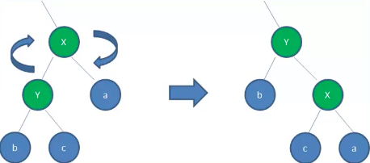

# 一、邂逅红黑树

首先，红黑树的学习确实具有一定的挑战性，可以说是数据结构中的难点中的难点。

在数据结构的学习过程中，红黑树通常被认为是一项较为复杂的知识点。红黑树的理解和掌握相对困难，需要对平衡二叉树的概念有深入的理解，并且掌握红黑树的性质、插入和删除操作等细节。

在面试过程中，红黑树常常出现作为考察的内容。面试官会询问面试者是否了解红黑树的原理和应用。对于一些知名的互联网公司，红黑树可以作为评估面试者对数据结构的深度掌握的重要指标。

然而，在一些非大型互联网公司的面试中，很少会考察红黑树的知识点。这是因为面试官本身可能对红黑树的了解也有限。

红黑树作为一项难度较高的知识点，确实需要投入一定的时间和精力来深入学习和理解。不过，在学习过程中要保持积极的心态，逐步掌握红黑树的原理和应用。

以上所述红黑树的难度和出现频率是一般情况下的观点，并不适用于所有的面试和公司。有些公司可能更注重其他的数据结构或算法知识点。

OK，在这里，我们就一起来踏入数据结构 **红黑树这块禁区**

# 二、红黑树的规则



红黑树，除了符合二又搜索树的基本规则外，还添加了一些特性：

1. **节点只能是红色或黑色。**
2. **根节点是黑色的。**
3. **每个叶子节点都是黑色的空节点（NIL节点）。**
4. **每个红色节点的两个子节点都是黑色的。（*从每个叶子到根的所有路径上不能有两个连续的红色节点*）**
5. **从任一节点到其每个叶子节点的所有路径都包含相同数目的黑色节点，也称为"黑色高度相同"。**

这些规则确保了红黑树的平衡和性能。通过这些规则，红黑树保持了相对平衡的状态，避免了出现过于倾斜的情况，从而保证了搜索、插入和删除等操作的时间复杂度都是 $O(logN)$。

# 三、红黑树的相对平衡

前面的约束，确保了红黑树的关键特性：

- 从**根到叶子**的**最长可能路径**，不会超过**最短可能路径**的**两倍长**。
- 结果就是这个树**基本**是平衡的
- 虽然没有做到绝对的平衡，但是可以保证在最坏的情况下，依然是高效的

为什么可以做到 **最长路径不超过最短路径的两倍** 呢？

- **性质4** 决定了路径不可能有两个相连的红色节点，因此：
  - 最短的路径可能都是黑色节点
  - 最长的路径只可能是红色和黑色交替的节点
- **性质5** 决定了所有路径都有相同数目的黑色节点
- 这就表明了没有路径能多余任何其他路径的两倍长

# 四、变换

插入一个新节点时，有可能树不再平衡，可以通过三种方式的变换，让树保持平衡：变色/左旋转/右旋转

> **变色**

为了重新符合红黑树的规则，尝试把**红色节点**变为**黑色**，或者把**黑色节点**变为**红色**。

首先，需要知道，插入的**新节点**通常都是**红色节点**：

- 因为在**插入节点为红色**的时候，有可能插入一次是**不违反红黑树任何规则**的
- 而**插入黑色节点**，必然会导致有一条路径上**多了黑色节点**，这是很难调整的
- 红色节点**可能导致出现红红相连**的情况，但是这种情况可以通过**颜色调换和旋转**来调整

> **左旋转**

```ini
       A                       B
      / \                     / \
     a   B      →            A   c
        / \                 / \
       b   c               a   b

```


**逆时针** 旋转红黑树的两个节点，使得父节点被自己的右孩子取代，而自己成为自己的左孩子。



图中，身为右孩子的Y取代了X的位置，而X变成了Y的左孩子。此为左旋转。

> **右旋转**

**顺时针** 旋转红黑树的两个节点，使得父节点被自己的左孩子取代，而自己成为自己的右孩子。




图中，身为左孩子的Y取代了X的位置，而X变成了Y的右孩子。

