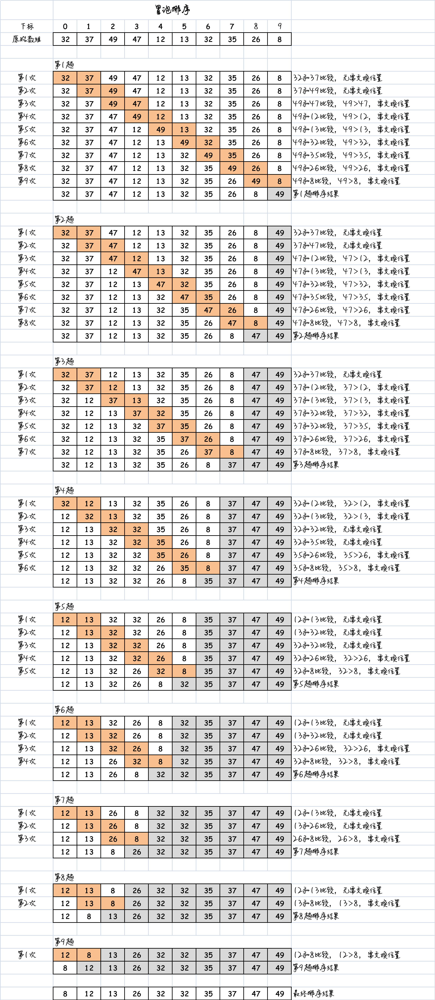

# 一、认识冒泡排序

动图演示：[参考这里 >>](https://visualgo.net/zh/sorting)

冒泡排序算法相对其他排序运行 **效率较低**，但是在概念上它是排序算法中最简单的。因此，冒泡排序是在刚开始学习排序时，最适合学习的一种排序方式。冒泡排序是一种简单的排序算法，它通过重复遍历待排序的元素列表，比较相邻的两个元素并交换它们的位置，从而逐步将最大（或最小）的元素移动到列表的末尾。这个过程类似于冒泡，因此得名为冒泡排序。

冒泡排序的实现思路如下：

1. 从列表的第一个元素开始，依次比较当前元素与其相邻的下一个元素的大小。
2. 如果当前元素大于相邻的元素，则交换它们的位置，将较大的元素向右移动。
3. 继续向列表的下一个位置移动，并重复步骤2，直到遍历到列表的倒数第二个元素。
4. 重复执行步骤1到步骤3，直到列表中的所有元素都排序完成。

图解思路，如下所示：



# 二、代码实现

```js
/**
 * 冒泡排序
 * @param {*} arr 待排序数组
 * @returns 已排序数组
 */
function bubbleSort(arr) {
  // 获取数组长度
  const length = arr.length;
  // 外层循环控制遍历次数（趟数）
  for (let i = 0; i < length - 1; i++) {
    // 内层循环进行比较和交换（次数）
    for (let j = 0; j < length - i - 1; j++) {
      // 如果当前元素比下一个元素大，则交换它们的位置
      if (arr[j] > arr[j + 1]) {
        // 使用解构赋值进行交换（当然你也可以使用空杯原理交换位置）
        [arr[j], arr[j + 1]] = [arr[j + 1], arr[j]];
      }
    }
  }
}
```

# 三、效率

在冒泡排序算法中，我们需要进行多轮遍历来比较和交换元素，直到所有元素都被正确排序。因此，比较次数取决于待排序数组的大小。

在最坏情况下，即待排序数组完全逆序时，冒泡排序需要进行的比较次数达到最大。对于长度为 n 的数组，第一轮遍历需要进行 n-1 次比较，第二轮遍历需要进行 n-2 次比较，以此类推，最后一轮遍历需要进行 1 次比较。所以总的比较次数为：

$$(n-1) + (n-2) + ... + 1 = n * (n-1) / 2$$

使用大O表示法表示为：$O(n^2)$。

在平均情况下，冒泡排序的比较次数也为 $O(n^2)$。

需要注意的是，冒泡排序的比较次数是基于最坏情况和平均情况下的分析，实际运行时可能会出现最好情况，即待排序数组已经完全有序的情况。在最好情况下，冒泡排序只需要进行一轮遍历，并且不需要进行任何比较和交换，因此比较次数为 $O(n)$。

然而，无论在哪种情况下，冒泡排序的时间复杂度都是 $O(n^2)$，因为在每一轮遍历中，都需要比较相邻的元素并进行交换。

