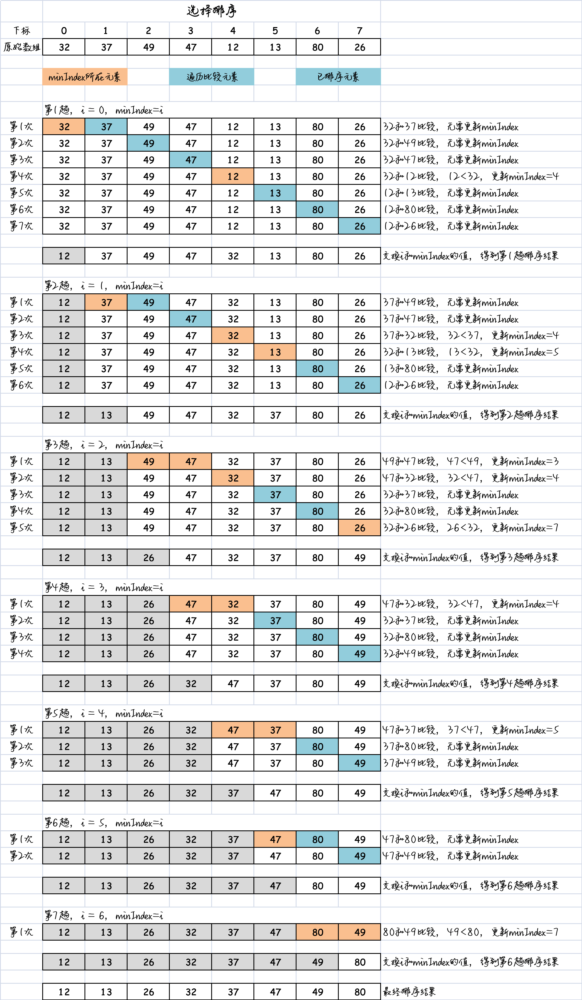

# 一、概述

选择排序是一种简单直观的排序算法，它通过不断选择未排序部分中的最小（或最大）元素，并将其放置在已排序部分的末尾，逐步完成排序。

选择排序改进了冒泡排序，将 **交换的次数** 由  $O(N^2)$ 减少到 $O(N)$，但是 **比较的次数** 依然是 $O(N^2)$。

选择排序的实现思路如下：

1. 将待排序的数组分为**已排序部分**和**未排序部分**。一开始，已排序部分为空，未排序部分包含整个数组。
2. 在未排序部分中，首先假设第1个元素为最小值，依次遍历未排序部分。
3. 在遍历过程中，比较当前元素与已记录的最小值元素的大小，如果当前元素比记录值要小，则更新记录下标。
4. 将选出的最小元素与未排序部分的第一个元素交换位置
5. 重复步骤2到步骤4，直到未排序部分为空，即所有元素都被放置到已排序部分。

选择排序的特点是每一轮只进行一次交换操作，因此交换的次数相对较少，适用于对交换次数有限制的情况。

图解思路，如下所示：



# 二、代码实现

```js
/**
 * 选择排序
 * @param {*} arr 待排序数组
 */
function selectionSort(arr) {
  // 获取数组长度
  const length = arr.length;
  // 遍历未排序部分
  for (let i = 0; i < length - 1; i++) {
    let minIndex = i; // 假设当前元素是最小的
    // 在未排序部分中寻找最小元素的索引
    for (let j = i + 1; j < length; j++) {
      if (arr[j] < arr[minIndex]) {
        minIndex = j; // 更新最小元素的索引
      }
    }
    // 将最小元素与未排序部分的第一个元素进行交换
    [arr[i], arr[minIndex]] = [arr[minIndex], arr[i]];
  }
}
```

# 三、效率

选择排序的时间复杂度始终为 $O(n^2)$，其中 n 是待排序数组的长度。

无论在最好情况、最坏情况还是平均情况下，选择排序的时间复杂度都是 $O(n^2)$。

选择排序的比较次数是固定的，即总共需要进行 $n-1$ 轮比较。在每一轮比较中，需要遍历未排序部分来寻找最小（或最大）元素，比较次数为 $n-i$ 次，其中 i 是已排序部分的长度。

总的比较次数为 $(n-1) + (n-2) + ... + 1 = n * (n-1) / 2$，使用大O表示法表示为 $O(n^2)$。

选择排序的交换次数是与比较次数相等的，因为每次找到最小（或最大）元素后都会进行交换操作。

选择排序的空间复杂度为 $O(1)$，因为只需要常数级别的额外空间来进行变量的存储，不需要使用额外的数据结构。

需要注意的是，尽管选择排序的时间复杂度较高，但在某些特定情况下，选择排序可能比其他复杂度相同的排序算法更加适用。例如，当数据量较小、交换操作代价较高或者对稳定性要求不高时，选择排序可能会有一些优势。
