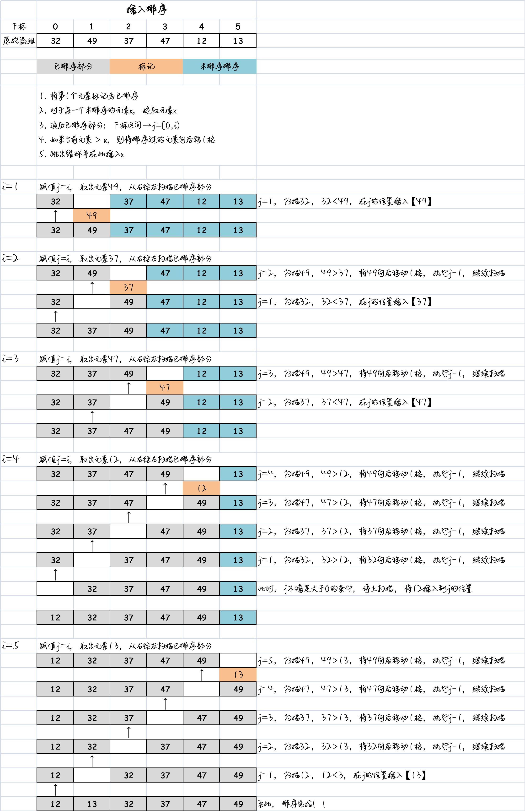

# 一、概述

**插入排序** 是简单排序中效率最好的一种，也是学习其他高级排序算法的基础，比如希尔排序和快速排序。因此，它非常重要。

理解 **局部有序**：

- 插入排序的核心思想是**局部有序**。那么什么是局部有序呢？
- 假设有一群人站成一排，我们选择其中一个人作为标记。
- 该标记人左边的所有人已经按照某种顺序排好了。
- 这意味着，有一部分人是已经有序的，而另一部分还没有顺序。

插入排序的思路：

1. 从 **第一个元素** 开始，它可以被认为已经是有序的。
2. 取出 **下一个元素**，并在已排序的元素序列中 **从后向前扫描**。
3. 如果 **已排序的元素大于新元素**，将该元素移到下一个位置。
4. 重复上一步骤，直到找到已排序的元素小于或者等于新元素的位置。
5. 将新元素插入到该位置后，重复以上步骤。

通过不断将未排序的元素插入到已排序的序列中，最终实现整体的有序排列。

插入排序的优点在于，它的实现简单直观，适用于小型数据集或者部分有序的数据集。同时，它的性能也相对较好，是许多高级排序算法的基础。

图解思路，如下所示：



# 二、代码实现

```js
/**
 * 插入排序
 * @param {*} arr 待排序数组
 */
function insertionSort(arr) {
  // 1. 获取数组的长度
  const length = arr.length;
  // 2. 外层循环：从第1个位置开始获取数据，向前面局部有序进行插入（遍历未排序部分）
  for (let i = 1; i < length; i++) {
    // 3. 内层循环：获取i位置的元素，和前面的数据依次进行比较
    let current = arr[i]; // 当前待插入元素
    let j = i; // 记录当前位置下标
    while (arr[j - 1] > current && j > 0) {
      arr[j] = arr[j - 1];
      j--;
    }

    // 4. 在j位置，放置current即可。
    arr[j] = current;
  }
}
```

# 三、效率

插入排序的比较次数：

- 在插入排序的每一趟中，最多需要进行的比较次数逐渐增加，第一趟需要1次比较，第二趟需要2次比较，依此类推，最后一趟需要 $N-1$ 次比较，其中 $N$ 是待排序数组的长度。
- 因此，插入排序的最大比较次数可以通过求和公式得到：$1 + 2 + 3 + ... + N-1 = \frac{N \cdot (N-1)}{2}$。
- 然而，在每一趟中，平均只有数组元素的一半需要进行比较操作，因此可以将最大比较次数除以2得到：$\frac{N \cdot (N-1)}{4}$。相对于选择排序而言，插入排序的比较次数减少了一半。

插入排序的复制次数：

- 在插入排序的每一趟中，最多需要进行的复制次数与比较次数相同，即 $1 + 2 + 3 + ... + N-1 = \frac{N \cdot (N-1)}{2}$。
- 平均复制次数可以通过将最大复制次数除以2得到：$\frac{N \cdot (N-1)}{4}$。

对于基本有序的情况：

- 插入排序在处理已经有序或基本有序的数据时表现更好。
- 当数据已经有序时，内部的 while 循环条件始终为假，因此它变成了外层循环的一个简单语句，只会执行 $N-1$ 次。
- 在这种情况下，插入排序的运行时间为 $O(N)$，效率相对较高。
- 此外，插入排序的比较次数是选择排序的一半，因此插入排序相对于选择排序具有更高的效率。