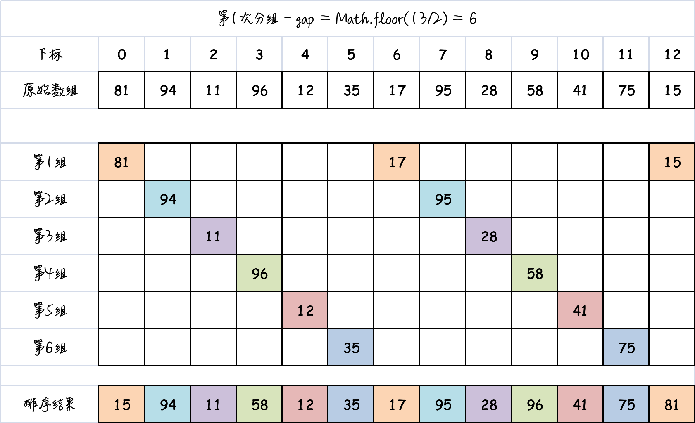
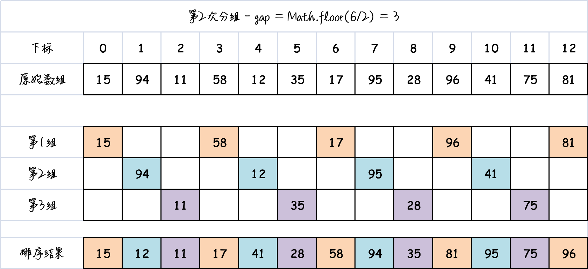
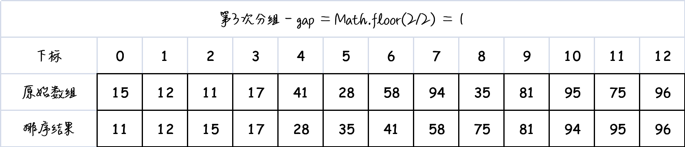

# 一、概述

[参考 >>](https://baijiahao.baidu.com/s?id=1719645128431014366&wfr=spider&for=pc)

**希尔排序**是**插入排序**的一种改进版，它比插入排序更快速和高效。

希尔排序的历史背景：

- 希尔排序是由 Donald Shell 在 1959 年首次提出的。
- 在设计排序算法时，主要关注的是排序算法的速度。
- 在简单排序算法出现后的一段时间里，人们发明了各种各样的算法。
- 然而，这些算法的时间复杂度都是 $O(N^2)$，似乎无法超越这个界限。
- 计算机学术界流传着 "排序算法不可能突破 $O(N^2)$" 的观点，就像之前人们普遍认为人类不可能在100米短跑中突破10秒大关一样。
- 然而，终于有一天，一位科学家发布了一个超越 $O(N^2)$ 的新排序算法。为了纪念这个重要突破，该算法被命名为希尔排序（Shell Sort）。
- 随后，出现了几种能够超越 $O(N^2)$ 的排序算法，其中包括我们将在后面讲解的快速排序算法。

# 二、思想

## 1. 插入排序的问题

由于希尔排序是基于插入排序的改进，因此我们需要回顾一下插入排序的过程。

想象一下，在插入排序执行到**一半**的时候，**标记符左边**的数据项**已经排好序**，而**标记符右边**的数据项还**未排序**。这时我们取出标记符指向的数据项，并将其存储在一个临时变量中。然后，从刚刚移除的位置左边第一个单元开始，每次将有序的数据项向右移动一个单元，直到可以成功插入存储在临时变量中的数据项。

插入排序存在的问题是：

- 假设一个**较小的数据项**在**靠近右端的位置**上，而这个位置本来应该是**较大的数据项的位置**。
- 当我们将这个**较小的数据项移动到左边**的正确位置时，所有**中间的数据项都必须向右移动一**位。
- 如果每个步骤都需要对数据项进行N次复制，那么平均下来每次移动需要移动$\frac{N}{2}$个元素，而有N个元素需要移动，所以复制的次数为$\frac{N^2}{2}$。

因此，我们通常认为插入排序的效率为$O(N^2)$。

如果有一种方式，可以避免一个个移动中间的数据项，而是直接将较小的数据项移动到左边，那么这个算法的执行效率将会有很大的改进。

## 2. 希尔排序的思路

希尔排序的思路是通过将待排序的元素分成多个子序列，对每个子序列进行插入排序，从而逐步减小序列的无序程度。

具体来说，希尔排序的步骤如下：

1. 首先，确定一个间隔值（称为**增量**），将待排序的元素分成若干个子序列（*将间隔相同距离的元素分为一组*）。
2. 对每个子序列进行插入排序。这里的插入排序与普通的插入排序类似，但是是对同一子序列内的元素进行排序。
3. 不断缩小增量，重复上述步骤，直到增量为1。当增量为1时，整个序列将被视为一个子序列，进行最后一次插入排序。

通过这种分组和逐步缩小增量的方式，希尔排序可以更高效地将元素移动到正确的位置，从而实现排序。

希尔排序的优势在于它能够提前部分排序数据，使得后续的排序工作更加高效。虽然希尔排序的原理相对复杂一些，但它的性能表现往往比插入排序更好，尤其适用于大型数据集的排序任务。

> **思路解析**

比如现在有一组数据：81, 94, 11, 96, 12, 35, 17, 95, 28, 58, 41, 75, 15（13个元素）

初始增量可以是 **数组长度的一半**，然后逐步减小增量，示例数据的增量为：

- 第1次分组：$gap = Math.floor(\frac{13}{2}) = 6$
- 第2次分组：$gap = Math.floor(\frac{6}{2}) = 3$
- 第3次分组：$gap = Math.floor(\frac{3}{2}) = 1$

排序步骤：

1. 间隔为6，进行分组，然后对每个分组进行直接插入排序，最后组成一个新的相对有序的数组，如下图所示：

   

2. 间隔为3，进行分组，然后对每个分组进行直接插入排序，最后组成一个新的相对有序的数组，如下图所示：

   

3. 间隔为1，只有1组，直接进行插入排序操作得出最终结果。

   

# 三、增量

在希尔排序中，增量的选择对算法的性能有一定影响。虽然存在多种增量序列的选择方法，但以下两种方法被广泛推荐使用：

1. **原稿推荐**（*推荐*）

   希尔排序的一种常见增量序列是将初始间距设为数组长度的一半，即 $\frac{N}{2}$。这种增量序列的好处在于，它将每次排序划分为两个部分，简化了增量的选择过程。

   例如，对于一个数组长度为 N = 100 的数组，使用该增量序列的话，增量间隔序列为 50, 25, 12, 6, 3, 1。这意味着希尔排序将进行多趟排序，每趟排序时所比较的元素之间的间隔将依次缩小。从初始的间隔开始，通过不断减半的方式，直到最后一趟排序时的间隔为 1，完成整个排序过程。

   这种增量序列的优点是，在开始排序之前无需进行任何计算，可以直接应用于待排序的数组。它提供了一种简单且有效的增量选择方式，使得希尔排序可以更快地对数据进行分组和交换，从而提高排序的效率。

2. **Hibbard增量**

   在希尔排序中，Hibbard增量是一种常用的增量序列。它的计算方式是 $gap = 2^k - 1$，其中 k 是一个递减的整数序列。Hibbard增量的选取方法能够有效地改善希尔排序的性能。

   Hibbard增量的特点是以幂函数的形式递减。初始的增量值通常是数组长度的一半（$gap = \frac{N}{2}$），然后每次通过计算 $gap = 2^k - 1$ 来减小增量。具体地，k 的初始值为 $\log_2(N + 1)$，然后每次递减 1，直到 k 为 0。

   举个例子，如果待排序数组的长度为 100，使用Hibbard增量的话，初始的增量值为 50，然后逐步减小为 31、15、7、3、1。在每个增量值下，希尔排序会对元素进行分组，对每个组进行插入排序操作。随着增量值的减小，元素之间的间隔也逐渐缩小，最终完成整个排序过程。

   这种增量的最坏复杂度为 $O(N^{\frac{3}{2}})$ , 猜想的平均复杂度为$O(N^{\frac{5}{4}})$

# 四、代码实现

```js
/**
 * 希尔排序
 * @param {*} arr 待排序数组
 */
function shellSort(arr) {
  // 1. 获取数组长度
  const length = arr.length;
  // 2. 初始化增量（数组长度的一半）
  let gap = Math.floor(length / 2);
  // 3. while循环（gap不断减小）
  while (gap > 0) {
    // 4. 以gap作为间隔，进行分组，对分组进行插入排序
    for (let i = gap; i < length; i++) {
      let temp = arr[i]; // 当前待插入元素
      let j = i; // 记录当前位置下标

      // 在已排序的元素序列中从后向前扫描，找到插入位置
      while (j >= gap && arr[j - gap] > temp) {
        arr[j] = arr[j - gap];
        j -= gap;
      }
      // 将新元素插入到合适的位置
      arr[j] = temp;
    }
    // 5. 缩小gap
    gap = Math.floor(gap / 2);
  }
}
```


# 五、效率

希尔排序的效率与增量选择密切相关。然而，证明希尔排序的效率是非常困难的，甚至某些增量序列的效率至今仍未被证明。但是通过统计数据，我们可以得出以下结论：希尔排序使用原始增量的最坏情况下的时间复杂度为$O(N^3)$，而在通常情况下，希尔排序的效率要好于$O(N^3)$。

总体而言，大多数情况下，希尔排序的效率都高于简单排序算法。这一点可以通过对排序算法的时间进行统计来证明。此外，在某些适当的增量序列和特定数据量N的情况下，希尔排序甚至可以优于快速排序算法。
