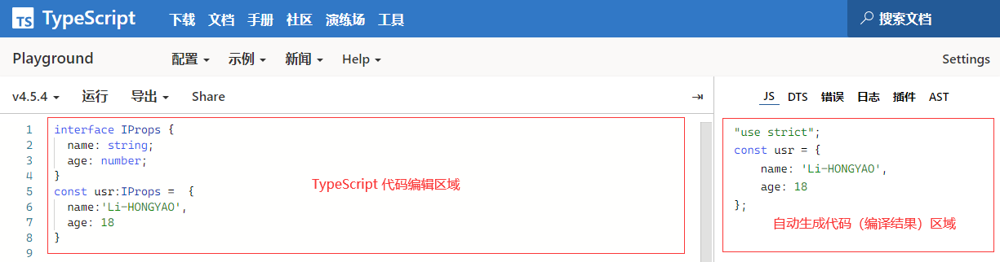

- [TypeScript 官方文档 >>](https://www.typescriptlang.org/)
- [TypeScript 中文手册 >>](https://www.tslang.cn/)

# 一、概述

`TypeScript` 是一种由微软开发的自由和开源的编程语言。

对比 `JS`，`TS`是 `JS` 的**超集**，简单的说就是在 `JavaScript` 的基础上加入了**类型系统**，让每个参数都有明确的意义，从而带来了更加**智能**的提示。

相对于`JS`而言，`TS`属于**强类型**语言，所以对于项目而言，会使代码更加规范，从而解决了大型项目代码的复杂性。

所以，`TS` 的优势如下：

- 类型检查
- 更好的代码提示
- 代码语义更清晰易懂

> **Tips：**浏览器是不识别`TS`的，所以在编译的时候，`TS`文件会先编译为`JS`文件。

# 二、环境

搭建 TypeScript 环境

## 1. 在线编译

点击前往：https://www.typescriptlang.org/zh/play



> 提示：如果你只是想简单体验一下 TypeScript，建议通过 `Playground` 来实现。

## 2. nodeJS

1）下载安装 [nodejs >>](https://nodejs.org/zh-cn/)

2）构建项目

```shell
# windows
$ mkdir hello-ts && cd hello-ts && npm init -y && mkdir src && cd src && type nul > index.ts && cd ..
# macOS
$ mkdir hello-ts && cd hello-ts && npm init -y && mkdir src && cd src && touch index.ts && cd ..
```

3）安装依赖

```shell
$ npm install typescript --save-dev
```

4）创建配置文件 & 输入配置内容

```shell
# windows
$ type nul > tsconfig.json
# macOS
$ touch tsconfig.json
```

```js
{
  "compilerOptions": {
    /** 1.基础选项 */
    "target": "esnext" /** 指定ECMAScript目标版本（esnext最新） */,
    "module": "esnext" /** 指定模块:commonjs,amd,umd... */,
    "resolveJsonModule": true,
    "esModuleInterop": true,
    "isolatedModules": false /** 将每个文件做为单独的模块*/,
    "declaration": true /** 生成相应的 '.d.ts' 文件 */,
    "outDir": "./lib" /** 指定输出目录 */,
    "lib": ["esnext", "dom", "DOM.Iterable"] /** 指定要包含在编译中的库文件*/,

    /** 2.类型检查选项 */
    "strict": true /** 启用所有严格类型检查选项*/,

    /** 3.额外的检查 */
    "noUnusedLocals": true /** 有未使用的变量时，抛出错误 */,
    /** 4.模块解析选项 */
    "moduleResolution": "node" /** 选择模块解析策略*/,
    "baseUrl": "./" /** 用于解析非相对模块名称的基目录*/,
    "paths": {} /** 模块名到基于 baseUrl 的路径映射的列表 */
  },
  /** 5.指定编译文件或排除指定编译文件 */
  "include": ["src/**/*.ts"],
  "exclude": ["node_modules"]
}
```

5）**npm scripts**

```js
"scripts": {
  "build": "tsc --watch", /** 实时编译 */
  "start": "npx nodemon ./lib/index.js" /** 实时执行 */
}
```

6）使用

首先在终端输入 `npm run build`，开启实时编译，然后另起一个终端，执行 `npm run start` 即可实时在控制台查看输出。

现在，我们在 `./src/index.ts`  文件中随便输入一段 TS 代码测试：

```typescript
// -- 定义接口
interface IProps {
  name: string;
  age: number;
  job: string;
}
// -- 定义一个遍历，实现IProps接口
const usr: IProps = {
  name: 'Li-HONGYAO',
  age: 18,
  job: '前端工程师',
};
// -- 输出变量
console.log(usr);s
```

然后我们可以看到，在 `lib/` 目录下自动为我们生成了如下两个文件：

- `index.d.ts`：类型声明文件；
- `index.js`：编译后的文件；

同时，由于我们通过 `nodemon` 实时执行编译后的文件，所以可以看到控制台输出结果：

```javascript
{ name: 'Li-HONGYAO', age: 18, job: '前端工程师' }
```

好的，那接下来，就正式开启我们的 TypeScript 学习之旅吧~

# 三、TS的基本数据类型

这里将TS的数据类型简单的进行下归类：

- 基本类型：`string`、`number`、`boolean`、`symbol`、`bigint`、`null`、`undefined`
- 引用类型：`array`、 `Tuple`、 `object`、`function`
- 特殊类型：`any`、`unknow`、`void`、`never`、`Enum`(枚举)
- 其他类型：`类型推理`、`字面量类型`、`交叉类型`

