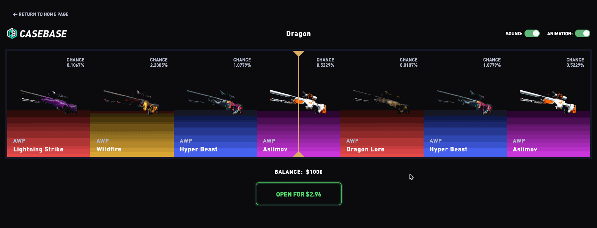
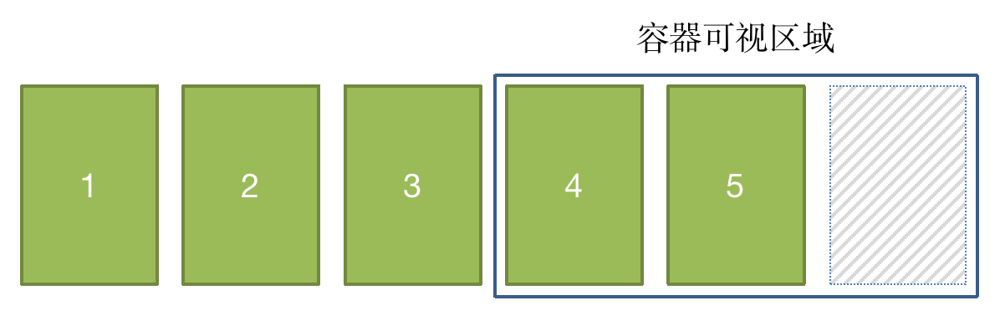
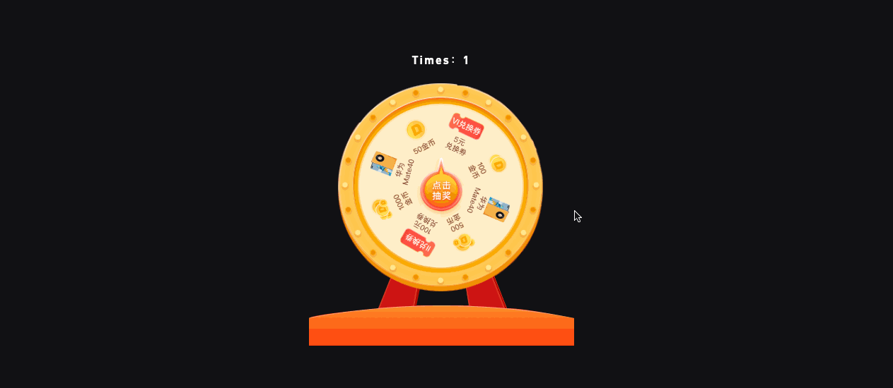

# 锲子

呀呀呀，感觉好久没有更新文章了，最近公司业务有一个滚动抽奖的需求，之前大多是实现 「大转盘」或者 「九宫格」的抽奖效果，拿到这个需求时，惯性的用大转盘的思维去实现，一顿操作猛如虎，甚至还搞出了3D旋转抽奖效果，但是完全和需求不一致呀，后面突然灵关一闪，最终使用 `Transition` + `Translate` 解决了。

闲暇之余，复盘了一下主流的抽奖效果实现，并且封装了一个工具类（*`LuckyDraw`*）便于后期使用，这里借此机会分享给大家。

# 说明

本篇文章主要给大家介绍一些实现的思路，下面会给大家贴上示例地址，你可以下载下来直接运行代码查看效果以及阅读完整实现。

技术方案：`Vite` +  `Vue` + `TypeScript` + `ElementPlus`

仓库地址：[点击前往 >>](https://gitee.com/lihongyao/lucky-draws-examples/tree/master/lucky-draw-cases)

> **！提示：** 如果您觉得这边文章对你有所帮助，麻烦点一波关注和 Star，谢谢啦~

# 示例

## 滚动抽奖

### 案例效果



> 源码目录：*`src/view/Scrolls`*

### 核心思路

 `Transition` +  `Transform:translateX` 

#### 1. 布局基本结构

```html
<!-- 外层容器 -->
<div class="lucky-draw">
  <!-- 中间标识线 -->
  <div class="lucky-draw-line"></div>
  <!-- 奖品容器，后续通过设置 transition + translateX 值实现滚动效果 -->
  <div class="lucky-draw-wrap">
    <!-- 奖品 -->
    <div class="lucky-draw-item"></div>
    ...
  </div>
  <!-- 抽奖结果 -->
  <div class="lucky-draw-results"></div>
</div>
```

- 外层容器固定宽高
- 中间标识线用于标识中奖物品，可通过伪元素（`:before` / `:after`）实现三角形，绝对定位到外层元素的正中间
- 奖品容器宽度由子元素决定，尽可能足够宽，便于做位移动画效果
- 奖品元素，在外层完整展示奇数个，便于后期计算，比如一屏展示5个，则元素宽度为：外层容器宽度 / 5
- 抽奖结果我是固定定位在外层容器正中间以弹框的形式呈现，当然你也可以在整个页面弹框

> **！提示：** 案例中的抽奖按钮以及音效和动画控制开关这里就不再叙述了，大家可以查看源码。

#### 2. 计算奖品元素宽度

首先我们要确定，容器在可视范围内 **完整展示** 多少个元素？为了让中奖的元素最终呈现在容器的最中间，建议展示 **奇数** 个（ *这样可以使得呈现中奖物品时左右对称，同时也便于计算偏移* ）。因此，我们可以通过如下公式计算出元素的宽度： 
$$
元素宽度 = 外层容器宽度 \div 一屏完整展示元素的个数
$$

#### 3. 数据处理

通常来说，参与到抽奖的奖品数量是有限的，可能只有几个奖品，几个奖品渲染到页面上所占的宽度是不够的，更别说做位移的动效了，那怎么办呢？我们可以自己随机数据呀，比如后端只返回了6条数据，那我要保证页面上展示70条，那我就从后端返回的数据中再随机64条数据（当然随机多少取决你自己，满足做位移动效的视觉效果就行），这样就可以让奖品撑起容器的宽度足够长，便于我们做位移动画。

展示在页面上的奖品数据大概长这样：

<mark>[ ...随机数据x64, ... 后端返回的数据x6 ]</mark>

可能大家会有疑问，为什么把后端返回的数据放最后？这是为了尽可能稳定的去展示动画效果，设想一下，如果放在最前面，中奖元素是第1个，而后面随机出来的数据中，刚好完美的避开了第1条数据，那还能做出位移的效果么？显然不能。

不过即使这样排列，仍然还有问题，如果中奖的物品刚好是最后一个元素，由于中奖物品要呈现在外层容器的最中间，那会出现容器后面有留白的问题，如下所示：



为了解决这个问题，我们可以在数组尾部，再追加1个元素占位即可，在计算中奖物品下标时，需要把尾部填充的数据排除，因为尾部追加的数据，只是用于占位。

当然，这只是在一屏展示3个元素的情况下追加1个，那如果一屏展示5个、7个甚至9个呢？这时我们可以动态计算，得出如下公式：

$$
后置填充数据条数 = Math.floor(一屏完整展示元素的个数 \div 2)
$$

根据如上公式可以得出：

- 一屏展示3个元素，后置需填充 1 条数据；
- 一屏展示5个元素，后置需填充 2 条数据；
- 一屏展示7个元素，后置需填充 3 条数据；
- 以此类推...

现在，我们最终要呈现在页面上的数据结构应该是这样的：

<mark>[ ...前置填充数据, ...后端返回数据, ...后置填充数据]</mark>

这里，我封装了一个函数，大家可以自行理解：

```typescript
/**
 * 获取页面呈现的奖品数据源
 * @param configs
 * @returns
 */
static getLuckyDrawDataList<T>(configs: {
  /** 数据源（后端返回的数据） */
  source: Array<T>;
  /** 生成个数（界面需要展示的元素个数，用于撑起容器的宽度） */
  total: number;
  /** 可视个数（即在外层容器宽度内一屏展示的个数-奇数） */
  visibleCount: number;
}): Array<T> {
  // -- 解构数据
  const { source, total, visibleCount } = configs;
  // -- 创建数组，默认为数据源的数据
  const t = [...source];
  // -- 计算数据源数据的条数
  const len = source.length;
  // -- 计算后置填充的数据条数
  const tail = Math.floor(visibleCount / 2);
  // -- 前置填充
  while (t.length < total - tail) {
    const i = Math.floor(Math.random() * len);
    t.unshift(source[i]);
  }
  // -- 后置填充
  while (t.length < total) {
    const i = Math.floor(Math.random() * len);
    t.push(source[i]);
  }
  return t;
}
```

#### 4. 执行抽奖动效

执行抽奖动效，大致分为如下几个步骤：

1. 调用后端接口，获取中奖的物品id

2. 查询中奖物品在页面展示的奖品数据源中的下标位置

   ⚠️  这一步非常关键，首先你需要排除后置填充的数据，然后从后往前查找中奖物品的下标。

   > **！提示：** 通常后端返回的奖品数据是是一个对象数组，为了便于查询，你可以将页面展示的奖品数据源的id值单独遍历出来用于查询中奖物品所在的位置

3. 根据得到的下标计算位移值，公式如下：

   $$ offset = -(index - mIndex) \times itemWidth $$

   关键参数解读：

   - `index`：上一步计算出来的中奖下标

   - `mIndex`：一屏完整展示个数中，中间那一个的下标值，比如一屏展示五个，中间的下标值为2，可通过如下公式计算

     $$ Math.floor(一屏完整展示的元素个数 \div 2) $$

   - `itemWidth`：奖品元素的宽度

4. 为容器动态设置 `Transition` + `Transform:translateX(offset)` 值

> **！注意：**
>
> - 每次开始动效之前需要复位 `transition` / `transform`
> - 由于在一个屏幕刷新周期内，重复相同的动作并不会刷新，需要下一周期内更新视图，为了解决这个问题可以使用 `requestAnimationFrame`。

#### 5. 音效控制

在开始动效之前，播放抽奖音效，动画停止之后，播放结束音效。

需要注意的是，为了让执行过程中的音效和整个动画的持续时间吻合，在设置 `transition` 属性时，需要将持续时间保持和音频的持续时间一致。

这里也封装了播放音响的方法：

```typescript
/**
 * 播放音效
 * @param uri 音效地址
 */
static playAudio(uri: string) {
  const audio = new Audio(uri);
  audio.play();
  audio.onended = function () {
    audio.src = '';
    audio.srcObject = null;
    audio.remove();
  };
}
```


## 大转盘

### 案例效果



> 源码目录：*`src/view/Turntable`*

### 核心思路

核心思路：通过  `Transition` +  `Transform:rotateZ` 实现大转盘的动画效果，监听 `transitionend` 事件，归位大转盘。

思路主要分为以下几点：

1. 切图：UI直接出设计图，切图通常分为三部分：**大转盘背景、转盘（奖品部分，正圆）、指针（抽奖按钮）**
2. 布局：这个比较简单，主要是将转盘（奖品部分）和指针（抽奖按钮）绝对定位到背景指定区域，其中转盘和指针中心点重合。当然，你可以根据你们的设计来做具体的布局。

3. 分析：每个奖品所占的角度是一致的，即平均分配一个圆，通常，命中某个奖品指针指向奖品正中间。
4. 相关计算：
   - 奖品所占角度：<mark> 360° / 奖品数量 </mark>（设为deg）
   - 中奖位置计算：<mark>deg * index 「+-」 deg / 2 </mark>
     - `index`：奖品下标位置
     - `「+-」`：顺时针还是逆时针旋转
   - 如果打算转满5圈后再旋转到指定奖品的位置，则计算公式为：<mark> 5 * 360 + 中奖位置 </mark>
5. 旋转相关
   - 我们只需要设置转盘的 `transition` + `transform:rotateZ` 属性即可实现旋转效果
   - 每次旋转之前需要复位转盘

## 九宫格

### 案例效果


> 源码目录：*`src/view/Lattice`*

### 核心思路

#### 1. 布局基本结构

```html
<div class="lattice">
  <!-- 抽奖背景 -->
  
  <!-- 外层容器 -->
  <div class="lattice-wrap">
    <div class="lattice-item"></div>
    <div class="lattice-item"></div>
    <div class="lattice-item"></div>
    <div class="lattice-item"></div>
    <div class="lattice-item"></div>
    <div class="lattice-item"></div>
    <div class="lattice-item"></div>
    <div class="lattice-item"></div>
  </div>
  <!-- 抽奖按钮 -->
  
</div>
```

> **！提示：** 背景、抽奖按钮以及奖品的设计由UI出图。

正常布局中，元素是从上往下，从左往右依次布局的，为了让抽奖效果可以以顺时针或者逆时针转动的形式呈现，布局时你需要用 **绝对定居** 布局每一个元素的位置（*当然，你也可以正常布局，然后在 JS 中处理*），如下图所示：


#### 2. 轮询效果

九宫格抽奖和前面的大转盘以及滚动抽奖的实现有所区别，大转盘和滚动抽奖我们可以通过 CSS 实现，并且可以很方便通过 `transition` 控制其动画曲线以及持续时间，而九宫格抽奖，我们是通过依次 **高亮** 抽奖元素的形式实现。

- 抽奖的高亮色块轮循，使用一个 `class` 去控制
  - 每次新增 `class` 时需移除上一次元素新增的 `class`
- 通过延时函数 `setTimeout`  控制轮询速度：
  - 开始：缓慢加速
  - 中奖：匀速
  - 结束：缓慢减速

# 抽奖工具类

具体用法，可参考：[代码示例 >>](https://gitee.com/lihongyao/lucky-draws-examples/tree/master/lucky-draw-cases)

```typescript

/**********************
 ** 【滚动抽奖】参数类型
 **********************/
interface LuckyDrawOptions {
  /** 容器元素，用于设置其 translateX 以达到位移效果 */
  wrap: HTMLElement;
  /** 中奖物品标识（ID） */
  winningID: string | number;
  /** 存有所有奖品标识（ID）的字符串数组 */
  winningIDs: Array<string | number>;
  /** 奖品元素宽度（不考虑间距） */
  itemWidth: number;
  /** 可视区域一屏展示的奖品个数 */
  visibleItemCount: number;
  /** 回调，抽奖动效结束之后的回调 */
  completed: Function;
  /** 开始音效，动画执行过程中的音效 */
  audioUriForStart?: string;
  /** 结束音效，动画执行结束时的音效*/
  audioUriForEnd?: string;
  /** 持续时间，默认10s（注意：持续时间必须与开始音效的持续时间保持一致，效果更好） */
  duration?: number;
  /** 是否启用动画 (默认true)*/
  openAnimation?: boolean;
  /** 是否启用音效 (默认true)*/
  openSound?: boolean;
}

/**********************
 ** 【转盘抽奖】参数类型
 **********************/
interface TurntableOptions {
  /** 大转盘元素 */
  wrap: HTMLElement;
  /** 奖品数量 */
  count: number;
  /** 中奖下标 */
  index: number;
  /** 大转盘结束 */
  completed: Function;
  /** 开始音效，动画执行过程中的音效 */
  audioUriForStart?: string;
  /** 结束音效，动画执行结束时的音效*/
  audioUriForEnd?: string;
  /** 是否启用音效 (默认true)*/
  openSound?: boolean;
  /** 旋转圈数（默认3） */
  loop?: number;
  /** 持续时间（默认5） */
  duration?: number;
}

/**********************
 ** 【九宫格】参数类型
 **********************/
interface LatticeOptions {
  /** 奖品元素的class */
  elClass: string;
  /** 中奖下标 */
  winningIndex: number;
  /** 回调，抽奖动效结束之后的回调 */
  completed: Function;
  /** 旋转圈数（默认8） */
  loop?: number;
}

class LuckyDraw {
  /**
   * 播放音效
   * @param uri 音效地址
   */
  static playAudio(uri: string) {
    const audio = new Audio(uri);
    audio.play();
    audio.onended = function () {
      audio.src = '';
      audio.srcObject = null;
      audio.remove();
    };
  }

  /**
   * 【滚动抽奖】获取页面呈现的奖品数据源
   *
   * @param configs
   * @returns
   */
  static getLuckyDrawDataList<T>(configs: {
    /** 数据源（后端返回的数据） */
    source: Array<T>;
    /** 生成个数（界面需要展示的元素个数，用于撑起容器的宽度） */
    total: number;
    /** 可视个数（即在外层容器宽度内一屏展示的个数-奇数） */
    visibleCount: number;
  }): Array<T> {
    // -- 解构数据
    const { source, total, visibleCount } = configs;
    // -- 创建数组，默认为数据源的数据
    const t = [...source];
    // -- 计算数据源数据的条数
    const len = source.length;
    // -- 计算后置填充的数据条数
    const tail = Math.floor(visibleCount / 2);
    // -- 前置填充
    while (t.length < total - tail) {
      const i = Math.floor(Math.random() * len);
      t.unshift(source[i]);
    }
    // -- 后置填充
    while (t.length < total) {
      const i = Math.floor(Math.random() * len);
      t.push(source[i]);
    }
    return t;
  }

  /**
   * 【滚动抽奖】
   * @param options
   */
  static draw(options: LuckyDrawOptions) {
    // -- 解构参数，处理默认值
    const {
      itemWidth,
      wrap,
      completed,
      winningID,
      winningIDs,
      visibleItemCount,
      audioUriForStart,
      audioUriForEnd,
      duration = 10,
      openAnimation = true,
      openSound = true,
    } = options;
    // -- 每次触发动画之前先复位状态
    wrap.style.transition = `transform 0s ease 0s`;
    wrap.style.transform = `translateX(0px)`;
    // -- 满足条件：播放开始音效
    if (openSound && openAnimation && audioUriForStart) {
      LuckyDraw.playAudio(audioUriForStart);
    }
    // -- 在屏幕刷新周期内，如果重复设置 style 无视觉效果
    // -- 所以调用 requestAnimationFrame 在下一周期内开始抽奖动效
    requestAnimationFrame(() => {
      // -- 查询中奖物品的下标（从后往前查找），便于计算位移距离
      /**
       * 特殊处理：
       * 1. 查询一屏展示的元素中（奇数个）中间元素的下标，如一屏展示5个，则中间元素为第3个元素，其下标为2，
       *    📌 计算公式：mIndex = Math.floor(visibleItemCount / 2)
       * 2. 动态计算截取长度，假设一屏展示5个元素，如果中奖元素刚好是最后一个，当我们执行动效把最后一个元素呈现在最中间时，
       *    最后两个元素的区域会是空白的，为了解决这个问题，我们必须考虑在最后预留两个元素作为填充，不计入计算中奖下标的位置。
       *    填充多少个元素在末尾不参与计算，可参照如下公式：
       *    📌 计算公式：winningIDs.slice(0, winningIDs.length - mIndex)
       */
      const mIndex = Math.floor(visibleItemCount / 2);
      const slice = winningIDs.slice(0, winningIDs.length - mIndex);
      const index = slice.lastIndexOf(winningID);
      // -- 未找到中奖物品，终止程序
      if (index === -1) return;
      // -- 动态计算偏移
      const offset = -(index - mIndex) * itemWidth;
      // -- 收尾函数
      const handleStop = () => {
        if (openSound && audioUriForEnd) {
          LuckyDraw.playAudio(audioUriForEnd);
        }
        completed();
      };
      // -- 判断是否启用动画
      if (openAnimation) {
        wrap.style.transition = `transform ${duration}s cubic-bezier(0.35, 0.08, 0.26, 0.93) 0s`;
        wrap.style.transform = `translateX(${offset}px)`;
        wrap.ontransitionend = function () {
          handleStop();
        };
      } else {
        wrap.style.transform = `translateX(${offset}px)`;
        handleStop();
      }
    });
  }
  /**
   * 【大转盘】
   *
   * 分析：每个奖品所占的角度是一致的，即平均分配一个圆，通常，命中某个奖品指针指向奖品正中间。
   * 思路：通过 transform/transition 实现大转盘的动画效果，监听 transitionend 事件，归位大转盘。
   * 计算：
   *  1. 奖品所占角度：360 / 奖品数量（设为x）
   *  2. 中奖位置计算：x * index +- x / 2 （index表示奖品下标位置，+-取决于顺时针还是逆时针）
   *  3. 如果打算转满5圈，则：5 * 360 + 中奖位置
   *
   * @param options
   */
  static turntable(options: TurntableOptions) {
    // -- 解构
    const {
      wrap,
      count,
      index,
      completed,
      openSound = true,
      audioUriForStart,
      audioUriForEnd,
      loop = 3,
      duration = 5,
    } = options;
    // -- 每次触发动画之前先复位状态
    wrap.style.transition = `transform 0s ease 0s`;
    wrap.style.transform = `rotateZ(0deg)`;
    // -- 计算奖品所占角度
    const deg = 360 / count;
    const rotate = loop * 360 + deg * index + deg / 2;
    // -- 满足条件：播放开始音效
    if (openSound && audioUriForStart) {
      LuckyDraw.playAudio(audioUriForStart);
    }
    // -- 设置
    requestAnimationFrame(() => {
      wrap.style.transition = `transform ${duration}s cubic-bezier(0.35, 0.08, 0.26, 0.93) 0s`;
      wrap.style.transform = `rotateZ(${rotate}deg)`;
      wrap.ontransitionend = function () {
        if (openSound && audioUriForEnd) {
          LuckyDraw.playAudio(audioUriForEnd);
        }
        completed();
      };
    });
  }

  /**
   * 【九宫格】
   * @param options
   */
  static lattice(options: LatticeOptions) {
    // -- 解构
    const { elClass, winningIndex, completed, loop = 8 } = options;
    // -- 获取元素
    const doms = document.querySelectorAll(`.${elClass}`);
    const len = doms.length;
    // -- 清空上一次抽奖时的状态
    doms.forEach((dom) => dom.classList.remove('active'));
    // -- 定义变量
    let index = 0; /** 记录当前激活元素的下标 */
    let lastIndex = 0; /** 记录上次激活元素的下标 */
    let speed = 250; /** 初始速度，用于设置定时器的interval参数 */
    let times = loop * len + winningIndex + 1; /** 高亮总次数*/
    let startEndTimes = 10; /** 开始和结束时的缓冲次数 */
    let startTimes = times - startEndTimes; /** 开始循环缓冲次数 */
    let endTimes = startEndTimes; /** 结束循环缓冲次数 */
    let timer = 0; /** 定时器 */

    // -- 动画函数
    const running = () => {
      // 移除上一次激活状态元素的样式
      doms[lastIndex].classList.remove('active');
      // 设置当前激活状态元素的样式
      doms[index].classList.add('active');
      // 赋值lastIndex
      lastIndex = index;
      // 当前次数+1
      index++;
      // 如果+1之后的元素大于数组长度-1，则复位（满足条件，则表示已转慢一圈）
      if (index > len - 1) {
        index = 0;
      }
      // 循环次数-1
      times--;
      // 「开始阶段」，speed 加速，减少值
      if (times >= startTimes) {
        speed -= 20;
      }
      // 「结束阶段」，speed 减速，增加值
      if (times <= endTimes) {
        speed += 20;
      }
      // 判断是否结束
      if (times <= 0) {
        clearTimeout(timer); // 停止计时器，释放资源
        completed(); // 调用完成回调函数
        return false; // 终止函数运行，结束循环。
      }
      // 「正常阶段」
      timer = setTimeout(running, speed);
    };
    // -- 开始动画
    timer = setTimeout(running, speed);
  }
}

export default LuckyDraw;

```

