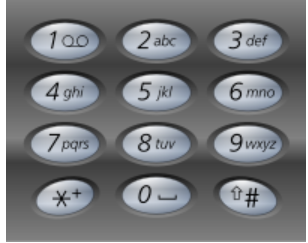

===================

=============

=============

==============

顺序：热题HOT100—>精选Top面试题

算法部分：
二分搜索 Binary Search 
分治 Divide Conquer 
宽度优先搜索 Breadth First Search 
深度优先搜索 Depth First Search
回溯法 Backtracking 
双指针 Two Pointers 
动态规划 Dynamic Programming 
扫描线 Scan-line algorithm
快排 Quick Sort

数据结构部分：
栈 Stack
队列 Queue
链表 Linked List 
数组 Array 
哈希表 Hash Table
二叉树 Binary Tree  
堆 Heap

第一周，链表、栈、队列
第二周，递归、排序、贪心
第三周，搜索算法、回溯算法、位运算、二分查找
第四周，二叉树
第五周，动态规划、背包问题
第六周，剑指 Offer 系列

